改进C的特性

## 自动类型

C++11 时代，auto 关键字可以用于变量类型的推断，可以在声明变量的时候根据变量初始值的类型自动为该变量选择合适的类型，而不需要显式指定类型。auto 自动类型推断发生在编译期，所以使用 auto 关键字不会降低程序的运行效率；

**(1)普通类型的推断**

```c++
auto x = 127;               // auto 被推断为 int 类型
auto y = 3.14;              // auto 被推断为 double 类型
auto z;                         // 错误，必须有初始值才能进行推断
```

**(2)引用类型推断**

```c++
int x = 0, &rx = x; 
auto a1 = rx;               // 使用引用其实是使用引用的对象，此时 auto 以引用对象的类型作为 auto 的类型，
							//所以auto 这里被推断为 int 
auto &a2 = rx;            	// 此时 auto 被推断为 int 类型，a2 对象本身就是 int & 类型
const auto &a3 = rx;  		// auto 被推断为 int 类型，a3 对象本身是 const int & 类型，
							//不能通过 a3 去修改 rx 引用的对象值
```

**(3)const类型的推断**

```c++
const int c = 10;
auto a1 = c;            // auto 此时是 int，顶层 const 属性被丢弃
auto &a2 = c;         // auto 此时是 const int，底层 const 属性保留
```

**(4)针对数组和函数的推断**

```c++
const char arr[] = "I Love China";
auto r1 = arr;						// 如果将数组名赋值给 auto 变量，那么 auto 推断的结果是指针类型，
						//如果有 const 属性会被保留，auto 推断的结果是 const char *，r1 为 const char *
auto &r2 = arr;                     // 如果将数组名赋值给 auto & 变量，auto & 变量的类型是一个数组引用类
									//型，即为const char (&) [14] 
int add(int a,int b);               // 函数声明
auto r3 = add;                      // r3 为 int(*)(int, int)
auto &r4 = add;                     // r4 为 int(&)(int, int)
```

**推断规则说明**

- 对于普通类型推断（没有 const 也不掺杂引用的），直接根据表达式右边值的类型进行推断，注意必须有初始值

-  使用引用进行推断，实际上就是使用引用对象的类型进行推断，此时引用特性会被丢弃，如果定义的对象需要成为引用，就自己在 auto 后面加上 & 来定义对象

- 使用带有 const 属性的对象进行推断时，如果定义的对象不是指针或者引用，则 const 属性会被丢弃，否则 const 属性会保留，见 (3) const 类型的推断

**auto关键字使用的场景**

- 适用的场景
  - 一些类型长度书写很长的，可以使用 auto 来简化，如 for(std::vector\<int\>::iterator it = v.begin();it != v.end();++it)，如果使用 auto 可以直接写为 for(auto it = v.begin();it != v.end();++it)
  - 当函数返回的值不确定时，可以使用 auto 做返回值类型，更加方便，编译器会根据返回值的类型推断 auto 的类型，这种语法是在`C++14`才出现的。

- 不适用的场景
  - 函数参数类型不能是 auto 类型，比如 int add(auto a, auto b) { return a + b; } 是不允许的
  - 类的成员变量不可以是 auto 类型。类的静态成员变量可以是 auto 类型的，但是需要使用 const 修饰，而且该变量的值在类内初始化

## 布尔类型

bool类型只有true（非0）和false（0）两个值；

C++编译器会将非0值转换为true，0值转换为false；

bool类型是C++基本数据类型，可以定义bool类型的`全局变量、常量、指针、数组`等；

## 三目运算符

C语言中的三目运算符返回的是`变量值`，`不能`作为`左值`使用；

C++中的三目运算符可以直接返回`变量本身`，既可以作为`右值`使用，又可以作为`左值`使用；

**注意：**三目运算符可能返回的值中如果有一个常量值，则不能作为左值使用；

- 当三目运算符的可能返回都是变量时，返回的是`变量引用`；

- 当三目运算符的可能返回中有常量时，返回的是`值`；

## 引用

引用可以看作一个已定义`变量的别名`，在一些场合可以`代替指针`；

引用在C++中的内部实现是一个指针常量；

引用相对于指针来说具有更好的<u>可读性</u>和<u>实用性</u>，C++为了实用性而隐藏了引用的存储空间这一细节；

```c++
//引用的语法
Type& name = var;

int a = 4;
int& b = a;	//b为a的别名

b = 5;	//操作b就是操作a
```

**注意：**普通引用在定义时`必须用同类型`的变量进行初始化。

C++编译器在编译过程中用`指针常量`作为引用的`内部实现`，因此<u>引用所占用的空间大小与指针相同</u>；

const引用可以使得`变量具有只读属性`；

## 内联函数

C++中推荐使用内联函数替代宏代码片段，使用`inline`关键字声明内联函数；

C++编译器直接将函数体插入函数调用的地方；

内联函数`没有`普通函数调用时的`额外开销`（压栈、跳转、返回）；

对于函数体很小，调用频繁的函数可以选择内联函数；

```c++
inline int func(int a, int b)
{
	return a < b ? a : b;
}
```

**注意：**内联函数声明时inline关键字必须和函数定义结合在一起，否则编译器会直接忽略内联请求；

- 内联函数具有普通函数的特征（参数检查，返回类型等）；

- 函数的内联请求可能被编译器拒绝；

- 函数被`内联编译后`，`函数体直接扩展到调用的地方`；

**C++中inline内联编译的限制：**

- 不能存在任何形式的循环语句（取决于编译器版本）
- 不能存在`过多的条件判断语句`
- 函数体不能`过于庞大`
- 不能对`函数进行取址操作`
- 函数内联声明必须在调用语句之前

## 函数默认参数

C++中可以在`函数声明时为参数提供一个默认值`；

当函数调用时<u>没有提供参数的值</u>，则`使用默认值`；

```c++
#include <iostream>
using namespace std;
 
int sum(int a, int b=20)
{
  int result;
 
  result = a + b;
  
  return (result);
}
 
int main ()
{
   // 局部变量声明
   int a = 100;
   int b = 200;
   int result;
 
   // 调用函数来添加值
   result = sum(a, b);
   cout << "Total value is :" << result << endl;
 
   // 再次调用函数
   result = sum(a);
   cout << "Total value is :" << result << endl;
 
   return 0;
}

//Total value is :300
//Total value is :120
```

**函数默认参数的规则：**

- 参数的默认值必须`从右到左提供`
- 函数调用时`使用了默认值`，则后续参数`必须`使用默认值

## 重载

同一标识符在`不同的上下文有什么不同的意义`（Overload）

```c++
class printData
{
   public:
      void print(int i) {
        cout << "整数为: " << i << endl;
      }
 
      void print(double  f) {
        cout << "浮点数为: " << f << endl;
      }
 
      void print(char c[]) {
        cout << "字符串为: " << c << endl;
      }
};
 
int main(void)
{
   printData pd;
 
   // 输出整数
   pd.print(5);
   // 输出浮点数
   pd.print(500.263);
   // 输出字符串
   char c[] = "Hello C++";
   pd.print(c);
 
   return 0;
}

//整数为: 5
//浮点数为: 500.263
//字符串为: Hello C++
```

**函数重载`至少`满足下面的一个条件：**

- 参数个数不同
- 参数类型不同
- 参数顺序不同

**编译器调用重载函数的准则：**

尝试寻找可行的候选函数

- 精确匹配实参
- 通过默认参数能够匹配实参
- 通过默认类型转换匹配实参

<u>匹配失败</u>：

- 最终寻找到的候选函数不唯一，则出现二义性，编译失败
- 无法匹配所有候选者，函数未定义，编译失败

**函数重载的注意事项：**

重载函数在`本质`上是`相互独立的不同函数`

重载函数的`函数类型不同`

函数`返回值不能`作为函数重载的依据

> 函数重载是由函数名和参数列表决定的；

### 重载与指针

将重载`函数名`赋值给`函数指针`时

1. 根据重载规则挑选与`函数指针参数列表一致`的候选者
2. `严格匹配`候选者的函数类型与函数指针的`函数类型`

**注意：**

函数重载`必然发生在同一个作用域中`

编译器需要用`参数列表`或`函数类型`进行函数选择

`无法`通过`函数名`得到重载函数的`入口地址`

## C++和C相互调用

C++编译器能够兼容C语言的编译方式，优化使用C++编译的方式

extern关键字能强制让C++编译器进行C方式的编译

> __cplusplus是C++编译器内置的标准宏定义，确保C代码以统一的C方式被编译成目标文件

```c++
#ifdef __cplusplus
extern "C" {
#endif
    
// do C-style compilation here

#ifdef __cplusplus
}
#endif
```

## 动态内存分配

- C++通过`new`关键字进行动态内存申请

- C++中的动态内存申请是基于类型进行的
- `delete`关键字用于内存释放

```c++
//变量申请：
Type* pointer = new Type;
……
delete pointer;

//数组申请：
Type* pointer = new Type[N];
……
delete[] pointer;
```

### new关键字与malloc函数的区别

- new关键字是C++的一部分，malloc是由C库提供的函数
- new以具体类型为单位进行内存分配，malloc以字节为单位进行内存分配
- new在申请单个类型变量时可进行初始化，malloc不具备内存初始化的特征

## 命名空间

C语言中只有一个全局作用域，C语言中`所有的全局标识符共享同一个作用域`，标识符之间可能发生冲突

**C++提出命名空间概念：**

- 命名空间将全局作用域分成不同的部分
- 不同命名空间中的标识符可以同名而不会发生冲突
- `命名空间可以相互嵌套`
- 全局作用域也叫`默认命名空间`

命名空间的定义可以不连续，甚至可以写在多个文件中。如果已经定义了该命名空间，那么就相当于添加新成员的声明；

```c++
//命名空间定义
namespace name
{
   namespace internal
   {
       /*……*/
   }
    /*……*/
}

//命名空间使用
using namespace name;	//使用整个命名空间
using name::variable;	//使用命名空间中的变量
::variable	//使用默认命名空间中的变量

//实例
#include <iostream>
using namespace std;
 
// 第一个命名空间
namespace first_space{
   void func(){
      cout << "Inside first_space" << endl;
   }
}
// 第二个命名空间
namespace second_space{
   void func(){
      cout << "Inside second_space" << endl;
   }
}
int main ()
{
 
   // 调用第一个命名空间中的函数
   first_space::func();
   
   // 调用第二个命名空间中的函数
   second_space::func(); 
 
   return 0;
}
```

## 类型转换

详细参考链接：[四种类型转换运算符](http://c.biancheng.net/view/2343.html)

C++将强制类型转换分为4种不同类型

- static_cast
- const_cast
- dynamic_cast
- reinterpret_cast

**static_cast强制类型转换**

用于`基本类型`间的转换

`不能`用于`基本类型指针`间的转换

用于`有继承关系类对象`之间的转换和`类指针`之间的转换

**const_cast强制类型转换**

用于`去除`变量的`只读属性`

强制转换的目标类型必须是`指针`或`引用`

**dynamic_cast强制类型转换**

用于`有继承关系的类指针`间的转换

用于`有交叉关系的类指针`间的转换

具有类型检查的功能

**`需要虚函数的支持`**

**reinterpret_cast强制类型转换**

用于`指针类型间`的转换

用于`整数`和`指针类型`间的转换

## const

- 只有用`字面量`初始化的const常量才会`进入符号表`

- 使用其他`变量`初始化的const常量仍然是`只读变量`

- 被`volatile修饰`的const常量`不会进入符号表`

在`编译期间不能直接确定初始值`的const标识符，都会被作为`只读变量`处理；

**const引用的类型与初始化变量的类型**

- 相同：初始化变量成为只读变量
- 不同：生成一个新的只读变量


**constexpr关键字**（C++11引入）

常量的概念，在编译时求值；

```c++
constexpr int func()
{
    int a = 6;
    return a;
}

int main()
{
    constexpr int var{ 1 };
    int b = 5;
    constexpr int var2 = func();
    cout << var2 << endl;

    return 0;
}
```

## 引用与指针

指针是一个变量

- 值为一个内存地址，不需要初始化，可以保存不同的地址
- 通过指针可以访问对应内存地址中的值
- 指针可以被const修饰成为常量或者只读变量

引用只是一个变量的新名字

- 对引用的操作（赋值，取地址等）都会`传递到代表的变量上`
- const引用使其代表的变量具有只读属性
- 引用必须在定义时初始化，之后无法代表其他变量

## C异常处理

C语言经典处理方式if else

```c++
double divide(double a, double b, int* valid)
{
    const double delta = 0.000000000000001;
    double ret = 0;
    
    if( !((-delta < b) && (b < delta)) )
    {
        ret = a / b;
        
        *valid = 1;
    }
    else
    {
        *valid = 0;
    }
    
    return ret;
}

int main(int argc, char *argv[])
{   
    int valid = 0;
    double r = divide(1, 0, &valid);
    
    if( valid )
    {
        cout << "r = " << r << endl;
    }
    else
    {
        cout << "Divided by zero..." << endl;
    }
    
    return 0;
}
```

 通过setjmp()和longjmp()进行优化；

- int setjmp(jmp_buf env)
  - 将当前上下文保存在jmp_buf结构体中
- void longjmp(jmp_buf env, int val)
  - 从jmp_buf结构体中恢复setjmp()保存的上下文
  - 最终从setjmp函数调用点返回，返回值为val


**setjmp()和longjmp()引入的缺陷：**

- 必然涉及到使用全局变量
- 暴力跳转导致代码可读性降低
- 本质还是if else异常处理方式

**异常处理代码实例分析**

```c++
#include <iostream>
#include <string>
using namespace std;

#define SUCCESS           0 
#define INVALID_POINTER   -1
#define INVALID_LENGTH    -2
#define INVALID_PARAMETER -3

int MemSet(void* dest, unsigned int length, unsigned char v)
{
    if( dest == NULL ) {
        return INVALID_POINTER;
    }
    
    if( length < 4 ) {
        return INVALID_LENGTH;
    }
    
    if( (v < 0) || (v > 9) ) {
        return INVALID_PARAMETER;
    }
    
    unsigned char* p = (unsigned char*)dest;
    
    for(int i=0; i<length; i++) {
        p[i] = v;
    }
    
    return SUCCESS;
}

int main(int argc, char *argv[])
{
    int ai[5];
    int ret = MemSet(ai, sizeof(ai), 0);
    
    if( ret == SUCCESS )
    {
    }
    else if( ret == INVALID_POINTER )
    {
    }
    else if( ret == INVALID_LENGTH )
    {
    }
    else if( ret == INVALID_PARAMETER )
    {
    }
    
    return ret;
}
```

## Vector

标准库中的向量（Vector）是一个封装了动态大小数组的顺序容器；简单的认为，Vector是一个能够存放任意类型的动态数组或集合。（Vector本身就是个类模板）

**基本用法**

1. Vector<类型>标识符
2. Vector<类型>标识符(最大容量)
3. Vector<类型>标识符(最大容量,初始所有值)
4. Int i[5]={1,2,3,4,5}
   Vector<类型>vi(I,i+2);//得到i索引值为3以后的值
5. Vector< vector< int> >v; 二维向量//这里最外的<>要有空格。否则在比较旧的编译器下无法通过

```c++
#include < vector> 
using namespace std;

vector<Student> stu_list;
vector<vector<string>> str_list;	//该集合里面每个元素又是一个Vector<string>对象
vector<int*> p_list;				//注意不能往Vector装引用类型
```

## 迭代器

一种遍历容器内元素的数据类型，类似于指针，可理解为迭代器用来指向容器中的某个元素；

通过迭代器可以读容器中的元素值，可以修改某个迭代器所指向的元素值；

**容器的迭代器用法**

```c++
vector<int> iv = { 100, 200, 300 };
vector<int>::iterator iter1;

//迭代器begin()/end()操作，反向rbegin()/rend()操作
iter2 = iv.begin()	//如容器中有元素，则返回的迭代器指向容器的第一个元素
iter3 = iv.end()	//返回的迭代器指向容器的末端元素的后面，指向的是一个不存在的元素（一个标记）
//如果容器为空，begin()和end()返回的迭代器相同；

for (vector<int>::iterator iter = iv.begin(); iter != iv.end(); iter++)
{
	cout << *iter << endl;
}
//反向迭代器
for (vector<int>::reverse_iterator riter = iv.rbegin(); riter != iv.rend(); riter++)
{
	cout << *riter << endl;
}

//const_iterator迭代器指向的元素值不能改变，而迭代器本身是可以不断指向下一个元素
vector<int>::const_iterator citer;
for (citer = iv.begin(); citer != iv.end(); citer++)
{
	cout << *citer << endl;
}
```

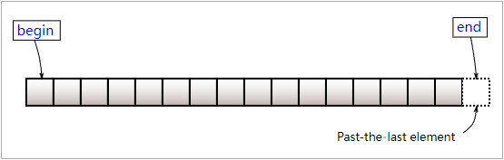


C++11引入的两个新函数cbegin()、cend()跟begin()、end()类似，返回的都是常量迭代器；

------


# 面向对象

以模块为中心构建可复用的软件系统，提高软件产品的可维护性和可扩展性；

## 类和对象

**类和对象是面向对象中的两个概念**

- 类：指的是一类事物，是一个抽象的概念
- 对象：指的是属于某个类的`具体实体`
- 类是一种`模型`，这种模型可以`创建出不同的对象实体`
- 对象实体是类模型的一个`具体实例`

**类和对象的意义**

- 类用于抽象的`描述`一类事物所特有的属性和行为
- 对象是具体的事物，`拥有所属类中描述的一切属性和行为`

<u>每个类可以有多个对象，每个对象必然属于某个类；</u>

**类的表示法**

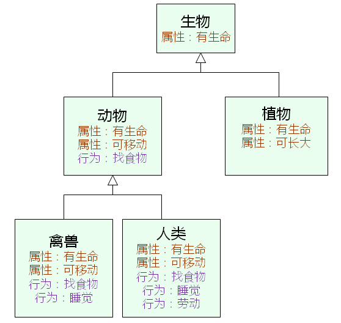

### 类成员

- 每一个`对象拥有自己独立的属性`（成员变量）

- 所有的`对象共享类的方法`（成员函数）
- 方法能直接访问对象的属性
- 方法中的隐藏参数 `this`用于`指代当前对象`

### 类的封装

并不是类的每个属性都是对外公开的；

必须在类的表示法中`定义属性和行为的公开级别`；

- 成员变量：C++中用于表示类属性的变量
- 成员函数：C++中用于表示类行为的函数

C++中可以给成员变量和成员函数定义`访问级别`

- public：成员变量和成员函数可以在类的内部和外界访问和调用
- private：成员变量和成员函数只能在类的内部被访问和调用

类的`封装机制`使得使用方式和内部细节相分离；

通过定义类成员的`访问级别实现封装机制`；

**类成员的作用域**

类成员的作用域都`只在类的内部`，`外部无法直接访问`；

`成员函数`可以直接`访问成员变量`和`调用成员函数`；

类的外部可以通过类变量访问public成员；

类成员的`作用域与访问级别没有关系`；

<u>C++中用struct定义的类中所有成员默认为public</u>

### 类的关键字

用`struct`定义类时，所有成员的默认访问级别为`public`；

用`class`定义类时，所有成员的默认访问级别为`private`；

C++中的类支持声明和实现分离

- 在头文件中声明类
- 在源文件中实现类

### 对象的初始化

从程序设计的角度，`对象只是变量`

- 在`栈`上创建对象时，成员变量初始为`随机值`

- 在`堆`上创建对象时，成员变量初始值为`随机值`

- 在`静态存储区`创建对象时，成员变量初始值为`0`

一般而言，对象都需要一个确定的初始状态

C++可以定义与类名相同的构造函数用于对象初始化

- 构造函数没有任何返回类型的声明
- 构造函数在对象定义时自动被调用

```c++
class Test
{
private:
    int i;
    int j;
public:
    int getI() { return i; }
    int getJ() { return j; }
    Test()
    {
        printf("Test() Begin\n");
        
        i = 1;
        j = 2;
        
        printf("Test() End\n");
    }
};

```

**带参数的构造函数**

构造函数可以`根据需要定义参数`

一个类中可以存在`多个重载的构造函数`

构造函数的重载遵循C++重载的规则

**构造函数调用**

一般情况下，构造函数在对象定义时被自动调用

一些特殊情况下，需要手工调用构造函数

```c++
class Test
{
private:
    int m_value;
public:
    Test() 
    { 
        printf("Test()\n");
        
        m_value = 0;
    }
    Test(int v) 
    { 
        printf("Test(int v), v = %d\n", v);
        
        m_value = v;
    }
    int getValue()
    {
        return m_value;
    }
};

int main()
{
    Test ta[3] = {Test(), Test(1), Test(2)};      
    
    for(int i=0; i<3; i++)
    {
        printf("ta[%d].getValue() = %d\n", i , ta[i].getValue());
    }
    
    Test t = Test(100);
    
    printf("t.getValue() = %d\n", t.getValue());
    
    return 0;
}
```

开发一个数组类解决原生数组的安全性问题

```c++
//IntArray.h
#ifndef _INTARRAY_H_
#define _INTARRAY_H_

class IntArray
{
private:
    int m_length;
    int* m_pointer;
public:
    IntArray(int len);
    int length();
    bool get(int index, int& value);
    bool set(int index ,int value);
    void free();
};
#endif

//IntArray.cpp
#include "IntArray.h"

IntArray::IntArray(int len)
{
    m_pointer = new int[len];

    for (int i = 0; i < len; i++)
    {
        m_pointer[i] = 0;
    }

    m_length = len;
}

int IntArray::length()
{
    return m_length;
}

bool IntArray::get(int index, int &value)
{
    bool ret = (0 <= index) && (index < length());

    if (ret)
    {
        value = m_pointer[index];
    }

    return ret;
}

bool IntArray::set(int index, int value)
{
    bool ret = (0 <= index) && (index < length());

    if (ret)
    {
        m_pointer[index] = value;
    }

    return ret;
}

void IntArray::free()
{
    delete[] m_pointer;
}

//main.cpp
#include "IntArray.h"
#include <stdio.h>

int main()
{
    IntArray a(5);    
    
    for(int i=0; i<a.length(); i++)
    {
        a.set(i, i + 1);
    }
    
    for(int i=0; i<a.length(); i++)
    {
        int value = 0;
        
        if( a.get(i, value) )
        {
            printf("a[%d] = %d\n", i, value);
        }
    }
    
    a.free();

    return 0;
}
```

### 特殊构造函数

- 无参构造函数

当类中没有定义构造函数时，`编译器默认提供一个无参的构造函数`，并且其函数体为空；

- 拷贝构造函数

参数为const class_name&，当类中没有定义拷贝构造函数时，编译器默认提供一个拷贝构造函数，`简单的进行成员变量的值复制`；

**拷贝构造函数的意义**

浅拷贝

- 拷贝后对象的物理状态相同

深拷贝

- 拷贝后对象的逻辑状态相同

编译器提供的拷贝构造函数只进行浅拷贝

对象中有成员指代了系统中的资源时需要深拷贝

- 成员指向了动态内存空间
- 成员打开了外存中的文件
- 成员使用了系统中的网络端口
- ……

```C++
//深拷贝
IntArray::IntArray(const IntArray& obj)
{
    m_length = obj.m_length;
    
    m_pointer = new int[obj.m_length];
    
    for(int i=0; i<obj.m_length; i++)
    {
        m_pointer[i] = obj.m_pointer[i];
    }
}
```

**移动构造函数**

移动构造是C++11标准中提供的一种新的构造方法；C++11引入移动语义：源对象资源的控制权全部交给目标对象。


移动构造函数的参数和拷贝构造函数不同，拷贝构造函数的参数是一个左值引用，但是移动构造函数的初值是一个右值引用。这意味着，移动构造函数的参数是一个右值或者将亡值的引用。也就是说，只有当用一个右值，或者将亡值初始化另一个对象的时候，才会调用移动构造函数。移动构造函数的例子如下：

```c++
#include <iostream>
#include <string>

using namespace std;

class Integer 
{
    int* m_ptr;

public:
    Integer(int value) : m_ptr(new int(value)) 
    {
        cout << "Call Integer(int value)" << endl;
    }

    Integer(const Integer& source) : m_ptr(new int(*source.m_ptr)) 
    {
        cout << "Call Integer(const Integer& source)拷贝" << endl;
    }

    Integer(Integer&& source) noexcept : m_ptr(source.m_ptr)
    {
        source.m_ptr = nullptr;
        cout << "Call Integer(Integer&& source)移动" << endl;
    }

    virtual ~Integer() 
    {
        cout << "Call ~Integer()" << endl;
        delete m_ptr;
    }

    int GetValue(void) 
    { 
        return *m_ptr; 
    }
};
Integer getNum()
{
    Integer a(100);
    return a;
}
int main(int argc, char const* argv[]) 
{
    Integer a(getNum());
    cout << "a=" << a.GetValue() << endl;
    cout << "-----------------" << endl;
    Integer temp(10000);
    Integer b(temp);
    cout << "b=" << b.GetValue() << endl;
    cout << "-----------------" << endl;

    return 0;
}
```

移动构造函数首先将传递参数的内存地址空间接管，然后将内部所有指针设置为nullptr，并且在原地址上进行新对象的构造，最后调用原对象的的析构函数，这样做既不会产生额外的拷贝开销，也不会给新对象分配内存空间。即提高程序的执行效率，节省内存消耗。

**移动赋值运算符**

```c++
//拷贝赋值运算符
Integer& operator= (const Integer& src)
{
    if (this == &src) return *this;
     delete m_ptr;
    m_ptr = new int(*(src.m_ptr));
    return *this;
}
//移动赋值运算符
Integer& operator= (Integer&& src) noexcept
{
    if (this == &src) return *this;
    delete m_ptr;
    m_ptr = src.m_ptr;
    src.m_ptr = nullptr;
    return *this;
}
```

### 初始化列表

C++提供了初始化列表对成员进行初始化

**注意事项：**

- 成员的`初始化顺序`与成员的声明顺序相同
- 成员的初始化列表顺序`与初始化列表中的位置无关`
- 初始化列表`先于构造函数的函数体执行`

```c++
class Value
{
private:
    int mi;
public:
    Value(int i)
    {
        printf("i = %d\n", i);
        mi = i;
    }
    int getI()
    {
        return mi;
    }
};

class Test
{
private:
    Value m2;
    Value m3;
    Value m1;
public:
    Test() : m1(1), m2(2), m3(3)
    {
        printf("Test::Test()\n");
    }
};
```

**类中的const成员**

- 类中的const成员会被分配空间的
- 类中的const成员的本质是只读变量
- 类中的const成员只能在初始化列表中指定初始值

编译器无法直接得到const成员的初始值，因此无法进入符号表成为真正意义的常量

**初始化与赋值不同**

- 初始化：对`正在创建的对象`进行初值设置
- 赋值：对`已经存在的对象`进行值设置

### 对象的构造顺序

`局部对象`的构造顺序`依赖于程序的执行流`

`堆对象`的构造顺序`依赖于new的使用顺序`

`全局对象`的构造顺序是`不确定`的

**单个对象创建时构造函数的调用顺序**

1. 调用父类的构造过程
2. 调用成员变量的虚构函数（调用顺序与声明顺序相同）
3. 调用类自身的构造函数

<u>析构函数与对应构造函数的调用顺序相反</u>；

### 析构函数

C++的类中可以定义一个清理函数叫析构函数，功能与构造函数相反

定义：~ClassName()

- 析构函数`没有参数`也没有返回值类型声明
- 析构函数在对象销毁时`自动被调用`

析构函数是`对象释放系统资源`的保障

```c++
class Test
{
private:
    /* data */
public:
    Test(/* args */);
    ~Test();
};

Test::Test(/* args */)
{
    printf("Test()\n");
}

Test::~Test()
{
    printf("~Test()\n");
}
```

### const成员函数

**定义：**

Type ClassNmae::function(Type p) const

类中的函数`声明`与实际函数`定义`中都必须带`const`关键字；

**const成员函数**

- const对象只能调用const的成员函数
- const成员函数中只能调用const成员函数
- const成员函数中不能直接改写成员变量的值

### 静态成员变量

- 静态成员变量`属于整个类所有`
- 静态成员变量的生命周期不依赖于任何对象
- 可以`通过类名直接访问`公有静态成员变量
- 所有对象共享类的静态成员变量
- 可以`通过对象名访问`公有静态成员变量

**静态成员变量的特性**

- 在定义时直接通过`static`关键字修饰
- 静态成员变量`需要在类外单独分配空间`
- 静态成员变量在程序内部`位于全局数据区`
- 静态成员变量的`生命周期为程序运行期`

**语法规则：**

Type ClassName::VarName = value;

```c++
class Test
{
private:
    static int count;

public:
    Test(/* args */);
    ~Test();
    int getCount();
};

Test::Test(/* args */)
{
    count++;
}

Test::~Test()
{
    count--;
}

int Test::getCount()
{
    return count;
}

int Test::count = 0;

Test gTest;
int main()
{
    Test t1;
    Test t2;

    printf("count = %d\n", gTest.getCount());
    printf("count = %d\n", t1.getCount());
    printf("count = %d\n", t2.getCount());

    return 0;
}
```

### 静态成员函数

- 静态成员函数是类中特殊的成员函数
- 静态成员函数`属于整个类所有`
- 可以`通过类名直接访问`公有静态成员函数
- 可以`通过对象名访问`公有静态成员函数

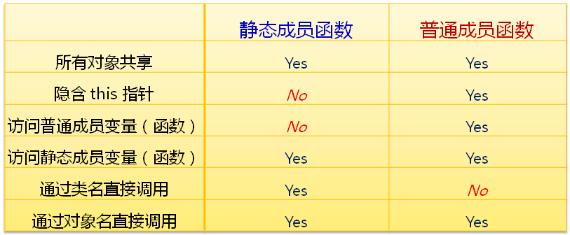

**静态成员函数的定义**

- 直接通过static关键字修饰成员函数

```c++
class Test
{
public:
    static void Func1(){ }
    static int Func2();
};

int Test::Func2(){
    return 0;
}
```

### 二阶构造模式

工程开发中的`构造过程`可分为两个阶段

- 资源无关的初始化操作（不可能出现异常情况的操作）
- 需要使用系统资源的操作（可能出现异常情况，如内存申请、访问文件等）

```C++
class TwoPhaseCons 
{
private:
    TwoPhaseCons() // 第一阶段构造函数
    {   
    }
    bool construct() // 第二阶段构造函数
    { 
        return true; 
    }
public:
    static TwoPhaseCons* NewInstance(); // 对象创建函数
};

TwoPhaseCons* TwoPhaseCons::NewInstance() 
{
    TwoPhaseCons* ret = new TwoPhaseCons();

    // 若第二阶段构造失败，返回 NULL    
    if( !(ret && ret->construct()) ) 
    {
        delete ret;
        ret = NULL;
    }
        
    return ret;
}


int main()
{
    TwoPhaseCons* obj = TwoPhaseCons::NewInstance();
    
    printf("obj = %p\n", obj);

    delete obj;
    
    return 0;
}
```

构造函数`只能决定对象的初始化状态`，初始化`失败不影响对象的诞生`；

二阶构造人为的`将初始化过程分为两部分`，能够确保创建的`对象都是完整初始化`的；

### 友元

友元是C++中的一种关系

友元关系发生在`函数与类之间`或者`类与类之间`

友元关系是`单项的`，`不能传递`

**友元的用法**

- 在类中以`friend`关键字声明友元

- 类的友元可以是其他类或者具体函数

- 友元`不是`类的一部分
- 友元`不受`类中访问级别的限制
- `友元可以直接访问具体类的所有成员`

在类中用`friend`关键字对`函数`或`类`进行声明：

```c++
class Point
{
    double x;
    double y;
    
    friend void func(Point& p);
};

void func(Point& p)
{
    
}

//示例
class Point
{
    double x;
    double y;

public:
    Point(double x, double y)
    {
        this->x = x;
        this->y = y;
    }
    double getX()
    {
        return x;
    }
    double getY()
    {
        return y;
    }
    friend double func(Point &p1, Point &p2);
};

double func(Point &p1, Point &p2)
{
    double ret = 0;

    ret = (p2.y - p1.y) * (p2.y - p1.y) +
          (p2.x - p1.x) * (p2.x - p1.x);

    ret = sqrt(ret);
    return ret;
}

int main()
{
    Point p1(1, 2);
    Point p2(10, 20);

    printf("p1(%f,%f)\n", p1.getX(), p1.getY());
    printf("p2(%f,%f)\n", p2.getX(), p2.getY());
    printf("|(p1,p2)| = %f\n", func(p1, p2));

    return 0;
}
```

友元为了兼顾C语言的高效而诞生，但是破坏了面向对象的封装性，在现代实际产品中已经逐渐被遗弃；

**注意事项：**

- 友元不具备传递性
- 类的友元可以是其他类的成员函数
- 类的友元可以是某个完整的类（所有的成员函数都是友元）

### 函数重载

类中的`成员函数`可以进行`重载`

- 构造函数的重载
- 普通成员函数的重载
- 静态成员函数的重载

重载必须发生在`同一作用域中`，`全局函数`和`成员函数不能`构成重载关系

```c++
class Test
{
    int i;
public:
    Test()
    {
        printf("Test::Test()\n");
        this->i = 0;
    }
    
    Test(int i)
    {
        printf("Test::Test(int i)\n");
        this->i = i;
    }
    
    Test(const Test& obj)
    {
        printf("Test(const Test& obj)\n");
        this->i = obj.i;
    }
    
    static void func()
    {
        printf("void Test::func()\n");
    }
    
    void func(int i)
    {
        printf("void Test::func(int i), i = %d\n", i);
    }
    
    int getI()
    {
        return i;
    }
};

void func()
{
    printf("void func()\n");
}

void func(int i)
{
    printf("void func(int i), i = %d\n", i);
}

int main()
{
    func();
    func(1);
    
    Test t;        // Test::Test()
    Test t1(1);    // Test::Test(int i)
    Test t2(t1);   // Test(const Test& obj)
    
    func();        // void func()
    Test::func();  // void Test::func()
    
    func(2);       // void func(int i), i = 2;
    t1.func(2);    // void Test::func(int i), i = 2
    t1.func();     // void Test::func()
    
    return 0;
}
```

**重载的意义：**

通过函数名和参数列表对函数用法进行提示，`扩展`系统中`已经存在`的函数功能

```c++
char* strcpy(char* buf, const char* s, unsigned int n)
{
    return strncpy(buf, s, n);
}

int main()
{
    const char* s = "Wong Software";
    char buf[16] = {0};

    //strcpy(buf, s);
    //strncpy(buf, s, sizeof(buf)-1);
    strcpy(buf, s, sizeof(buf)-1);

    printf("%s\n",buf);

    return 0;
}
```

### 操作符重载

C++中的重载能够扩展操作符的功能；

操作符的重载以函数的方式进行，本质是用`特殊形式的函数`扩展操作符的功能；

通过`operator`关键字可以定义特殊的函数，`通过函数重载操作符`

```c++
class Type
{
public:
	Type operator Sign(const Type& p)
	{
		Type ret;
    
    	return ret;
	}
}
//Sign为系统中预先定义的操作符，如：+,-,*,/,等
```

可以将操作符重载函数定义为`类的成员函数`

- 比全局操作符重载函数少一个参数（左操作数）
- 不需要依赖友元
- 编译器优先在成员函数中寻找操作符重载函数

```c++
class Complex
{
    int a;
    int b;
public:
	………………//省略
        
    Complex operator + (const Complex& p)
    {
        Complex ret;

        ret.a = this->a + p.a;
        ret.b = this->b + p.b;

        return ret;
    }
};

int main()
{

    Complex c1(1, 2);
    Complex c2(3, 4);
    Complex c3 = c1 + c2;   //c1.operator + (c2)
    
    printf("c3.a = %d, c3.b = %d\n", c3.getA(), c3.getB());
    return 0;
}
```

**注意事项：**

- c++规定赋值操作符（=）只能重载为成员函数

- 操作符重载`不能改变`原操作符的`优先级`，`不能改变`操作数的`个数`，`不应改变`操作符的`原有语义`

# C++标准库

- C++标准库并`不是`C++语言的一部分，是由`类库`和`函数库`组成的集合；
- C++标准库中定义的类和对象都位于`std`命名空间中；
- C++标准库的头文件都`不带.h`后缀；
- C++标准库涵盖了C库的功能；
- C++标准库包含经典`算法`和`数据结构`的体现；

**C++编译环境的组成：**

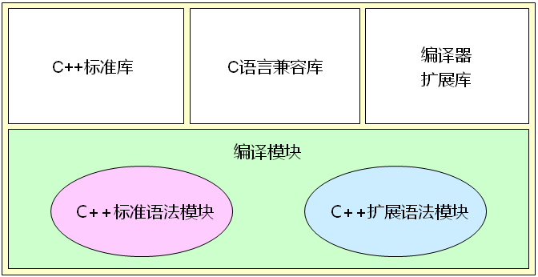


**C++标准库预定了多种常用的数据结构**

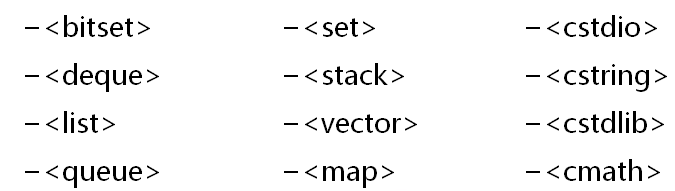


**面向对象思想的标准库**

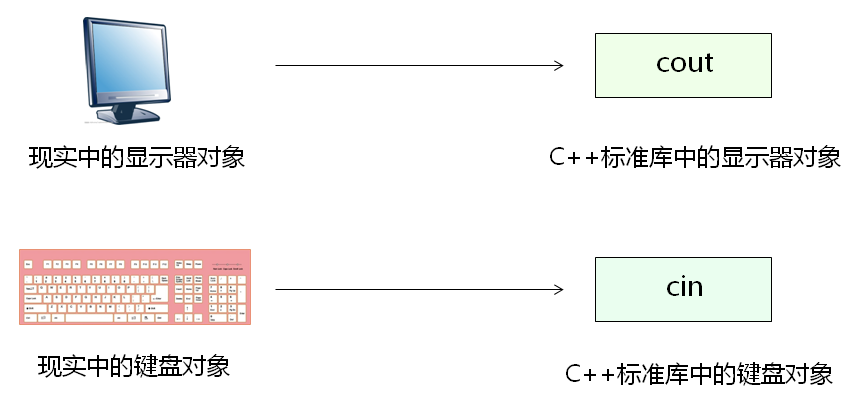

## 字符串类

c++支持C语言的所有概念，`没有原生的字符串类型`；

C++标准库提供了`string`类型

- 支持字`符串连接`
- 支持字符串的`大小比较`
- 支持`子串查找和提取`
- 支持`字符串的插入和替换`

**字符串与数字的转换**

- 标准库中提供了相关的类对字符串和数字进行转换

- 字符串流类（sstream）用于string的转换

`<sstream>`--相关头文件

`<istringstrream>`--字符串输入流

`<ostringstream>`--字符串输出流

```c++
#include <iostream>
#include <sstream>
#include <string>

using namespace std;

#define TO_NUMBER(s, n) (istringstream(s) >> n)
#define TO_STRING(n) (((ostringstream&)(ostringstream() << n)).str())

int main()
{
    double n = 0;
    if(TO_NUMBER("234.567",n))
    {
        cout << n << endl;
    }

    string s = TO_STRING(12345);
    cout << s << endl;

    return 0;
}
```

**字符串循环右移实例：**

```c++
string operator >> (const string& s, unsigned int n)
{
    string ret = "";
    unsigned int pos = 0;
    
    n = n % s.length();
    pos = s.length() - n;
    ret = s.substr(pos);
    ret += s.substr(0, pos);
    
    return ret;
}

int main()
{
    string s = "abcdefg";
    string r = (s >> 3);
    
    cout << r << endl;	//"efgabcd"
    
    return 0;
}
```

**string类实现字符串反转实例：**

```c++
string reverse(const string &str, const char c)
{
    int end;
    int start = 0;
    int len;
    string ret = "";
    string tmp;

    while (1)
    {
        end = str.find(c, start);

        if (end == -1) // 沒找到;
        {
            len = str.length() - start;
            tmp = str.substr(start, len);

            reverse(tmp.begin(), tmp.end()); // 反轉字符串

            ret += tmp;

            return ret;
        }
        else // 找到;
        {
            len = end - start;
            tmp = str.substr(start, len);

            reverse(tmp.begin(), tmp.end()); // 反轉字符串

            ret += tmp + ';';
            start = end + 1;
        }
    }
}

int main()
{
    cout << reverse("", ';') << endl;               // 输出：空字符串
    cout << reverse(";", ';') << endl;              // 输出：;
    cout << reverse("abcde;", ';') << endl;         // 输出：edcba;
    cout << reverse("we;tonight;you", ';') << endl; // 输出：ew;thginot;uoy

    return 0;
}
```

## 数组访问操作符重载

数组访问符的原生意义是`数组访问`和`指针运算`；

数组访问操作符（[]）

- 只能通过类的`成员函数重载`
- 重载函数`能且仅能`使用一个参数
- 可以定义不同参数的`多个重载函数`

```c++
class Test
{
    int a[5];
public:
    int& operator [] (int i)
    {
        return a[i];
    }
    
    int& operator [] (const string& s)
    {
        if( s == "1st" )
        {
            return a[0];
        }
        else if( s == "2nd" )
        {
            return a[1];
        }
        else if( s == "3rd" )
        {
            return a[2];
        }
        else if( s == "4th" )
        {
            return a[3];
        }
        else if( s == "5th" )
        {
            return a[4];
        }
        
        return a[0];
    }
    
    int length()
    {
        return 5;
    }
};

int main()
{
    Test t;
    
    for(int i=0; i<t.length(); i++)
    {
        t[i] = i;
    }
    
    for(int i=0; i<t.length(); i++)
    {
        cout << t[i] << endl;
    }
    
    cout << t["5th"] << endl;
    cout << t["4th"] << endl;
    cout << t["3rd"] << endl;
    cout << t["2nd"] << endl;
    cout << t["1st"] << endl;
    
    return 0;
}
```

## 函数对象

- 使用具体的类对象取代函数
- 该类的对象`具备函数调用行为`
- 多个对象相互独立 

函数调用操作符（`（）`）

- 只能通过类的成员函数重载
- 可以定义不同参数的多个重载函数

```c++
class Fib
{
    int a0;
    int a1;
public:
    Fib()
    {
        a0 = 0;
        a1 = 1;
    }

    Fib(int n)
    {
        a0 = 0;
        a1 = 1;

        for(int i = 2; i <= n; i++)
        {
            int t = a1;
            a1 = a0 + a1;
            a0 = t;
        }
    }

    int operator ()()
    {
        int ret = a1;
        a1 = a0 + a1;
        a0 = ret;

        return ret;
    }
};

int main ()
{
    Fib fib;

    for(int i = 0; i < 10; i++)
    {
        cout << fib() << endl;
    }

    cout << endl;

    for(int i = 0; i < 5; i++)
    {
        cout << fib() << endl;
    }

    cout << endl;

    Fib fib2(10);

    for(int i = 0; i < 5; i++)
    {
        cout << fib2() << endl;
    }
}
```

## 赋值操作符疑问

- 编译器为每个类默认重载了赋值操作符
- 默认的赋值操作符仅完成浅拷贝
- 当需要进行深拷贝时必须重载赋值操作符
- 赋值操作符与拷贝构造函数有相同的存在意义

```c++
//深拷贝
Test(const Test& obj)
{
	m_pointer = new int(*obj.m_pointer);
}
//重载赋值操作符
Test& operator = (const Test& obj)
{
	if(this != &obj)
	{
		delete m_pointer;
		m_pointer = new int(*obj.m_pointer);
	}
	return *this;
}
```

## 智能指针

使用对象代替指针解决方案分析：

- 重载指针特征操作符（-> 和 *）
- 只能通过类的`成员函数重载`
- 重载函数`不能`使用参数
- 只能定义`一个`重载函数

智能指针在指针生命周期结束时`主动释放堆空间`；

智能指针的意义在于最大程度的避免内存问题；

> **注意事项：**
>
> 只能用来指向堆空间中的对象或者变量
>

```c++
class Test
{
    int i;

public:
    Test(int i)
    {
        this->i = i;
    }
    int value()
    {
        return i;
    }
    ~Test()
    {
    }
};

class Pointer
{
    Test *mp;

public:
    Pointer(Test *p = NULL)
    {
        mp = p;
    }
    Pointer(const Pointer &obj)
    {
        mp = obj.mp;
        const_cast<Pointer &>(obj).mp = NULL;
    }
    Pointer &operator=(const Pointer &obj)
    {
        if (this != &obj)
        {
            delete mp;
            mp = obj.mp;
            const_cast<Pointer &>(obj).mp = NULL;
        }
        return *this;
    }
    Test *operator->()
    {
        return mp;
    }

    Test &operator*()
    {
        return *mp;
    }
    bool isNull()
    {
        return (mp == NULL);
    }
    ~Pointer()
    {
        delete mp;
    }
};

int main()
{
    Pointer p1 = new Test(0);
    cout << p1->value() << endl;

    Pointer p2 = p1;
    cout << p1.isNull() << endl;
    cout << p2->value() << endl;

    return 0;
}
```

## 现代智能指针

**C++ 标准库有四种智能指针：**

auto_ptr (C++ 98);  unique_ptr (C++ 11);  shared_ptr (C++ 11); weak_ptr(C++ 11); 

- **shared_ptr** : 共享式指针。多个指针指向同一个对象，最后一个指针被销毁时，这个对象会被释放。
- **weak_ptr** 是辅助shared_ptr工作的；
- **unique_ptr** : 独占式指针；同一个时间内，只有一个指针能够指向该对象。当然，该对象的所有权还是可以移交出去的；

**智能指针作用意义：**

- 忘记delete 的时候，智能指针帮组你delete,或者说，你压根就不再需要自己delete；智能指针的本分（帮助你delete）
- 帮助我们`进行动态分配对象（new出来的对象）的生命周期的管理`。能够有效防止内存泄漏；
- C++ 11标准中反对使用auto_ptr（弃用），目前auto_ptr已经完全被unique_ptr取代
- 这三种智能指针都是`类模板`，我们可以将new获得地址赋给他们；

### shared_ptr

- 共享所有权，不是被一个shared_ptr拥有，而是被多个shared_ptr之间互相协作；shared_ptr有额外开销；
- 工作原理：引用计数，`每个shared_ptr的拷贝都指向相同的内存`。
- 所以，只有最后一个指向该内存（对象）的shared_ptr指针不需要再指向该对象时，那么这个shared_ptr才会去析构所指向的对象
- 垃圾回收机制；我们从此不用担心对象何时被delete;
- 类模板，用到<>, <>里就是指针可以指向的类型，后边再跟智能指针名；

**最后一个指向该内存对象的shared_ptr在什么情况下会释放**

- 这个shared_ptr`被析构`的时候；
- 这个shared_ptr`指向其他的对象时`；

**常规初始化**

```c++
//格式： shared_ptr<指向的类型> 智能指针名：
shared_ptr<int> pi11(new int(100)); // pi指向一个值为100 的int型数据

//要注意智能指针是explicit, 不可以进行隐式类型转换。必须用直接初始化形式；（“=” 一般都是隐式转换）
shared_ptr<int> pi211 = new int(200); //报错
```

<u>裸指针可以初始化shared_ptr, 但不推荐。智能指针和裸指针不要穿插用</u>


**make_shared函数**

- 标准库里的函数模板，安全、高效的分配和使用shared_ptr；
- 它能够在动态内存（堆）中分配并初始化一个对象，然后`返回指向此对象的shared_ptr`;

```c++
shared_ptr<int> p7 = make_shared<int>(100); //这个shared_ptr指向一个值为100的整形内存，
											//有点类似int *pi = new int(100)
 
shared_ptr<string> p8 = make_shared<string>(5, 'a'); // 5个字符a生成的字符串。
													//类似于 string mystr(5, 'a');
 
shared_ptr<int> p9 = make_shared<int>(); // p4指向一个int, int里保存的值是0 （值初始化）
p9 = make_shared<int>(400); //p4 指向一个新int, int 里保存的是400； 
							//p4 首先释放刚才指向的值为0的内存，然后指向这个值为400的内存
 
auto p10 = make_shared<string>(5, 'a'); // 用auto比较简单
```

`共享式`，引用计数，每一个shared_ptr的拷贝`都指向相同的内存`（对象），只有最后一个指向该对象的shared_ptr指针不需要再指向该对象的时候，这个shared_ptr才会去析构所指向的对象。

**引用计数的增加**

- 每个shared_ptr 都会记录有多少个其他的shared_ptr指向相同的对象；

- 在如下情况下，所有指向这个对象的shared_ptr引用计数都会增加1
  - 像下面这样，我们用p6来初始化p7这个智能指针；
  - `把智能指针当做实参往函数里传递；`
  - `作为函数的返回值`

```c++
auto p6 = make_shared<int>(100); // 目前p6所指向的对象只有p6一个引用者；
auto p7(p6); //智能指针定义时的初始化，p7和p6指向了相同的对象，此对象目前有两个引用者；

void myfunc(shared_ptr<int> ptmp){
	return;
}
myfunc(p7);
    
shared_ptr<int> myfunc1(shared_ptr<int>& ptmp){ // 如果参数为引用，则智能指针的引用计数不会增加
	return ptmp;
}

auto p8 = myfunc1(p7); // 引用计数会变成3，这是因为有p8来接这个临时的智能指针。
myfunc(p7); 			// 没有变量来接这个临时的智能指针，则临时智能指针生命周期到了，引用计数从3恢复到2；
```

**引用计数的减少**

- 给shared_ptr赋予新值，让该shared_ptr指向一个新对象；
- 局部的shared_ptr离开其作用域；
- 当一个shared_ptr引用计数从1变成0，则它会自动释放自己所管理

```c++
auto p6 = make_shared<int>(100);  
auto p7(p6); 
auto p8 = myfunc1(p7);
p8 = make_shared<int>(200); // p8 指向新对象，计数为1， p6, p7 指向的对象计数恢复为2；
p7 = make_shared<int>(300); // p7 指向新对象，计数为1， p6 指向的对象计数恢复为1；
p6 = make_shared<int>(400); // p6 指向新对象，计数为1， p6指向的原内存被释放；

auto p9 = make_shared<int>(100); // 目前p9所指向的对象只有p9一个引用者；
auto p10(p9); // p9 和 p10 指向相同的对象，引用计数为2；
myfunc(p10);// 进入函数体myfunc中是3个引用计数，从myfunc中退出时引用计数恢复为2个；

auto p11 = make_shared<int>(110); // 只有p11指向该对象
auto p12 = make_shared<int>(120); 
p11  = p12;
// 给p11赋值会让p11指向p12所指向的对象，该对象引用计数变成2，
//而原来p11所指向的对象引用计数会从1变成0，从而导致被释放。
```

**shared_ptr指针常用操作**

use_cout()：返回多少个智能指针指向某个对象，主要用于调试目的；

```c++
shared_ptr<int> myp(new int(100));
int icout = myp.use_count(); // 1
shared_ptr<int> myp2(myp);
icout = myp.use_count(); // 2
 
shared_ptr<int> myp3;
myp3 = myp2;
icout = myp3.use_count(); // 3
icout = myp.use_count(); // 3
```

unique()：是否该智能指针独占某个指向的对象，也就是若只有一个智能指针指向某个对象，则unique()返回true,否则返回false；

```c++
shared_ptr<int> myp4(new int(100));
shared_ptr<int> myp5(myp4);
if (myp4.unique()) {  
	cout << "unique OK" << endl;
}
else{
	cout << "unique NO" << endl;//输出NO
}
 
shared_ptr<int> myp6;
if (myp6.unique()) { //成立
	cout << "unique OK " << endl;
}
```

reset()：恢复/复位

- reset()不带参数时
  - 若pi 是`唯一`指向该对象的指针，那么`释放`pi所指向的对象，并将pi`置空`
  - 若pi`不是唯一`指向该对象的指针，那么`不释放`pi所指向的对象，但指向该对象的引用`计数会减少1`，同时`将pi置空`

```c++
shared_ptr<int> pi(new int(100));
pi.reset();
if (pi == nullptr)
{
	cout << "pi 被置空" << endl;
}

shared_ptr<int> pi1(new int(100));
auto pi2(pi1);
pi1.reset();
```

- reset()带参数（一般是一个new出来的指针）时
  - 若pi1是`唯一`指向该对象的指针，则`释放`pi1指向的对象，让pi1`指向新对象`。
  - 若pi1`不是唯一`指向该对象的指针，则`不释放`pi1指向的对象，但指向该对象的引用`计数会减少1`，同时让pi1`指向新对象`；

```c++
shared_ptr<int> pi3(new int(100));
auto pi4(pi3); // pi4引用计数会变成2
pi3.reset(new int(1)); //释放原内存，指向新内存；
if (pi3.unique()){
	cout << "pi3 unique OK" << endl;
}
 
if (pi4.unique()) {
	cout << "pi4 unique OK" << endl;
}
```

- <u>空指针也可以通过reset来重新初始化</u>

```c++
shared_ptr<int> p;
p.reset(new int(1)); //释放p所指向的对象，让p指向新对象，因为原来p为空的，所以就等于啥也没释放直接指向新对象；
```

*解引用：获得p指向的对象

```c++
shared_ptr<int> p;
p.reset(new int(1)); 
```

get()：返回p中保存的指针（裸指针），小心使用，如果智能指针释放了所指向的对象，那么这个返回的裸指针也就变得无效了；

```c++
shared_ptr<int> myp7(new int(100));
int *p111 = myp7.get();
*p111 = 45;
 
delete p111; //千万不要这么干，不然系统会报告异常，产生不可预料的结果；
```

swap()：交换两个智能指针所指向的对象

```c++
shared_ptr<string> ps1(new string("I Love China1!"));
shared_ptr<string> ps2(new string("I Love China2!"));
std::swap(ps1, ps2);
ps1.swap(ps2);
```

= nullptr：将智能指针置空，所指向的对象引用计数减1，若引用计数变为0， 则释放智能指针所指向的对象。

```c++
shared_ptr<string> ps3(new string("I Love China!"));
shared_ptr<string> ps4(ps3); 
ps3 = nullptr;
```

**指定删除器以及数组问题**

- **指定删除器；**
  - 一定时机帮我们删除所指向的对象；delete ： 将delete运算符号作为默认的资源析构方式。
  - 我们可以指定自己的删除器`取代`系统提供的默认删除器，当智能指针需要删除所指向的对象时，编译器就会调用我们自己提供的删除器来删除。
  - shared_ptr指定删除器方法比较简单，一般只需要`在参数中添加具体的删除器函数名`即可；

```c++
void myDelete(int* p){ //自定义的删除器，当智能指针引用计数为0， 就会自动调用该删除器
    
	//写一些日志
	delete p; //既然提供了删除器来取代智能指针的缺省删除器，就需要自己来删除所指向的对象。
}

shared_ptr<int> p13(new int(123456), myDelete);
shared_ptr<int> p14(p13); // 两个引用计数
p14.reset(); // 剩1个引用计数，p14为 nullptr
p13.reset(); // 要释放指向的对象，调用我们的删除器myDelete，同时p置空；
```

- 删除器可以是一个lambda表达式

```c++
shared_ptr<int> ps(new int(123456), [](int *p){
	delete p;
});
```

- 有些情况，默认删除器处理不了，（用shared_ptr管理动态数组），需要我们提供自己指定的删除器；

```c++
shared_ptr<int> p22(new int[10], [](int *p){
	delete[]p;
});

class A{
public:
	A(){};
	~A(){};
};

shared_ptr<A> pA33(new A[10]);
 // 异常因为系统释放pA是delete pA所指向的裸指针，而不delete []pA
 //这种情况下我们需要写自己的删除器。
shared_ptr<A> pA44(new A[10], [](A *p){
	delete[] p;
});
```

- 可用`default_delete`来做删除器，default_delete是标准库里的模板类。

```c++
shared_ptr<A> pA(new A[10], std::default_delete<A[]>());
```

- 定义数组的时候我们在尖括号中加[]（C++17）

```c++
shared_ptr<A[]> pA55(new A[10]); // 在<>中加个[]就行了；
shared_ptr<int[]> p77(new int[10]);
//p77[0] = 12;
//p77[1] = 15;
```

- 或者自行封装

```C++
// 写个函数模板来封装shared_ptr数组
template<typename T>
shared_ptr<T> make_shared_array(size_t size){
	return shared_ptr<T>(new T[size], default_delete<T[]>());
}

shared_ptr<int> pintArr = make_shared_array<int>(5);
shared_ptr<A> pAArr = make_shared_array<A>(15);
```

- **指定删除器额外说明**

- 就算是两个shared_ptr指定了不同的删除器，只要他们所指向的对象类型相同，那么这两个shared_ptr也属于同一类型；

```C++
auto lambda1 = [](int *p){
	//日志。。
	delete p;
};
 
auto lambda2 = [](int *p){
	//日志。。。
	delete p;
};
shared_ptr<int> p99(new int(100), lambda1);
shared_ptr<int> p100(new int(200), lambda2);
p100 = p99; // p100 会先调用lambda2 把自己所指向的对象释放，然后指向p99所指向的对象。p99指向的对象引用计数为2；
	
//整个main执行完毕后，还会调用lambda1来释放p99、p100共同指向的对象；
p99.reset();
```

- 类型相同，就代表可以放到元素类型为该对象类型的容器里来；

```C++
vector<shared_ptr<int>> pvec{ p99, p100 };
```

> make_shared是提倡的生成shared_ptr的方法。但是make_shared这种方法，让我们没有办法指定自己的删除器；

#### shared_ptr使用建议

std::shared_ptr 使用场景

```C++
shared_ptr<int> create0(int value){
	return make_shared<int>(value); //返回一个shared_ptr
}
 
void myfunc(int value){
	shared_ptr<int> ptmp = create0(10);
	return; // 离开作用域后， ptemp会被自动释放，它所指向的内存也会被自动释放
}
 
shared_ptr<int> myfunc1(int value){
	shared_ptr<int> ptmp = create0(10);
	return ptmp; // 系统是根据ptmp这个局部变量来产生一个临时的shared_ptr对象往回返
}

myfunc(12); // 如果这块不用shared_ptr变量来接收myfunc返回的结果，那么从myfunc返回的shared_ptr就会被销毁，所指向的对象也会被销毁。 
 
auto p11 = myfunc1(12); // 用一个变量来接myfunc的返回值，那么myfunc1返回的shared_ptr就不会被销毁，它所指向的对象也不会被销毁。
```

std::shared_ptr 使用陷阱分析

- 慎用裸指针

```c++
void proc(shared_ptr<int> ptr){
	return;
}

int *p = new int(100); //裸指针
//proc(p); //语法错， int* p 不能转换成shared_ptr<int>
 
proc(shared_ptr<int>(p)); // 参数是个临时的shared_ptr, 用一个裸指针显式的构造；
*p = 45; // 潜在的不可预料的问题； 因为p指向的内存已经被释放了；

//解决方案：
shared_ptr<int> myp(new int(100));
proc(myp);
*myp = 45;
//把一个普通裸指针绑定到了一个shared_ptr上之后，那内存管理的责任就交给了shared_ptr了，这个时候你就不应该再用裸指针（内置指针）来访问shared_ptr 所指向的内存了；
```

- `绝对要记住，不要用裸指针初始化多个shared_ptr`

```c++
int *p1 = new int(100); // 裸指针
shared_ptr<int> p3(p1);
shared_ptr<int> p4(p1); // p1 和 p4 无关联了（p3和p4每个强引用计数都为1了），会导致p3和p4所指向的内存被释放两次，产生异常

//解决方案：
shared_ptr<int> p5(new int);
shared_ptr<int> p6(p5); 
// 这种写法就是ok的，p5和p6 指向同一个内存地址并且两者是互通（用的是同一个控制块）
```

- 慎用get()返回的指针
  - get返回的指针`不能delete`，否则会异常
  - 不能将其他智能指针绑定到get返回的指针上

```C++
shared_ptr<int> myp1(new int(100));
int *p00 = myp1.get();
//delete p00; // 不可以删除，会导致异常

shared_ptr<int> myp2(new int(100));
int *p22 = myp2.get(); //这个指针千万不能随意释放，否则myp2就没办法正常管理该指针了
{
	shared_ptr<int> myp3(p22); // 现在myp2和myp3引用计数都为1，但一旦跳出这个程序块
                              //离开上边这个myp3的范围，导致myp2指向的内存被释放了
}
myp2 = 65; // 该内存已经被释放，这样赋值会导致不可预料的后果；
```

>永远不要用get得到的指针来初始化另外一个智能指针或者给另外一个智能指针赋值。

- enable_shared_from_this
  - 不要把`类对象指针`（this） 作为shared_ptr返回，`改用enable_shared_from_this`
  - 这个enable_shared_from_this中有一个弱指针weak_ptr，这个弱指针能够监视this,在我们调用shared_from_this()这个方法时，这个方法内部实际上是调用了这个weak_ptr的lock()方法；
  - 大家都知道lock方法会让shared_ptr指针计数+1， 同时返回这个shared_ptr , 这个就是工作原理；

```C++
class CT {
public:
	shared_ptr<CT> getself(){
		return shared_ptr<CT>(this); //用裸指针初始化了多个shared_ptr的感觉；
	}
};

shared_ptr<CT> pct1(new CT);
shared_ptr<CT> pct2 = pct1->getself(); //问题出现

//解决方案
class CT : enable_shared_from_this<CT>  {
public:
	shared_ptr<CT> getself(){
		return shared_from_this(); // 这个就是enable_shared_from_this 类模板
	}
};
```

- 避免循环引用

```C++
class CB1; //声明一下CB
 
class CA1{
public:
	shared_ptr<CB1> m_pbs;
	~CA1(){
		int test;
		test = 1;
	}
};
 
class CB1{
public:
	//shared_ptr<CA> m_pas;	//同时两个强引用会导致无法正常释放内存。
	
	weak_ptr<CA1> m_pas;  //把其中一个变成弱引用
	~CB1(){
		int test;
		test = 1;
	}
};

shared_ptr<CA1> pca1(new CA1);
shared_ptr<CB1> pcb1(new CB1);
 
pca1->m_pbs = pcb1; // 等价于指向CB1对象的有两个强引用
pcb1->m_pas = pca1; // 因为m_pas 是弱引用，所以这里指向CA1的对象只有一个强引用；
```

- - 上面代码运行，CA1先析构，CB1后析构；
  - 离开作用域之后，pca引用计数从1就变成0会释放CA1 对象（CA1的析构函数被执行）；
  - CA1 的析构函数被执行了，（表示对象即将被释放），导致CA1内的m_pbs引用计数会减1， 也就是指向CB1对象的引用计数-1；
  - 超出pcb作用域时指向CB1 的计数也会-1；最终会有一个时刻，指向CB1对象的强引用计数会从1减少到0，导致CB1对象被释放；


- 移动语义
  - 移动肯定比复制快，复制你要增加引用计数，移动不需要；
  - 移动构造函数快过复制构造函数，移动赋值运算符快过拷贝赋值运算符；

```C++
shared_ptr<int> p1(new int(100));
shared_ptr<int> p2(std::move(p1)); //移动语义， 移动构造一个新的智能指针对象p2,
										// p1 就不再指向该对象（变成空），引用计数依旧是1；
 
shared_ptr<int> p3; 
p3 = std::move(p2); // 移动赋值， p2指向空，p3指向该对象，整个对象引用计数仍旧为1；
```

### weak_ptr

- weak_ptr辅助shared_ptr进行工作。
- weak "弱"，反义词 "强"。强指的就是shared_ptr, 弱指的就是weak_ptr;
- weak_ptr： 也是个类模板，也是个智能指针。
  - 这个智能指针`指向一个由shared_ptr管理的对象`。
  - 但是weak_ptr指针`不控制所指向的对象的生存期`；
- 将weak_ptr绑定到shared_ptr上并`不会改变shared_ptr的引用计数`
- 当shared_ptr需要释放所指向对象的时候照常释放，不管是否有weak_ptr指向该对象。
- 可以理解成 监视 shared_ptr（强引用）的生命周期用的，是一种对shared_ptr的扩充。
- weak_ptr不是一种独立的智能指针，`不能用来操作所指向的资源`，所以它看起来像一个shared_ptr的助手
- weak_ptr能够监视到它所指向的对象释放存在；

**weak_ptr的创建**

创建weak_ptr的时候，一般是用一个shared_ptr来初始化：

- piw弱共享pi, pi引用计数（强引用计数）不改变，但是弱引用计数会改变（弱引用计数会从0变成1）
- 强引用计数才能决定对象的生存期，弱引用计数对对象生存期没有影响

```c++
auto pi = make_shared<int>(100); //shared_ptr
weak_ptr<int> piw(pi);

auto pi = make_shared<int>(100);
weak_ptr<int> piw1;
piw1 = pi; // pi是一个shared_ptr,赋值给一个weak_ptr,两者指向同一个内存对象；
weak_ptr<int> piw2;
piw2 = piw; // 把weak_ptr赋给另外一个weak_ptr，现在pi是一个强引用。piw和piw2 是两个弱引用；
```

- lock()：检查`weak_ptr所指向的对象是否存在`，如果存在，那么这个lock他就能`返回一个指向该对象的shared_ptr`(指向对象的`强引用计数就会+1`)；如果他所指向的对象不存在，lock会返回一个空的shared_ptr；

```c++
auto pi2 = piw2.lock(); //pi2 是一个shared_ptr
if (pi2 != nullptr) {
	//所指向的对象存在
	*pi2 = 12;
}
else{
	cout << "很遗憾， lock()失败" << endl;
}

auto pi = make_shared<int>(100);
pi.reset();	// 因为pi是唯一指向该对象的强引用智能指针，所以 reset()会释放pi所指向的对象，同时将pi置空。
```

> weak_ptr 能够判断所指向的对象是否存在

- use_count()：获取与该弱指针共享对象的其他shared_ptr的数量，或者说获得当前`所观测资源的强引用计数`；

```C++
auto pi3 = make_shared<int>(100);
auto pi4(pi3);  //是一个shared_ptr
 
weak_ptr<int> piw3(pi3);
int isc = piw3.use_count();
cout << isc << endl; // 输出2
```

- expired()：这个函数用来`判断所观测的资源是否已经被释放`；若该指针的use_count()为0 （表示该弱指针所指向的对象已经不存在了），则返回true；否则返回false；

```C++
auto pi3 = make_shared<int>(100);
auto pi4(pi3);  //是一个shared_ptr
 
weak_ptr<int> piw3(pi3);
 
pi3.reset();
pi4.reset();
if (piw3.expired())
{
	cout << "对象已经过期" << endl;
}
```

- 将该弱引用指针设置为空，`不影响指向该对象的强引用数量`，但指向该对象的弱引用数量会减少1；

```c++
piw3.reset();
```

**例子：**

```c++
auto p1 = make_shared<int>(42);
weak_ptr<int> pw;
pw = p1; // 可以用shared_ptr给weak_ptr赋值；
if (!pw.expired())
{
	auto p2 = pw.lock(); //返回一个shared_ptr,并且 此时强引用计数为2；
	if (p2 != nullptr)
	{
		//做一些操作
		int test;
		test = 1;
		
	}
}// 离开这个范围，强引用计数 会恢复为1 
else{
	//已经过期
	int test;
	test = 1;
}
//走到这里，则强引用计数变回了1；
```

- weak_ptr的尺寸：weak_ptr的尺寸和shared_ptr尺寸一样大，是裸指针的2倍

```C++
weak_ptr<int> pw2;
int *p;
int ilen1 = sizeof(p); // 4个字节，是个裸指针
int ilen2 = sizeof(pw2); // 8个字节，两个裸指针
```

- 第一个裸指针  指向的是这个智能指针所指向的对象；
- 第二个裸指针  指向一个很大的数据结构（控制块），这个控制块里有：
  - 1. 所指对象的强引用计数
  - 2. 所指对象的弱引用计数
  - 3. 其他数据，比如自定义的删除器的指针、内存分配器等等；
- 示意图：


### unique_ptr

- 独占式的概念（专属所有权）：同一个时刻，只能有一个unique_ptr指针指向这个对象（这块内存）；
- 当这个`unique_ptr被销毁`的时候，它`所指向的对象也被销毁`；

**初始化**

```C++
unique_ptr<int> pi; //可以指向int对象的一个空智能指针
unique_ptr<int> pi2(new int(105)); // 此时pi2指向一个值为105的int对象；

unique_ptr<int> p1 = make_unique<int>(100);
auto p2 = make_unique<int>(200);
unique_ptr<int> pi22(new int(105)); //前边不能简写为auto;
```

>C++ 14才有的make_unique：不支持指定的删除器语法，如果不用删除器，建议优先选择使用，性能更高。


**unique_ptr常用操作**

- unique_ptr不支持的操作

```C++
unique_ptr<string> ps1(new string("I Love China!"));
unique_ptr<string> ps2(ps1); //该智能指针不支持拷贝动作（定义时初始化）
unique_ptr<string> ps3 = ps1;  //该智能指针不支持拷贝动作（定义时初始化）
unique_ptr<string> ps4;
ps4 = ps1; //ps1是独占式智能指针，独占式智能指针不支持赋值操作
```

- 移动语义

```C++
unique_ptr<string> ps21(new string("I Love China!"));
unique_ptr<string> ps22 = std::move(ps21); // 移动完后，ps21 位空， ps22指向原来ps21所指
```

- release()：
  - 放弃对指针的控制权（切断了智能指针和其所指向的对象之间的联系）。
  - `返回裸指针，将该智能指针置空。`
  - 返回的这个裸指针我们可以手工delete来释放，也可以用来初始化另外一个智能指针，或者给另外一个智能指针赋值。

```C++
unique_ptr<string> ps31(new string("I Love China!"));
unique_ptr<string> ps32(ps31.release());
if (ps31 == nullptr){
	cout << "ps31 被置空" << endl;
}
 
//ps32.release(); // 导致内存泄漏
string * tempp = ps32.release(); // auto tempp = 也可以
delete tempp; //人工（手工）delete释放
```

- reset()：
  - 不带参数情况： 释放智能指针所指向的对象，并将智能指针置空。
  - 带参数的情况：释放 智能指针所指向的对象，并让该智能指针指向新对象。

```C++
unique_ptr<string> ps41(new string("I Love China!"));
ps41.reset();

unique_ptr<string> ps42(new string("I Love China!"));
ps41.reset(ps42.release()); // reset释放ps41指向的对象内存，让ps41指向ps42所指向的内存，同时ps42被置空

ps41.reset(new string("I Love China!"));
```

- = nullptr：释放智能指针所指向的对象，并将智能指针置空。

```C++
unique_ptr<string> ps51(new string("I Love China!"));
ps51 = nullptr; // 释放ps51所指向的对象，并将ps51置空
```

- 指向一个数组

```c++
unique_ptr<int[]> ptrarray(new int[10]); // 注意，数组这里要跟上[]
ptrarray[0] = 12;
ptrarray[1] = 24;
 
//这里不要忘记A[] ,否则如果有自己的析构函数，则会报异常
unique_ptr<A[]> ptrarray1(new A[100]);
```

- get()：返回智能指针中保存的裸指针。

```C++
unique_ptr<string> ps71(new string("I Love China!"));
string* ps7 = ps71.get();
*ps7 = "This is a test!";
//delete ps7; // 不要这么干，否则产生不可预料的后果；
```

- *解引用：获取该智能指针指向的对象，可以直接操作

```C++
unique_ptr<int> pt1(new int(100));
*pt1 = 200;
 
unique_ptr<int[]> pt2(new int[10]); //对于定义的内容是数组，是没有*解引用运算符的；
```

- swap()：交换两个智能指针所指向的对象

```C++
unique_ptr<string> ps91(new string("I Love China1!"));
unique_ptr<string> ps92(new string("I Love China2!"));
std::swap(ps91, ps92);
ps91.swap(ps92);
```

- 转换成shared_ptr类型
  - 如果unique_ptr为右值，就可以将它赋值给shared_ptr。
  - 因为shared_ptr包含一个显示构造函数，可用于将右值unique_ptr转换为shared_ptr， shared_ptr将接管原来归unique_ptr所拥有的对象。

```C++
auto myfunc(){
	return 	unique_ptr<string>(new string("I Love China!")); 
   // 这是个右值； （临时对象都是右值）
}

shared_ptr<string> pss1 = myfunc(); //这里会创建控制块

//第二种方式
unique_ptr<string> pss1(new string("I Love China!"));
shared_ptr<string> pss2 = std::move(pss1); // 左值转右值，执行后pss1为空， pss2就是shared_ptr
```

- 返回unique_ptr：虽然unique_ptr智能指针不能拷贝，但是，`当这个unique_ptr将要被销毁，是可以拷贝的`。最常见用法就是从函数返回一个unique_ptr。

```C++
unique_ptr<string> tuniqp(){
	//unique_ptr<string> pr(new string("I Love China!"));
	//return pr; //从函数返回一个局部的unique_ptr对象。
				//返回这种局部对象，导致系统给我们生成一个临时unique_ptr对象，调用unique_ptr的移动构造函数。
	return unique_ptr<string>(new string("I Love China!"));
}

unique_ptr<string> ps;
ps = tuniqp(); 
//可以用ps来接，则临时对象直接构造在ps里，
//如果不接，则临时对象会被释放，同时会释放掉所指向的对象的内存；
```

- 指定删除器
  - 格式： unique_ptr<指向的对象类型， 删除器> 智能指针变量名；
  - unique_ptr删除器相对复杂一点，`先要在类型模板参数中传递进去类型名，然后在参数中再给具体的删除其函数名`

```C++
void mydelete(string* pdel)
{
	delete pdel;
	pdel = nullptr;
}

typedef void(*fp)(string *); 	// （第一种）定义一个函数指针类型，类型名为fp
using fp2 = void(*)(string*);	// （第二种）用using定义一个函数指针类型，类型名为fp2
typedef decltype(mydeleter)* fp3; 	//（有可能会遇到第三种）
//这里多了一个*， 因为decltype返回的是函数类型void(string*)，加*表示函数指针类型，fp3应该void *(string *);

unique_ptr<string, fp2> ps1(new string("asd"), mydelete);


//用lambda 表达式看看写法，lambda 表达式可以理解成带有operator()类类型对象。
auto mydella = [](string* pdel) {
		delete pdel;
		pdel = nullptr;
};
unique_ptr<string, decltype(mydella)> ps5(new string("asd"), mydella);
```

- 指定删除器额外说明
  - shared_ptr ： 就算两个shared_ptr指定的删除器不相同，只要他们`所指向的对象相同`，那么这两个`shared_ptr也属于同一个类型`。
  - 但是unique_ptr不一样，指定unique_ptr中的删除器会影响unique_ptr的类型，所以从灵活性来讲，shared_ptr设计的更灵活；
  - 当shared_ptr的删除器不同，但指向类型一样的shared_ptr，可以放到统一个容器里，vector<shared_ptr ...>
  - unique_ptr如果删除器不同，那么就等于整个unique_ptr类型不同，这种类型不同的unique_ptr智能指针是没有办法放到同一个容器里的；

**尺寸问题**

- 通常情况下，unique_ptr 尺寸跟裸指针一样；
- 如果你增加了自己的删除器，则unique_ptr的尺寸可能增加，也可能不增加。
  - 如果lambda表达式这种删除器，尺寸就没变化
  - 定义一个函数作为删除器，尺寸发生变化，已经是8字节了。

```C++
string *p;
int ilenp = sizeof(p); //4字节
 
unique_ptr<string> ps31(new string("I Love China!"));
int ilen = sizeof(ps31); //4字节
```

- 增加字节对效率有影响，所以自定义删除器要慎用；
- shared_ptr, 不管你指定什么删除器， shared_ptr的尺寸（大小）都是裸指针的2倍；

### **智能指针总结**

智能指针主要目的：帮助我们释放内存，以防止我们忘记释放内存时造成的内存泄漏。

```C++
auto_ptr<string> ps4(new string("I Love China"));
auto_ptr<string> ps5 = ps4;// ps5指向字符串，ps4变成空了，这可以防止ps4和ps5析构一个string两次；
//用ps4（你没有意识到ps4已经空了），代码就会崩溃；
//这个也是auto_ptr用法上的一个陷阱。

shared_ptr<string> ps6(new string("I Love China"));
shared_ptr<string> ps7 = ps6; //ps7 和ps6都有效，强引用计数为2；
unique_ptr<string> ps8(new string("I Love China"));
unique_ptr<string> ps9 = ps8; //编译出错
//虽然auto_ptr 和unique_ptr都是独占式的，但unique_ptr 这种情况，编译的时候就会报错；
//而不会默默的把ps7的所有权转移到ps8上，避免后续如果使用ps7导致程序崩溃的问题；


//当然如果用移动语义，也能达到auto_ptr的效果：
shared_ptr<string> ps10(new string("I Love China"));
shared_ptr<string> ps11 = std::move(ps10); //运用了移动语义
```

- auto_ptr为什么被废弃
  - auto_ptr : C++ 98时代的智能指针，具有 unique_ptr一部分特性； unique_ptr， shared_ptr，weak_ptr;
  - 不能在容器中保存，也不能从函数中返回auto_ptr;
- auto_ptr被废弃的主要原因：设计的不太好，容易被误用引起潜在的程序崩溃等问题，所以C++ 11启用了unique_ptr来取代auto_ptr
- C++ 11表示不建议再使用auto_ptr ,强烈建议大家，用unique_ptr取代；unique_ptr比auto_ptr更安全；


**智能指针的选择**

- 如果程序要使用多个指向同一个对象的指针，应该选择shared_ptr；
- 如果程序不需要多个指向同一个对象的指针，应该`首选unique_ptr`；

## 逻辑操作符陷阱 

逻辑运算符的原生语义

- 操作数只有两种值（true和false）
- 逻辑表达式`不用完全计算就能确定最终值`
- 最终结果只能是true或者false

<u>不推荐重载逻辑与和逻辑或，没办法通过函数调用的方式满足逻辑操作符的原生语义；</u>

```c++
class Test
{
    int mValue;
public:
    Test(int v)
    {
        mValue = v;
    }
    int value() const
    {
        return mValue;
    }
};

bool operator && (const Test& l, const Test& r)
{
    return l.value() && r.value();
}

bool operator || (const Test& l, const Test& r)
{
    return l.value() || r.value();
}

Test func(Test i)
{
    cout << "Test func(Test i) : i.value() = " << i.value() << endl;
    
    return i;
}

int main()
{
    Test t0(0);
    Test t1(1);
    
    if( func(t0) && func(t1) )
    {
        cout << "Result is true!" << endl;
    }
    else
    {
        cout << "Result is false!" << endl;
    }
    
    cout << endl;
    
    if( func(1) || func(0) )
    {
        cout << "Result is true!" << endl;
    }
    else
    {
        cout << "Result is false!" << endl;
    }
    
    return 0;
}
```

**建议：**

- `实际工程开发中避免重载逻辑操作符`
- 通过`重载比较操作符代替`逻辑操作符重载
- 直接`使用成员函数代替`逻辑操作符重载
- 使用`全局函数`对逻辑操作符进行重载

## 逗号操作符

逗号操作符（,）可以构成逗号表达式

- 逗号表达式用于`将多个子表达式连接为一个表达式`
- 逗号表达式的值为`最后一个子表达式的值`
- 逗号表达式中的前`N-1个子表达式可以没有返回值`
- 逗号表达式按照`从左向右的顺序`计算每个子表达式的值

**重载逗号操作符**

- 在C++中重载逗号操作符是合法的；

- 使用`全局函数`对逗号操作符进行重载
- 重载函数的`参数`必须有一个是`类类型`
- 重载函数的`返回值`类型必须是`引用`

```c++
Class& operator , (const Class& a, const Class& b)
{
    return const_cast<CLass&>(b);
}
```

```C++
class Test
{
    int mValue;
public:
    Test(int i)
    {
        mValue = i;
    }
    int value()
    {
        return mValue;
    }
};

Test& operator , (const Test& a, const Test& b)
{
    return const_cast<Test&>(b);
}

Test func(Test& i)
{
    cout << "func() : i = " << i.value() << endl;
    
    return i;
}

int main()
{   
    Test t0(0);
    Test t1(1);
    Test tt = (func(t0), func(t1));         // Test tt = func(t1);
    
    cout << tt.value() << endl; // 1
    
    return 0;
}
```

> 工程中不要重载逗号表达式！

## 前置操作符和后置操作符

**++操作符可以被重载**

- `全局函数`和`成员函数`均可进行重载
- 重载前置++操作符`不需要额外的参数`
- 重载后置++操作符`需要一个int类型的占位参数`

**对于基础类型的变量**

- 前置++的效率和后置++的效率基本相同
- 根据项目组编码规范进行选择

**对于类类型的对象**

- 前置++的效率高于后置++

- 尽量使用`前置++操作符提高程序效率`

```C++
class Test
{
    int mValue;
public:
    Test(int i)
    {
        mValue = i;
    }
    int value()
    {
        return mValue;
    }

    Test& operator ++()             //前置++
    {
        ++mValue;
　　　　　return *this; 
    }

    Test operator ++(int)    　　　　 //后置++
   {
　　　　　　Test ret(mValue);

　　　　　　++mValue;  　　//改变实际对象的内容

　　　　　　return ret;　　//返回临时对象
  }
};
```

## 类型转换函数

标准数据类型之间会进行隐式的类型安全转换，规则如下：

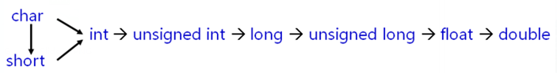

 

构造函数可以定义不同类型的参数；

参数满足下列条件时称为`转换构造函数`

- 有且仅有一个参数
- 参数是基本类型
- 参数是其他类类型

编译器的行为是进行`隐式类型转换`；


工程中通过`explicit`关键字杜绝编译器的转换尝试；

一般`单参数的构造函数`都声明为explicit；

转换构造函数被`explicit`修饰时只能进行`显式转换`；

```c++
//转换方式
static_cast<ClassName>(value);
ClassName(value);
(ClassName)value;	//不推荐
```

```c++
class Test
{
    int mValue;
public:
    Test()
    {
        mValue = 0;
    }
    
    explicit Test(int i)
    {
        mValue = i;
    }
    
    Test operator + (const Test& p)
    {
        Test ret(mValue + p.mValue);
        
        return ret;
    }
    
    int value()
    {
        return mValue;
    }
};

int main()
{   
    Test t;
    
    
    t = static_cast<Test>(5);    // t = Test(5);
    
    
    
    Test r;
    
    r = t + static_cast<Test>(10);   // r = t + Test(10);
    
    cout << r.value() << endl;
    
    return 0;
}
```

C++类中可以定义类型转换函数

类型转换函数用于`将类对象转换为其他类型`

```c++
operator Type()
{
	Type ret;
	……
	return ret;
}
```

**类型转换函数**

- 与转换构造函数具有同等的地位
- 使得编译器有能力`将对象转化为其他类型`
- 编译器能够`隐式的使用`类型转换函数

```c++
class Test;

class Value
{
public:
    Value()
    {
    }
    explicit Value(Test& t)
    {
    }
};

class Test
{
    int mValue;
public:
    Test(int i = 0)
    {
        mValue = i;
    }
    int value()
    {
        return mValue;
    }
    operator Value()
    {
        Value ret;
        cout << "operator Value()" << endl;
        return ret;
    }
};

int main()
{   
    Test t(100);
    Value v = t;
    
    return 0;
}
```

**注意：**

- `无法抑制`隐式的类型转换函数调用
- 类型转换函数可能与转换构造函数`冲突`
- 工程中以Type `toType()`的公有成员代替类型转换函数

# 继承

面向对象中的继承指类之间的父子关系

- 子类拥有父类的`所有属性和行为`
- 子类就是一种`特殊的父类`
- 子类对象可以当作父类对象使用
- 子类中可以`添加父类没有的`方法和属性

```c++
class Parent
{
    int mv;
public:
    void method(){};
};

class Child : public Parent	//描述继承关系
{
    
};
```

**重要规则：**

- 子类就是一个特殊的父类
- 子类对象可以直接初始化父类对象
- 子类对象可以直接赋值给父类对象

**继承的意义：**

通过继承，可以获得`父类的所有功能`，并且可以在子类中`重写已有功能`或者`添加新功能`，继承是面向对象中代码代码复用的重要手段；

## 继承中访问级别

面向对象中的访问级别不只是public和private；

可以定义`protected`访问级别；

protected关键字是为了继承而专门设计的；

关键字protected的意义：

- 修饰的成员`不能被外界直接访问`
- 修饰的成员`可以被子类直接访问`

```c++
class Parent
{
protected:
    int mv;

public:
    Parent()
    {
        mv = 100;
    }
    int value()
    {
        return mv;
    }
};

class Child : public Parent
{
public:
    int addValue(int v)
    {
        mv += v;
        return mv;
    }
};

int main()
{
    Parent p;
    cout << "p.mv = " << p.value() << endl;
    // p.mv = 1000;    // error

    Child c;
    cout << "c.mv = " << c.value() << endl;

    c.addValue(50);
    cout << "c.mv = " << c.value() << endl;
    // c.mv = 10000;  // error

    return 0;
}
```

**定义类时访问级别的选择**：

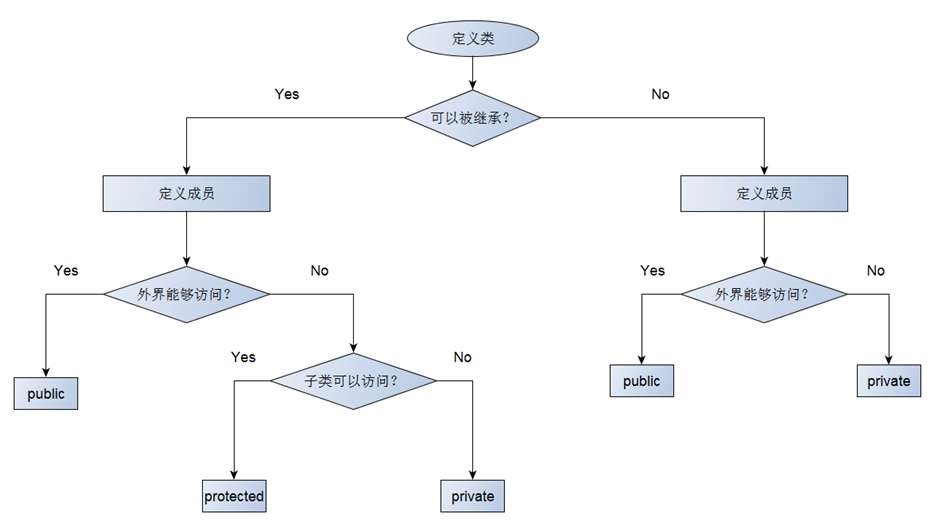

组合与继承综合实例:
需要一个父类Object, 为子类Point和子类Line 提供name名字和info信息；
由于线Line至少需要两个点Point才能组成,所以Line子类内部需要通过Point子类来组合；

```c++
class Object
{
protected:
    string mName;
    string mInfo;

public:
    Object()
    {
        mName = "Object";
        mInfo = "";
    }
    string name()
    {
        return mName;
    }
    string info()
    {
        return mInfo;
    }
};

class Point : public Object
{
private:
    int mX;
    int mY;

public:
    Point(int x = 0, int y = 0)
    {
        ostringstream s;
        this->mX = x;
        this->mY = y;
        s << "P(" << mX << "," << mY << ")"; // 坐标信息
        mName = "Point";
        mInfo = s.str();
    }
};

class Line : public Object
{
private:
    Point mP1;
    Point mP2;

public:
    Line(Point p1, Point p2)
    {
        ostringstream s;
        mP1 = p1;
        mP2 = p2;
        s << "Line from " << p1.info() << " to " << p2.info(); // 线的信息
        mName = "Line";
        mInfo = s.str();
    }
};

int main()
{
    Point p1(2, 3);
    Point p2(6, 3);
    Line L(p1, p2);

    /*打印点的信息*/
    cout << p1.name() << ":" << endl;
    cout << p1.info() << endl;

    /*打印线的信息*/
    cout << L.name() << ":" << endl;
    cout << L.info() << endl;
    return 0;

    return 0;
}
```

## 继承方式

C++中支持三种不同的继承方式

- public

父类成员在子类中`保持原有访问级别`

- private

父类成员在子类中`变为私有成员`

- protected

父类中的`公有成员变为保护成员`，其他成员保持不变

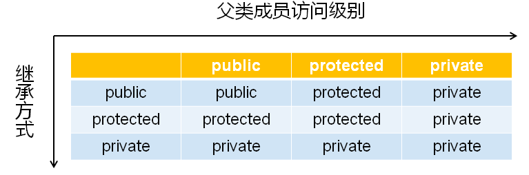

继承成员的访问属性 = Max{继承方式，父类成员访问属性}

C++中的默认继承方式为private；


**继承与访问级别深度实践**

```c++
#include <iostream>
#include <string>
using namespace std;

class Parent {
protected:
    int m_a;
    int m_b;
public:
    int m_c;
    
    void set(int a, int b, int c) {
        m_a = a;
        m_b = b;
        m_c = c;
    }
};

class Child_A : public Parent {
public:
    void print() {
        cout << "m_a " << m_a << endl;
        cout << "m_b " << m_b << endl;
        cout << "m_c " << m_c << endl;
    }
};

class Child_B : protected Parent {
public:
    void print() {
        cout << "m_a " << m_a << endl;
        cout << "m_b " << m_b << endl;
        cout << "m_c " << m_c << endl;
    }
};

class Child_C : private Parent {
public:
    void print() {
        cout << "m_a " << m_a << endl;
        cout << "m_b " << m_b << endl;
        cout << "m_c " << m_c << endl;
    }
};

int main() {
    Child_A a;
    Child_B b;
    Child_C c;
    
    a.m_c = 100;
    // b.m_c = 100;    // Child_B 保护继承自 Parent， 所以所有的 public 成员全部变成了 protected 成员， 因此外界无法访问
    // c.m_c = 100;    // Child_C 私有继承自 Parent， 所以所有的成员全部变成了 private 成员， 因此外界无法访问
    
    a.set(1, 1, 1);
    // b.set(2, 2, 2);
    // c.set(3, 3, 3);
    
    a.print();
    b.print();
    c.print();
    
    return 0;
}
```

一般而言，C++工程项目中`只使用public继承；`

C++派生语言只支持public一种继承方式；

protected和private继承带来的复杂性远大于实用性；

## 继承的构造和析构

**子类对象的构造函数**

- 必须对继承而来的成员进行初始化
- 直接通过`初始化列表`或者`赋值的方式`进行初始化
- `调用父类构造函数`进行初始化

**父类构造函数在子类中的调用方式**

- 默认调用：适用于无参构造函数和使用默认参数的构造函数
- 显式调用：通过初始化列表进行调用，适用于所有父类构造函数

```c++
class Child : public Parent
{
public:
    Child()	//隐式调用
    {
        
    }
    Child(String s) : Parent("Paremeter to Parent")	//显式调用
    {
        
    }
};
```

**构造规则**

- 子类对象在创建时会首先调用父类的构造函数
- `先执行父类构造函数`再执行子类的构造函数
- 父类构造函数可以被`隐式调用`或者`显式调用`

**对象创建时构造函数的调用顺序**

- 调用`父类`的构造函数
- 调用`成员变量`的构造函数
- 调用类`自身`的构造函数

```c++
class Object
{
public:
    Object(string s)
    {
        cout << "Object(string s) : " << s << endl;
    }
};

class Parent : public Object
{
public:
    Parent() : Object("Default")
    {
        cout << "Parent()" << endl;
    }
    Parent(string s) : Object(s)
    {
        cout << "Parent(string s) : " << s << endl;
    }
};

class Child : public Parent
{
    Object mO1;
    Object mO2;
public:
    Child() : mO1("Default 1"), mO2("Default 2")
    {
        cout << "Child()" << endl;
    }
    Child(string s) : Parent(s), mO1(s + " 1"), mO2(s + " 2")
    {
        cout << "Child(string s) : " << s << endl;
    }
};

int main()
{       
    Child cc("cc");
    
    return 0;
}
```

子类对象在销毁时需要调用父类析构函数进行清理；

析构函数的调用顺序与构造函数相反

- 执行`自身`的析构函数
- 执行`成员变量`的析构函数
- 执行`父类`的析构函数

## 父子类间的冲突

子类可以定义父类中的同名成员；

子类中的成员将`隐藏父类中的同名成员`；

父类中的同名成员`依然存在于子类中`；

通过`作用域分辨符`（::）访问父类中的同名成员；

```c++
class Parent
{
public:
    int mi;
    
    void add(int v)
    {
        mi += v;
    }
    
    void add(int a, int b)
    {
        mi += (a + b);
    }
};

class Child : public Parent
{
public:
    int mi;
    
    void add(int v)
    {
        mi += v;
    }
    
    void add(int a, int b)
    {
        mi += (a + b);
    }
    
    void add(int x, int y, int z)
    {
        mi += (x + y + z);
    }
};

int main()
{
    Child c;
    
    c.mi = 100;    
    c.Parent::mi = 1000;
    
    cout << "c.mi = " << c.mi << endl;
    cout << "c.Parent::mi = " << c.Parent::mi << endl;
    
    c.add(1);
    c.add(2, 3);
    c.add(4, 5, 6);
    
    cout << "c.mi = " << c.mi << endl;
    cout << "c.Parent::mi = " << c.Parent::mi << endl;
    
    return 0;
}
```

子类可以`定义`父类中的`同名成员`；

子类中的成员将`隐藏父类中的同名成员`；

子类和父类中的函数`不能构成重载`关系；

子类可以定义父类中`完全相同`的成员函数；

使用`作用域分辨符`访问父类中的同名成员；

## 同名覆盖引发的问题

子类对象可以当作父类对象使用（兼容性）

- 子类对象可以`直接赋值`给父类对象
- 子类对象可以`直接初始化`父类对象
- 父类指针可以`直接指向子类对象`
- 父类引用可以`直接引用子类对象`


子类对象的兼容性实验：

```c++
class Parent
{
public:
    int mi;

    void add(int v)
    {
        mi += v;
    }

    void add(int a, int b)
    {
        mi += (a + b);
    }
};

class Child : public Parent
{
public:
    int mv;
    
    void add(int x, int y, int z)
    {
        mv += (x + y + z);
    }
};

int main()
{
    Parent p;
    Child c;

    p = c;

    Parent p1(c);
    Parent& rp = c;
    Parent* pp = &c;

    rp.mi = 100;
    rp.add(5);
    rp.add(10, 10);

    // pp已退化为父类对象，只能访问父类成员
    // pp->mv = 1000;
    // pp->add(1, 2, 3);

    return 0;
}
```

当使用父类指针（引用）指向子类对象时

- 子类对象退化为父类对象
- `只能访问`父类中定义的成员
- 可以`直接访问`被子类`覆盖`的同名成员


子类中可以重定义父类中已经存在的成员函数，这种重定义`发生在继承中`，叫做函数`重写`；

函数重写是同名覆盖的一种特殊情况

```c++
class Parent
{
public:
    int mi;
    
    void add(int i)
    {
        mi += i;
    }
    
    void add(int a, int b)
    {
        mi += (a + b);
    }

    void print()
    {
        cout << "Parent print" << endl;
    }
};

class Child : public Parent
{
public:
    int mv;
    
    void add(int x, int y, int z)
    {
        mv += (x + y + z);
    }

    void print ()
    {
        cout << "Child print" << endl;
    }
};

/**在编译这个函数时，编译器不可能知道指针p究竟指向了什么。但是编译器没有理由报错。
  *于是，编译器认为 最安全的做法是调用父类的print函数，
  *因为，父类和子类肯定都有相同的print函数。*/
void how_to_print(Parent* p)
{
    p->print();
}

int main()
{
    Parent p;
    Child c;

    how_to_print(&p);   // Expected to print: Parent print.
    how_to_print(&c);   // Expected to print: Parent print.
    
    return 0;
}
```

# 多态

面向对象中的多态概念：

根据实际的`对象类型决定函数调用`的具体目标；

同样的`调用语句`在实际运行时有`多种不同的表现形态`；


**C++语言直接支持多态的概念**

- 通过使用`virtual`关键字对多态进行支持
- 被virtual声明的函数`被重写后具有多态特征`
- 被virtual声明的函数叫做`虚函数`

```c++
class Parent
{
public:
    virtual void print()
    {
        cout << "I'm Parent." << endl;
    }
};

class Child : public Parent
{
public:
    void print()
    {
        cout << "I'm Child." << endl;
    }
};

void how_to_print(Parent* p)
{
    p->print();     // 展现多态的行为
}

int main()
{
    Parent p;
    Child c;
    
    how_to_print(&p);    // Expected to print: I'm Parent.
    how_to_print(&c);    // Expected to print: I'm Child.
    
    return 0;
}
```


**多态的意义**

- 在程序`运行过程中`展现出`动态的特征`
- `函数重写必须多态实现`，否则没有意义
- 多态是面向对象组件化程序设计的基础

**理论中的概念**

- 静态联编：在程序的`编译期间`就能确定具体的函数调用，如：函数重载
- 动态联编：在`程序实际运行后`才能确定具体的函数调用， 如：函数重写

```c++
class Parent
{
public:
    virtual void func()
    {
        cout << "void func()" << endl;
    }
    
    virtual void func(int i)
    {
        cout << "void func(int i) : " << i << endl;
    }
    
    virtual void func(int i, int j)
    {
        cout << "void func(int i, int j) : " << "(" << i << ", " << j << ")" << endl;
    }
};

class Child : public Parent
{
public:
    void func(int i, int j)
    {
        cout << "void func(int i, int j) : " << i + j << endl;
    }
    
    void func(int i, int j, int k)
    {
        cout << "void func(int i, int j, int k) : " << i + j + k << endl;
    }
};

void run(Parent* p)
{
    p->func(1, 2);     // 展现多态的特性
                       // 动态联编
}


int main()
{
    Parent p;
    
    p.func();         // 静态联编
    p.func(1);        // 静态联编
    p.func(1, 2);     // 静态联编
    
    cout << endl;
    
    Child c;
    
    c.func(1, 2);     // 静态联编
    
    cout << endl;
    
    run(&p);
    run(&c);
    
    return 0;
}
```

**编程实例**

```c++
class Boss
{
public:
    int fight()
    {
        int ret = 10;
        
        cout << "Boss::fight() : " << ret << endl;
        
        return ret;
    }
};

class Master
{
public:
    virtual int eightSwordKill()
    {
        int ret = 8;
        
        cout << "Master::eightSwordKill() : " << ret << endl;
        
        return ret;
    }
};

class New_Master : public Master
{
public:
    int eightSwordKill()
    {
        int ret = Master::eightSwordKill() * 2;
        cout << "New_Master::eightSwordKill() : " << ret << endl;
        return ret; 
    }
};

void field_pk(Master* master, Boss* boss)
{
    int k = master->eightSwordKill();
    int b = boss->fight();
    
    if( k < b )
    {
        cout << "Master is killed..." << endl;
    }
    else
    {
        cout << "Boss is killed..." << endl;
    }
}

int main()
{
    Master master;
    Boss boss;

    cout << "Master vs Boss" << endl;
    field_pk(&master, &boss);

    cout << "New_Master vs Boss" << endl;
    New_Master newMaster;
    field_pk(&newMaster, &boss);

    return 0;
}
```

函数重写只可能发生在父类和子类之间；

`virtual`关键字是c++中支持多态的`唯一`方式；

`被重写的虚函数可表现为多态的特征；`

## 对象模型分析

本质class是一种特殊的struct

- 在内存中class依旧可以看作变量的集合
- class和struct遵循相同的内存对齐规则
- class中的成员函数与成员变量是`分开存放`的，每个对象有`独立的`成员变量，所有对象`共享`类中的成员函数

**对象本质分析**

成员变量：

- 运行时的对象`退化为结构体`的形式
- 所有`成员变量`在内存中依次排布
- 成员变量间可能存在内存空隙
- 可以`通过内存地址`直接访问成员变量
- <u>访问权限关键字在运行时失效</u>

成员函数：

- 类中的`成员函数`位于`代码段`中
- 调用成员函数时`对象地址作为参数隐式传递`
- 成员函数`通过对象地址`访问成员变量
- C++语法规则隐藏了对象地址的传递过程


下面用 C 语言模拟过程，显示的传递对象地址，以明白对象调用成员函数的过程。

```c
// ClassDemo.h
#ifndef _CLASSDEMO_H_
#define _CLASSDEMO_H_
typedef void Demo;
Demo* Demo_Create(int i, int j);
int Demo_GetI(Demo* pThis);
int Demo_GetJ(Demo* pThis);
int Demo_Add(Demo* pThis, int value);
void Demo_Free(Demo* pThis);
#endif

// ClassDemo.c
#include<malloc.h>
#include"ClassDemo.h"
struct ClassDemo
{
    int mi;
    int mj;
};
Demo* Demo_Create(int i, int j)
{
    struct ClassDemo* ret = (struct ClassDemo*)malloc(sizeof(struct ClassDemo));
    if (ret != NULL)
    {
        ret->mi = i;
        ret->mj = j;
    }
    return ret;
}
int Demo_GetI(Demo* pThis)
{
    struct ClassDemo* obj = (struct ClassDemo*)pThis;
    return obj->mi;
}
int Demo_GetJ(Demo* pThis)
{
    struct ClassDemo* obj = (struct ClassDemo*)pThis;
    return obj->mj;
}
int Demo_Add(Demo* pThis, int value)
{
    struct ClassDemo* obj = (struct ClassDemo*)pThis;
    return obj->mi + obj->mj + value;
}
void Demo_Free(Demo* pThis)
{
    free(pThis);
}

// main.c
#include<stdio.h>
#include"ClassDemo.h"
int main()
{
    Demo* d = Demo_Create(1, 2);
    printf("d.mi = %d\n", Demo_GetI(d));
    printf("d.mj = %d\n", Demo_GetJ(d));
    printf("Add(3) = %d\n", Demo_Add(d, 3));
    Demo_Free(d);
    return 0;
}
```

<u>在C++编译器的内部，类可以理解为结构体</u>；

子类是由父类成员叠加子类新成员得到的（ 父类在前，子类在后 ）

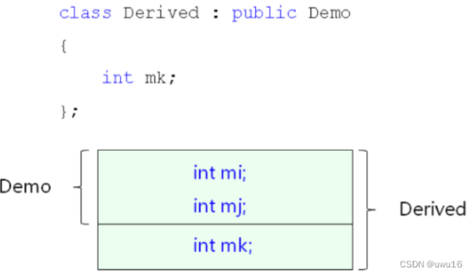

**C++多态的实现原理**

- 当类中`声明虚函数`时，编译器会在类中`生成一个虚函数表`
- 虚函数表是一个`存储成员函数地址的数据结构`
- 虚函数表是由编译器自动生成与维护的
- `virtual`成员函数会被编译器`放入虚函数表中`
- 存在虚函数时，每个对象中都有`一个指向虚函数表的指针`

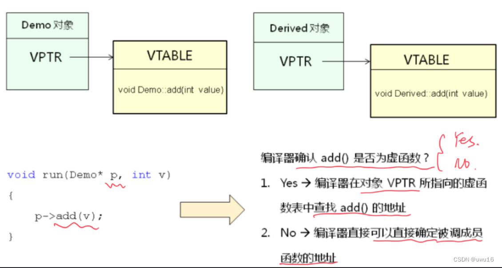


> 注意：指向虚函数表的指针放在**最开始的4个字节处**

```c
/*51-2.c*/
#include "51-2.h"
#include "malloc.h"

static int Demo_Virtual_Add(Demo* pThis, int value);
static int Derived_Virtual_Add(Demo* pThis, int value);

struct VTable   // 2、定义虚函数表数据结构
{
    int (*pAdd) (void*, int);   // 3、虚函数表里面存储什么
};

struct ClassDemo
{
    struct VTable* vptr;    // 1、定义虚函数表的指针==>虚函数表指针类型？？
    int mi;
    int mj;
};

struct ClassDerived
{
    struct ClassDemo d;
    int mk;
};

static struct VTable g_Demo_vtbl = 
{
    Demo_Virtual_Add
};

static struct VTable g_Derived_vtbl = 
{
    Derived_Virtual_Add
};


Demo* Demo_Create(int i, int j)
{
    struct ClassDemo* ret = (struct ClassDemo*)malloc(sizeof(struct ClassDemo));
    
    if( ret != NULL )
    {
        ret->vptr = &g_Demo_vtbl;   // 4、关联对象和指向的具体的虚函数表
        ret->mi = i;
        ret->mj = j;
    }
    
    return ret;
}

int Demo_GetI(Demo* pThis)
{
     struct ClassDemo* obj = (struct ClassDemo*)pThis;
     
     return obj->mi;
}

int Demo_GetJ(Demo* pThis)
{
    struct ClassDemo* obj = (struct ClassDemo*)pThis;
     
    return obj->mj;
}

// 6、定义虚函数表中指针所指向的具体函数
static int Demo_Virtual_Add(Demo* pThis, int value)
{
    struct ClassDemo* obj = (struct ClassDemo*)pThis;
     
    return obj->mi + obj->mj + value;
}

// 5、分析具体的虚函数
int Demo_Add(Demo* pThis, int value)
{
    struct ClassDemo* obj = (struct ClassDemo*)pThis;
     
    return obj->vptr->pAdd(pThis, value);   // 通过对象，找到指向虚函数表的指针，然后在虚函数表中找到具体要调用的函数地址
}

void Demo_Free(Demo* pThis)
{
    free(pThis);
}

Derived* Derived_Create(int i, int j, int k)
{
    struct ClassDerived* ret = (struct ClassDerived*)malloc(sizeof(struct ClassDerived));
    
    if( ret != NULL )
    {
        ret->d.vptr = &g_Derived_vtbl;
        ret->d.mi = i;
        ret->d.mj = j;
        ret->mk = k;
    }
    
    return ret;
}

int Derived_GetK(Derived* pThis)
{
    struct ClassDerived* obj = (struct ClassDerived*)pThis;
     
    return obj->mk;
}

static int Derived_Virtual_Add(Demo* pThis, int value)
{
    struct ClassDerived* obj = (struct ClassDerived*)pThis;
     
    return obj->mk + value;
}

int Derived_Add(Derived* pThis, int value)
{
    struct ClassDerived* obj = (struct ClassDerived*)pThis;
     
    return obj->d.vptr->pAdd(pThis, value);
}

/*51-2.h*/
#ifndef _51_2_H_
#define _51_2_H_

typedef void Demo;
typedef void Derived;

Demo* Demo_Create(int i, int j);
int Demo_GetI(Demo* pThis);
int Demo_GetJ(Demo* pThis);
int Demo_Add(Demo* pThis, int value);
void Demo_Free(Demo* pThis);

Derived* Derived_Create(int i, int j, int k);
int Derived_GetK(Derived* pThis);
int Derived_Add(Derived* pThis, int value);

#endif

/*main.c*/
#include "51-2.h"
#include "stdio.h"

void run(Demo* p, int v)
{
    int r = Demo_Add(p, v);
    printf("r = %d\n", r);
}

int main()
{
    Demo* pb = Demo_Create(1, 2);
    Derived* pd = Derived_Create(1, 22, 333);
    
    printf("pb->add(3) = %d\n", Demo_Add(pb, 3));
    printf("pd->add(3) = %d\n", Derived_Add(pd, 3));
    
    run(pb, 3);
    run(pd, 3);
    
    Demo_Free(pb);
    Demo_Free(pd);
    
    return 0;
}
```

继承的本质就是父子间`成员变量的叠加`；

C++中的多态是通过虚函数表实现的；

虚函数表是由编译器自动生成与维护；

虚函数的`调用效率低于`普通函数；

## 抽象类和接口

面向对象中的抽象类

- 一种`只能定义`类型，而`不能产生`对象的类
- `只能被继承并重写相关函数`
- 直接特征是相关函数`没有完整的实现`

**抽象类与纯虚函数**

- C++语言中没有抽象类的概念

- C++中通过纯虚函数实现抽象类
- 纯虚函数是指`只定义原型`的成员函数
- 一个C++类中`存在纯虚函数`就成为了抽象类

**纯虚函数的语法规则**

```c++
class Shape
{
public:
    virtual double area() = 0;
};
```

"= 0" 用于告诉编译器当前是`声明纯虚函数`，因此不需要定义函数体；

```c++
class Shape
{
public:
    virtual double area() = 0;
};

class Rect : public Shape
{
    int ma;
    int mb;
public:
    Rect(int a, int b)
    {
        ma = a;
        mb = b;
    }
    double area()
    {
        return ma * mb;
    }
};

class Circle : public Shape
{
    int mr;
public:
    Circle(int r)
    {
        mr = r;
    }
    double area()
    {
        return 3.14 * mr * mr;
    }
};

void area(Shape* p)
{
    double r = p->area();
    
    cout << "r = " << r << endl;
}

int main()
{
    Rect rect(1, 2);
    Circle circle(10);
    
    area(&rect);
    area(&circle);
    
    return 0;
}
```

- 抽象类`只能`用作父类`被继承`
- 子类必须实现纯虚函数的`具体功能`
- 纯虚函数被实现后`成为虚函数`
- 如果子类没有实现纯虚函数，则子类成为抽象类

**满足下面条件的C++类则称为接口**

- 类中`没有`定义任何的`成员变量`
- 所有的成员函数`都是公有的`
- 所有的成员函数`都是纯虚函数`
- 接口是一种`特殊的抽象类`

**接口初探：**

```c++
class Channel
{
public:
    virtual bool open() = 0;
    virtual bool close() = 0;
    virtual bool send(char* buf, int len) = 0;
    virtual bool receive(char* buf, int len) = 0;
};
```

## 多重继承

C++支持编写多重继承的代码

- 一个子类可以拥有多个父类
- 子类拥有`所有父类的`成员变量
- 子类继承`所有父类的`成员函数
- 子类对象可以`当作任意父类对象`使用

**多继承问题一：**


通过多重继承得到的对象可能拥有“`不同地址`”；


**多重继承问题二：**

```c++
class People
{
    string m_name;
    int m_age;

public:
    People(string name, int age)
    {
        m_name = name;
        m_age = age;
    }
    void print()
    {
        cout << "Name = " << m_name << ", "
             << "Age = " << m_age << endl;
    }
};

class Teacher : public People
{
public:
    Teacher(string name, int age) : People(name, age){}
};

class Student : public People
{
public:
    Student(string name, int age) : People(name, age){}
};

class Doctor : public Teacher, public Student
{
public:
    Doctor(string name, int age) : Teacher(name, age),Student(name, age){}
};

int main()
{
    Doctor d("Delphi", 33);
    
    d.Teacher::print();
    d.Student::print();

    return 0;
}
```

当多重继承关系出现闭合时将产生数据冗余的问题，多重继承可能产生冗余的成员；


**解决方案：`虚继承`**

```c++
class People {};
class Teacher : virtual public People {};
class Student : virtual public People {};
class Doctor : public Teacher, public Student {};
```

- 虚继承能够`解决数据冗余`问题
- 中间层父类不调用顶层父类构造函数
- 最终子类必须调用顶层父类的构造函数

> 当架构设计中需要继承时，无法确定使用直接继承还是虚继承，虚继承使得架构设计可能出现问题


**多重继承问题三：**

多重继承可能会产生多个虚函数表


需要进行强制类型转换时，C++中推荐使用新式类型转换关键字
解决方案：dynamic_cast


**正确使用多重继承：**

工程中开发中的“多重继承”方式——单继承某个类+实现（多个）接口

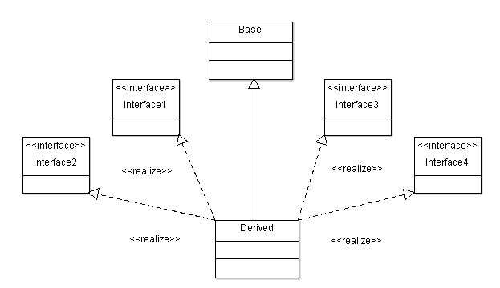

```c++
class Base
{
protected:
    int mi;
public:
    Base(int i)
    {
        mi = i;
    }
    int getI()
    {
        return mi;
    }
    bool equal(Base* obj)
    {
        return(this == obj);
    }
};

class Interface1
{
public:
    virtual void add(int i) = 0;
    virtual void minus(int i) = 0;
};

class Interface2
{
public:
    virtual void multiply(int i) = 0;
    virtual void divide(int i) = 0;
};

class Derived : public Base, public Interface1, public Interface2
{
public:
    Derived(int i) : Base(i) {}

    void add(int i)
    {
        mi += i;
    }
    void minus(int i)
    {
        mi -= i;
    }
    void multiply(int i)
    {
        mi *= i;
    }
    void divide(int i)
    {
        if( i != 0 )
        {
            mi /= i;
        }
    }
};

int main()
{
    Derived d(100);
    Derived* p = &d;
    Interface1* pInt1 = &d;
    Interface2* pInt2 = &d;
    
    cout << "p->getI() = " << p->getI() << endl;    // 100
    
    pInt1->add(10);
    pInt2->divide(11);
    pInt1->minus(5);
    pInt2->multiply(8);
    
    cout << "p->getI() = " << p->getI() << endl;    // 40
    cout << endl;

    cout << "pInt1 == p : " << p->equal(dynamic_cast<Base*>(pInt1)) << endl;
    cout << "pInt2 == p : " << p->equal(dynamic_cast<Base*>(pInt2)) << endl;

    return 0;
}
```

p->equal(dynamic_cast<Base*>(pInt1))为例，编译时，编译器就会去检查pInt1所在的地址，然后找到是d对象，通过d对象找到Base父类，从而去修正pInt1指针的地址；


**一些工程建议：**

- 先继承自`一个父类`，然后实现`多个接口`
- 父类中提供equal()成员函数，用于`判断指针是否指向当前对象`
- 与`多重继承`相关的强制类型转换用`dynamic_cast`完成

## 经典问题解析

### 关于动态内存分配

| new关键字是C++的一部分                | malloc是由C库函数提供的函数          |
| ------------------------------------- | ------------------------------------ |
| new以具体 **类型** 为单位进行内存分配 | malloc以 **字节** 为单位进行内存分配 |
| new在申请内存空间时可进行初始化       | malloc仅根据需要申请定量的内存空间   |
| new在所有C++编译器都被支持            | malloc在某些系统开发中是不能调用的   |
| new能够触发构造函数的调用             | malloc仅分配需要的内存空间           |
| 对象的创建只能使用new                 | malloc不适合面向对象开发             |

| delete在所有C++编译器中都被支持 | free在某些系统开发中是不能调用的 |
| ------------------------------- | -------------------------------- |
| delete能够触发析构函数的调用    | free仅归还之前分配的内存空间     |
| 对象的销毁只能使用delete        | free不适合面向对象开发           |

### 关于虚函数

构造函数`不可能`成为虚函数

- 在构造函数执行结束后，虚函数表指针才会被正确初始化

析构函数`可以`成为虚函数

- 建议在设计类时将析构函数声明为虚函数


将析构函数声明为虚函数后：


构造函数中`不可能`发生多态行为

- 在构造函数执行时，虚函数表指针未被正确初始化

析构函数中`不可能`发生多态行为

- 在析构函数执行时，虚函数表指针已经被销毁

### 关于继承中强制类型转换

- dynamic_cast是与`继承相关`的类型转换关键字

- dynamic_cast要求相关的类中`必须有虚函数`
- 用于直接或者间接`继承关系的指针`（引用）之间
  - 指针：
    - 转换成功：得到目标类型的指针
    - 转换失败：得到一个`空指针`
  - 引用：
    - 转换成功：得到目标类型的引用
    - 转换失败：得到一个`异常操作`信息

> 编译器会检查dynamic_cast的使用是否正确;
>
> 类型转换的结果只可能在**运行阶段**才能得到;


上述代码中，类的继承顺序是 class D：class C：class B：class A，
当pA是指向A类型的对象时（ pA = new A; ），向下转型失败，pA不能转换为B\*、C\*、D\*类型；

当pD是指向D类型的对象时（ pD = new D; ），向上转型成功，pD可以转换为A\*、B\*、C\*类型。

> 原因：因为每个类都会在内存中保存一份类型信息，编译器会将存在继承关系的类的类型信息使用指针“连接”起来，从而形成一个继承链，如下所示。
>   当使用 dynamic_cast 对指针进行类型转换时，程序会先找到该指针指向的对象，再根据对象找到当前类（指针指向的对象所属的类）的类型信息，并从此节点开始沿着继承链向上遍历，如果找到了要转化的目标类型，那么说明这种转换是安全的，就能够转换成功，如果没有找到要转换的目标类型，那么说明这种转换存在较大的风险，就不能转换。


> 补充：
>
> - dynamic_cast 用于在类的继承层次之间进行类型转换，它既允许向上转型（Upcasting），也允许向下转型（Downcasting）。向上转型是无条件的，不会进行任何检测，所以都能成功；向下转型的前提必须是安全的，要借助 RTTI 进行检测，所有只有一部分能成功。
> - dynamic_cast 与 static_cast 是相对的，dynamic_cast 是“动态转换”的意思，static_cast 是“静态转换”的意思。dynamic_cast 会在程序运行期间借助 RTTI 进行类型转换，这就要求基类必须包含虚函数；static_cast 在编译期间完成类型转换，能够更加及时地发现错误。
>   - 向上转型时，只要待转换的两个类型之间存在继承关系，并且基类包含了虚函数（这些信息在编译期间就能确定），就一定能转换成功。因为向上转型始终是安全的，所以 dynamic_cast 不会进行任何运行期间的检查，这个时候的 dynamic_cast 和 static_cast 就没有什么区别了。
>   - 向下转型是有风险的，dynamic_cast 会借助 RTTI 信息进行检测，确定安全的才能转换成功，否则就转换失败。
> - RTTI代表运行时类型信息，它提供了运行时确定对象类型的方法。

# 模板

定义宏代码块

- 优点：代码复用，适合所有的类型
- 缺点：编译器不知道宏的存在，缺少类型检查

定义函数

- 优点：真正的函数调用，编译器对类型进行检查
- 缺点：根据类型重复定义函数，无法代码复用

## 函数模板

**C++中泛型编程**

- 不考虑具体数据类型的编程方式

- 函数模板
  - 一种特殊的函数`可用不同类型进行调用`
  - 看起来和普通函数很相似，区别是`类型可被参数化`

```c++
template<typename T>
void Swap(T& a, T& b)
{
    T t = a;
    a = b;
    b = t;
}
```

>Swap泛型写法中的 **T** 不是一个具体的数据类型，而是**泛指任意的数据类型**


**函数模板的语法规则**

- `template`关键字用 `声明开始泛型编程`
- `typename`关键字用于`声明泛指类型`


**函数模板的使用**

- 自动类型推导调用
- 具体类型显示调用

```c++
int a = 0;
int b = 1;

Swap(a, b);	//自动推导

float c = 2;
float d = 3;

Swap<float>(c, d);	//显式调用
```

```c++
template <typename T>
void Swap(T& a, T& b)
{
    T c = a;
    a = b;
    b = c;
}

template <typename T>
void sort(T a[], int len)
{
    for(int i=0; i<len; i++)
    {
        for(int j=i; j<len; j++)
        {
            if( a[i] > a[j] )
            {
                Swap(a[i], a[j]);
            }
        }
    }
}

template <typename T>
void println(T a[], int len)
{
    for(int i=0; i<len-1; i++)
    {
        cout << a[i] << ", ";
    }
    cout << a[len - 1] << endl;
}

int main()
{
    int a[5] = {5, 3, 2, 4, 1};
    
    println(a, 5);
    sort(a, 5);
    println(a, 5);

    string s[5] = {"Java", "C++", "Pascal", "Ruby", "Basic"};
    println<string>(s, 5);
    sort<string>(s, 5);
    println<string>(s, 5);

    return 0;
}
```

函数模板是泛型编程在C++中的应用方式之一；
函数模板能够`根据实参对参数类型进行推导`；
函数模板`支持显示的指定参数类型`；
函数模板是C++中重要的代码复用方式之一；


**函数模板深入理解**

- 编译器从函数模板通过具体类型`产生不同的函数`

- 编译器会对函数模板进行`两次编译`
  - 对模板代码`本身`进行编译
  - 对参数`替换后`的代码进行编译

**注意事项：**

- 函数模板本身`不允许隐式类型转换`
  - 自动推导类型时，必须严格匹配
  - 显示类型指定时，能够进行隐式类型转换

> 编译器会对函数模板进行两次编译，两次编译实验：


**多参数函数模板**

- 函数模板可以定义任意多个不同的类型参数

```c++
template <typename T1, typename T2, typename T3>
T1 Add(T2 a, T3 b)
{
    return static_cast<T1>(a+b);
}

int r = Add<int, float, double>(0.5, 0.8);
```

**对于多参数函数模板**

- `无法自动推导返回值类型`
- 可以从左至右部分指定类型参数
- 工程中将`返回值参数`作为`第一个`类型参数


**函数模板可以像普通函数一样被重载**

- C++编译器优先考虑普通函数
- 如果函数模板可以产生一个更好的匹配，那么选择模板
- 可以 通过`空模板实参列表`限定编译器只匹配模板


## 类模板

一些类主要用于存储和组织数据元素，类中数据组织的方式和数据元素的具体类型无关，

C++中模板的思想应用于类，使得类的实现不关注数据元素的具体类型，而只关注类所需实现的功能；


**C++中的类模板**

- 以相同的方式处理不同的类型
- 在类声明前使用template进行标识
- `<typename T>` 用于说明类中使用的泛指类型T

```c++
template <typename T>
class Operator
{
public:
    T op(T a,T b);
};
```

**类模板的应用**

- `只能`显示指定具体类型，`无法`自动推导
- 使用具体类型 `<Type>` 定义对象

```c++
Operator<int> op1;
Operator<string> op2;
int i = op1.op(1, 2);
string s = op2.op("abc", "def");
```

- 声明的`泛指类型T`可以出现在类模板的任意地方
- 编译器对类模板的处理方式和函数模板相同
  - 类模板通过具体类型产生不同的类
  - `在声明的地方对类模板代码本身进行编译`
  - `在使用的地方对参数替换后的代码进行编译`

```c++
template <typename T>
class Operator
{
public:
    T add(T a, T b)
    {
        return a + b;
    }
    T minus(T a, T b)
    {
        return a - b;
    }
    T multiply(T a, T b)
    {
        return a * b;
    }
    T divide(T a, T b)
    {
        return a / b;
    }
};

string operator-(string& s1, string& s2)
{
    return "Minus";
}

int main()
{
    Operator<int> op1;
    cout << op1.add(111, 222) << endl;

    Operator<string> op2;
    cout << op2.add("aaa", "bbb") << endl;
    cout << op2.minus("aaa", "bbb") << endl;

    return 0;
}
```

**类模板的工程应用**

- 类模板必须在`头文件中定义`
- 类模板不能分开实现在不同的文件中
- 类模板`外部定义`的成员函数需要加上`模板<>`声明

```c++
/*Operator.h*/
#ifndef _OPERATOR_H_
#define _OPERATOR_H_

template <typename T>
class Operator
{
public:
    T add(T a, T b);
    T minus(T a, T b);
    T multiply(T a, T b);
    T divide(T a, T b);
};

template <typename T>           //外部定义的成员函数,都需要加上模板声明
T Operator<T>::add(T a, T b)    //同时加上模板<T>声明
{
    return a + b;
}

template <typename T>
T Operator<T>::minus(T a, T b)
{
    return a - b;
}

template <typename T>
T Operator<T>::multiply(T a, T b)
{
    return a * b;
}

template <typename T>
T Operator<T>::divide(T a, T b)
{
    return a / b;
}

#endif

/*test.cpp*/
#include <iostream>
#include <string>
#include "Operator.h"

using namespace std;

int main()
{
    Operator<int> op1;
    cout << op1.add(1, 2) << endl;
    cout << op1.multiply(4, 5) << endl;
    cout << op1.minus(5, 6) << endl;
    cout << op1.divide(10, 5) << endl;

    return 0;
}
```

> 类模板以相同的方式处理不同类型的数据；
>
> 类模板非常`适用于`编写`数据结构`相关代码；
>
> 类模板在使用时`只能显式指定类型`；


**多参数模板**

类模板可以定义`任意多个不同的`类型参数

```c++
template <typename T1, typename T2>
class Teest
{
public:
    void add(T1 a, T2 b);
}

Test<int, float> t;
```

## 类模板特化

模板本来是一组通用逻辑的实现，但是可能存在特定的参数类型下，通用的逻辑实现不能满足要求，这时就需要针对这些特殊的类型，而实现一个特例模板——即模板特化。

- 指定类模板的特定实现
- 部分类型参数必须显示指定
- 根据类型参数分开实现类模板


**类模板的特化类型**

- 部分特化：用特定规则约束类型参数
- 完全特化：完全显示指定类型参数

```c++
// 主模板类
template <typename T1, typename T2> 
class Test {};

// 完全特化
template < > 
class Test<int, int> {};

// 部分特化：对部分模板参数进行特化为一般类型
template <typename T2> 
class Test<int, T2> {};

// 部分特化：模板参数特化为指针
template <typename T1, typename T2> 
class Test<T1*, T2*> {};
```

```c++
template <typename T1, typename T2>
class Test
{
public:
    void add(T1 a, T2 b)
    {
        cout << "void add(T1 a, T2 b)" << endl;
        cout << a + b << endl;
    }
};

template <typename T>
class Test<T, T> // 当 Test 类模板的两个类型参数完全相同时，使用这个实现
{
public:
    void add(T a, T b)
    {
        cout << "void add(T a, T b)" << endl;
        cout << a + b << endl;
    }
    void print()
    {
        cout << "class Test < T, T >" << endl;
    }
};

template <>
class Test<void *, void *> // 当 T1 == void* 并且 T2 == void* 时
{
public:
    void add(void *a, void *b)
    {
        cout << "void add(void* a, void* b)" << endl;
        cout << "Error to add void* param..." << endl;
    }
};

template <typename T1, typename T2>
class Test<T1 *, T2 *> // 关于指针的特化实现
{
public:
    void add(T1 *a, T2 *b)
    {
        cout << "void add(T1* a, T2* b)" << endl;
        cout << *a + *b << endl;
    }
};

int main()
{
    Test<int, float> t1;
    Test<long, long> t2;
    Test<void *, void *> t3;

    t1.add(1, 2.5);
    t2.add(5, 5);
    t2.print();
    t3.add(NULL, NULL);
    Test<int *, double *> t4;
    int a = 1;
    double b = 0.1;
    t4.add(&a, &b);

    return 0;
}
```

**类模板特化注意事项**：

- 特化只是`模板的分开实现`
  - 本质上是同一个类模板
- 特化类模板的`使用方式是统一的`
  - 必须显示指定每一个类型参数


**重定义和特化的不同**

- 重定义
  - 一个类模板和一个新类（或者两个类模板）
  - 使用的时候需要考虑如何选择的问题
- 特化
  - 以统一的方式使用类模板和特化类
  - 编译器自动优先选择特化类

##  函数模板的特化

[部分内容可参考外部链接](https://blog.csdn.net/zhaominyong/article/details/109265862)

 **函数模板只支持类型参数完全特化；**


**工程中的建议：**

- 当需要重载函数模板时，`优先考虑使用模板特化`
- 当模板特化无法满足需求时，再使用函数重载（如上例）

## 数组模板

模板参数可以`数值型参数`（非类型参数）

```c++
template <typename T, int N>
void func()
{
    T a[N];
}

func<double, 10> ();
```

**数值型模板参数的限制**

- 变量不能作为模板参数
- 浮点数不能作为模板参数
- 类对象不能作为模板参数

本质：模板参数是在`编译阶段被处理的单元`，因此，在编译阶段必须准确无误的`唯一确定`；


**数值型模板参数实验：**


**数组模板类实验：**

```c++
/*Array.h*/
#ifndef _ARRAY_H_
#define _ARRAY_H_

template <typename T, int N>
class Array
{
    T m_Array[N];
public:
    int length();
    bool set(int index, T value);
    bool get(int index, T &value);
    T& operator[](int index);
    T operator[](int index) const;
    virtual ~Array();
};

template <typename T, int N>
int Array<T, N>::length()
{
    return N;
}

template <typename T, int N>
bool Array<T, N>::set(int index, T value) {
    bool ret = (0 <= index) && (index < N);
    if (ret) {
        m_Array[index] = value;
    }

    return ret;
}

template <typename T, int N>
bool Array<T, N>::get(int index, T& value) {
    bool ret = (0 <= index) && ( index < N);
    if (ret) {
        value = m_Array[index];
    }

    return ret;
}

template <typename T, int N>
T& Array<T, N>::operator[] (int index)
{
    return m_Array[index];
}

template <typename T, int N>
T Array<T, N>::operator[] (int index) const
{
    return m_Array[index];
}

template <typename T, int N>
Array<T, N>::~Array() {}

#endif

/*test.cpp*/
int main()
{
    Array<double, 5> ad;

    for (int i = 0; i < ad.length(); i++)
    {
        ad[i] = i * i;
    }

    for (int i = 0; i < ad.length(); i++)
    {
        cout << ad[i] << endl;
    }
    return 0;
}
```

## 智能指针类模板

**智能指针的意义**

- 现代C++开发库中最重要的类模板之一
- C++中自动内存管理的主要手段
- 能够很大程度上避开内存相关的问题
- 智能指针实际上是`将指针封装在一个类里`，通过`对象`来`管理指针`

**STL中的智能指针auto_ptr**

- 生命周期结束时，销毁指向的内存空间
- 不能指向堆数组，`只能指向堆对象（变量）`
- 一片堆空间只属于一个智能指针对象
- 多个智能指针对象`不能指向同一片堆空间`


**STL中的其它智能指针:**

- shared_ptr：带有引用计数机制，支持多个指针对象指向同一片内存
- weak_ptr：配合shared_ptr而引入的一种智能指针
- unique_ptr：一个指针对象指向一片内存空间，不能拷贝构造和赋值

**QT中的智能指针：**

- QPointer：
  当其指向的对象被销毁时，它会被自动置空
  析构时不会自动销毁所指向的对象
- QSharedPointer：
  引用计数型智能指针
  可以被自由地拷贝和赋值
  当引用计数为0时才删除指向的对象

**Qt中的其它智能指针：**

QWeakPointer
QScopedPointer
QScopedArrayPointer
QSharedDataPointer
QExplicitlySharedDataPointer


**智能指针类模板实验：**

```c++
/*SmartPointer.h*/
#ifndef _SMARTPOINTER_H_
#define _SMARTPOINTER_H_

template <typename T>
class SmartPointer
{
    T *mp;

public:
    SmartPointer(T *p = NULL){mp = p;} 
    SmartPointer(const SmartPointer<T> &obj)
    {
        mp = obj.mp;
        const_cast<SmartPointer<T> &>(obj).mp = nullptr;
    }
    SmartPointer<T> &operator=(const SmartPointer<T> &obj)
    {
        if (this != obj)
        {
            delete mp;
            mp = obj.mp;
            const_cast<SmartPointer<T> &>(obj).mp = nullptr;
        }
        return *this;
    }
    T *operator->() { return mp; }
    T &operator*() { return *mp; }
    bool isNull() { return (mp == nullptr); }
    T* get() { return mp; }
    ~SmartPointer() { delete mp; }
};

#endif

/*test.cpp*/
#include <iostream>
#include <string>
#include "SmartPointer.h"

using namespace std;

class Test
{
    string m_name;

public:
    Test(const char *name)
    {
        cout << "Hello, " << name << "." << endl;

        m_name = name;
    }

    void print()
    {
        cout << "I'm " << m_name << "." << endl;
    }

    ~Test()
    {
        cout << "Goodbye, " << m_name << "." << endl;
    }
};

int main()
{
    SmartPointer<Test> pt(new Test("Wong software"));
    cout << "pt = " << pt.get() << endl;
    pt->print();

    cout << endl;

    SmartPointer<Test> pt1(pt);
    cout << "pt = " << pt.get() << endl;
    cout << "pt = " << pt1.get() << endl;
    pt1->print();

    return 0;
}
```

智能指针在各种平台上都有不同的表现形式；

STL和Qt中都提供了对智能指针的支持；

## 单例类模板

**单例模式**

在架构设计时，某些类在整个系统生命期中`最多只能有一个对象存在`（Single Instance）

- 要控制类的对象数目，必须`对外隐藏构造函数`
  - 将构造函数的访问属性设置为`private`
  - 定义instance并初始化为NULL
  - 当需要使用对象时，`访问instance的值`
    - 空值：创建对象，并用instance标记
    - 非空值：返回instance标记的对象


**在单例类里,又分为了懒汉式和饿汉式,它们的区别在于创建实例的时间不同:**

- **懒汉式 :** 指代码运行后，`实例并不存在`，只有当需要时，才去创建实例`(适用于单线程)`
- **饿汉式 :** 指代码一运行，`实例已经存在`，当时需要时，直接去调用即可`(适用于多线程)`

```c++
class SObject
{
    static SObject* c_instance;

    // 将构造函数，拷贝构造函数，赋值函数全部私有化，外部无法创建对象
    SObject(){}
    SObject(const SObject&);
    SObject& operator = (const SObject&);

public:
    static SObject* GetInstance();

    void print()
    {
        cout << "this = " << this << endl;
    }
};

SObject* SObject::c_instance = nullptr;

SObject* SObject::GetInstance()
{
    if(c_instance == nullptr)
    {
        c_instance = new SObject();
    }

    return c_instance;
}

int main()
{
    SObject* s = SObject::GetInstance();
    SObject* s1 = SObject::GetInstance();
    SObject* s2 = SObject::GetInstance();

    s->print();
    s1->print();
    s2->print();
    
    return 0;
}
```

> 由于实例(instance),在系统生命期中,都是存在的,所以只要系统还在运行,就不需要**delete**


上面的懒汉式如果在**多线程情况下** ,多个SObject指针对象同时调用GetInstance()成员函数时,由于c_instance= NULL,就会创建多个实例出来.(除非使用mutex来添加互斥)

所以在多线程情况下，需要使用饿汉模式；

```C++
class SObject
{
    // 将构造函数，拷贝构造函数，赋值函数全部私有化，外部无法创建对象
    SObject(){}
    SObject(const SObject&);
    SObject& operator = (const SObject&);

public:
    static SObject& GetInstance()
    {
        static SObject c_instance;
        return c_instance;
    }

    void print()
    {
        cout << "this = " << this << endl;
    }
};

int main()
{
    SObject& s = SObject::GetInstance();
    SObject& s1 = SObject::GetInstance();
    SObject& s2 = SObject::GetInstance();

    s.print();
    s1.print();
    s2.print();
    
    return 0;
}
```

> 注意：类函数中如果使用static静态局部变量，那么该变量是不安全的，因为static变量是一直存在的，所有对象都会共享这个变量.


将单例模式相关的代码抽取出来，开发单例类模板。当需要单例类时，直接使用单例类模板。

```c++
#ifndef _SINGLETON_H_
#define _SINGLETON_H_

template
<typename T>
class Singleton {
    static T* c_instance;
public:
    static T* GetInstance();
};

template
<typename T>
T* Singleton<T>::c_instance = NULL;

template
<typename T>
T* Singleton<T>::GetInstance() {
    if (c_instance == NULL) {
        c_instance = new T();
    }
    return c_instance;
}

#endif
```

饿汉模式：

```c++
#ifndef _SINGLETON_H_
#define _SINGLETON_H_

template <typename T>
class Singleton
{
public:
    static T& GetIntance()
    {
        static T c_instance;
        return c_instance;
    }
};

#endif

/**/
class SObject
{
    friend class Singleton<SObject>;	//当需要这个单例类模板时,只需在类里通过friend添加为友元即可
    SObject(){}
    SObject(const SObject&);
    SObject& operator = (const SObject&);

public:
    void print()
    {
        cout << "this = " << this << endl;
    }
};

int main()
{
    SObject& s = Singleton<SObject>::GetIntance();
    SObject& s1 = Singleton<SObject>::GetIntance();
    SObject& s2 = Singleton<SObject>::GetIntance();
    
    s.print();
    s1.print();
    s2.print();

    return 0;
}
```

- 单例模式是开发中最常用的设计模式之一
- 单例模式的应用使得`一个类最多只有一个对象`
- `可以将单例模式相关的代码抽象成类模板`
- 需要使用单例模式的类直接使用单例模板

# 异常处理

C++内置了异常处理的语法元素 try……catch……

- try语句用于处理正常代码逻辑
- catch语句用于处理异常情况
  - try语句中的异常由对应的catch语句处理

```c++
try
{
    double r = divide(1, 0);
}
catch(……)
{
    cout << "Divided by zero……" << endl;
}
```

**C++通过throw语句抛出异常信息**

```c++
double divide(double a, double b)
{
    const double delta = 0.000000000000001;
    double ret = 0;
    
	if( !((-delta < b) && (b < delta)) ) {
        ret = a / b;
    }
	else {
        throw 0;// 产生除 0 异常
    }
	return ret;
}
```

**C++异常处理分析：**

throw抛出的异常必须被catch处理；

- 当前函数`能够处理异常`，程序继续往下执行
- 当前函数`无法处理异常`，则函数停止运行，并返回
- `未被处理的异常`会顺着`函数调用栈`向上传播，直到被处理为止，否则程序将停止执行


`同一个try`语句可以跟上`多个catch`语句

- catch语句可以定义具体处理的异常类型
- 不同类型的异常由`不同的catch语句`负责处理
- try语句中可以抛出任何类型的异常
- `catch(…)` 用于处理`所有类型的异常`（只能放在最后）
- 任何异常都只能被捕获`(catch)一次`


**异常处理的匹配规则**


>异常处理匹配时，**不进行任何的类型转换**


**catch语句块中可以抛出异常**

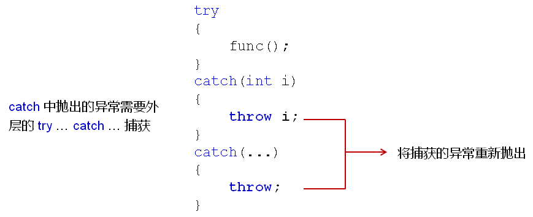


catch中捕获的异常可以被重新解释后抛出；

工程开发中使用这样的方式统一异常类型，如下：


```C++
/*
    假设： 当前的函数式第三方库中的函数，因此，我们无法修改源代码
    函数名： void func(int i)
    抛出异常的类型： int    -1 ==》 参数异常    -2 ==》 运行异常    -3 ==》 超时异常
*/
void func(int i)
{
    if( i < 0 )
    {
        throw -1;
    }
    
    if( i > 100 )
    {
        throw -2;
    }
    
    if( i == 11 )
    {
        throw -3;
    }
    
    cout << "Run func..." << endl;
}

void MyFunc(int i)
{
    try
    {
        func(i);
    }
    catch(int i)
    {
        switch (i)
        {
        case -1:
            throw "Invalid Parameter";
            break;
        case -2:
            throw "Runtime Exception";
            break;
        case -3:
            throw "Timeout Exception";
            break;
        }
    }
}

int main(int argc, char const *argv[])
{
    try
    {
        MyFunc(11);
    }
    catch(const char* s)
    {
        cout << "Exception Info: " << s << endl;
    }
    
    return 0;
}
```

- 异常的类型可以是`自定义类类型`

- 对于类类型异常的匹配依旧是`至上而下严格匹配`
- `赋值兼容性原则`在异常匹配中依然适用
  - 匹配子类异常的catch放在上部
  - 匹配父类异常的catch放在下部

- 在工程开发中会定义一系列的异常类
- 每个类代表工程中可能出现的一种异常类型
- `代码复用`时可能需要`重新解释不同的异常类`
- 在定义catch语句块时`推荐使用引用作为参数`

```c++
class Base {};

class Exception : public Base
{
    int m_id;
    string m_desc;
public:
    Exception(int id, string desc)
    {
        m_id = id;
        m_desc = desc;
    }
    int id() const
    {
        return m_id;
    }
    string description() const
    {
        return m_desc;
    }
};

/*
    假设： 当前的函数是第三方库中的函数，因此，我们无法修改源代码
    函数名： void func(int i)
    抛出异常的类型： int    -1 ==》 参数异常    -2 ==》 运行异常    -3 ==》 超时异常
*/
void func(int i)
{
    if( i < 0 )
    {
        throw -1;
    }
    
    if( i > 100 )
    {
        throw -2;
    }
    
    if( i == 11 )
    {
        throw -3;
    }
    
    cout << "Run func..." << endl;
}

void MyFunc(int i)
{
    try
    {
        func(i);
    }
    catch(int i)
    {
        switch(i)
        {
            case -1:
                throw Exception(-1,"Invalid Parameter");
                break;
            case -2:
                throw Exception(-2,"Runtime Exception");
                break;
            case -3:
                throw Exception(-3,"Timeout Exception");
                break;
        }
    }
}

int main(int argc, char const *argv[])
{
    try
    {
        MyFunc(11);
    }
    catch(const Exception& e)
    {
        cout << "Exception Info: " << e.description() << endl;
    }
    catch(const Base& e)
    {
        cout << "catch(const Base& e)" << endl;
    }
    
    return 0;
}
```

**C++标准库中提供了实用异常类**

- 标准库中的异常都是从`exception类`派生的
- exception类有两个主要的分支：
  - logic_error：常用语程序中的`可避免`逻辑错误
    - domain_error(const string& )    ：   专业领域内的范畴
    - invalid_argument(const string& )   ：  无效参数,比如对unsigned型进行负数操作
    - length_error(const string& )  ：    长度异常,比如字符串附加太多字符
    - out_of_range(const string&)     :    超出范围,比如数组下标越界
    - 它们都有一个what()成员函数,用来返回一个字符串异常信息
  - runtime_error：常用语程序中`无法避免`的恶性错误
    - range_error(const string& )  ：内部计算时发生区间错误
    - overflow_error(const string& )  ：算数运算时发生上溢
    - underflow_error(const string& )  ：算数运算时发生下溢
    - 它们都有一个what()成员函数,用来返回一个字符串异常信息


```c++
#include <iostream> 
#include <stdexcept>
 
using namespace std;
 
template <typename T, int N >
class Array
{
       T ma[N];
public:
       Array()
       { 
              for(int i=0;i<N;i++)
              ma[N]=0;
       }
 
       T& operator [] (int index)
       {  
              if((index>=0)&&(index<N))
              {
                     return ma[index];
              }
 
              else	//数组下标越界
              {
                  throw out_of_range("T& operator [] (int index)"); //抛出一个 out_of_range类
              }  
       }
};
 
int main()
{
       try
       {
              Array<int,5> arr;
              arr[10]=100;
       }
       catch(out_of_range& exc)
       {
              cout<< exc.what()<<endl;	//打印捕获到out_of_range类的异常信息
              cout<< " Line: " << __LINE__ <<", Function: "<< __FUNCTION__ << endl;  //打印当前行
       }
       return 0;
}
```

## 异常处理深度解析


- 如果异常无法被处理，`terminate()结束函数会被自动调用`
- 默认情况下，terminate()调用库函数abort()终止程序
- abort()函数使得程序执行异常而`立即退出`
- C++支持`自定义的结束函数`来替换默认的terminate()函数实现

**terminate()函数的替换：**

- `自定义一个无返回值无参数的函数`
  - 不能抛出任何异常
  - 必须以某种方式结束当前程序
- 调用set_terminate()设置自定义的结束函数
  - 参数类型为void(*)()
  - 返回值为默认的terminate()函数入口地址


**编程实验：析构函数抛出异常**


- 如果异常没有被处理，`最后terminate()结束整个程序`
- terminate()是整个程序`释放资源的最后机会`
- 结束函数可以自定义，但不能继续抛出异常
- `析构函数不能抛出异常`，可能导致terminate()多次调用

## 函数异常规格

- C++提供语法用于声明函数所抛出的异常
- 异常声明作为函数声明的修饰符，写在参数列表后面


 **异常规格说明的意义：**

- 提示函数调用者必须`做好异常处理的准备`
- 提示函数的维护者`不要抛出其它异常`
- 异常规格说明是`函数接口的一部分`

## 异常规格之外的异常

- 函数抛出的`异常不在规格说明中`，全局`unexpected()`被调用
- 默认的unexpected()函数会调用全局的terminate()函数
- 可以自定义函数替换默认的unexpected()函数实现
- 注意：`不是所有的C++编译器`都支持这个标准行为


**unexpected()函数的替换**

- `自定义一个无返回值无参数的函数`
  - 能够再次抛出异常
    - 当异常符合触发函数的异常规格说明时，恢复程序执行
    - 否则，调用全局terminate()函数结束程序
  - `调用set_unexpected()设置自定义的异常函数`
    - 参数类型为void(*)()
    - 返回值为默认的unexpected()函数入口地址


- C++中的函数可以声明异常规格说明
- 异常规格说明可以看作`接口的一部分`
- 函数抛出的`异常不在规格说明中`，unexpected()被调用
- unexpected()中能够再次抛出异常
  - `异常能够匹配，恢复程序的执行`
  - `否则，调用terminate()结束程序`

# 类型识别

在面向对象中可能出现下面的情况：

- 基类指针指向子类对象
- 基类引用成为子类对象的别名


这个时候就会出现问题：（由于**赋值兼容性原则**）没法通过一个父类指针判断指向的是父类对象还是子类对象

- 静态类型：变量（对象）自身的类型
- 动态类型：指针（引用）所指向对象的实际类型


基类指针是否可以强制类型转换为子类指针取决于动态类型；


**解决方案——利用多态**

- 在基类中`定义虚函数`返回具体的类型信息
- 所有的派生类都`必须实现`类型相关的虚函数
- 每个类中的类型虚函数`都需要不同的实现`


**多态解决方案的缺陷**

- 必须从基类开始提供类型虚函数
- 所有的派生类都必须重写类型虚函数
- 每个派生类的类型名必须唯一

**类型识别关键字**

- C++提供了`typeid关键字`用于获取类型信息
  - typeid关键字返回对应参数的`类型信息`
  - typeid返回一个`type_info类对象`
  - 当typeid的参数为`NULL`时将`抛出异常`

**typeid关键字的使用**

```c++
int i = 0;
const type_info& tiv = typeid(i);
const type_info& tii = typeid(int);
cout << (tiv == tii) << endl;
```

 **typeid的注意事项**

- 当参数为`类型`时：返回静态类型信息
- 当参数为`变量`时：
  - 不存在虚函数表 – 返回静态类型信息
  - 存在虚函数表 – 返回动态类型信息

```c++
class Base
{
public:
    virtual ~Base() = default;
};

class Derived : public Base
{

};

class Child : public Base
{
  
};

void get_TypeInfo(Base* b)
{
    const type_info& ti = typeid(*b);
    cout << ti.name() << endl;
}

int main(int argc, char *argv[])
{
    int i = 0;
    
    const type_info& tiv = typeid(i);
    const type_info& tii = typeid(int);
    
    cout << (tiv == tii) << endl;
    
    Base b;
    Derived d;
    
    get_TypeInfo(&b);
    get_TypeInfo(&d);
    return 0;
}
```

# 经典问题解析

## 指针的判别

C++中仍然支持C语言中的可变参数函数；

C++编译器的匹配调用`优先级`：重载函数 > 函数模板 > 变参函数

```c++
void test(int i)
{
    cout << "void test(int i)" << endl;
}

template <typename T>
void test(T v)
{
    cout << "void test(T v)" << endl;
}

void test(...)
{
    cout << "void test(...)" << endl;
}

int main(int argc, char *argv[])
{
    int i = 0;

    test(i);

    return 0;
}
```

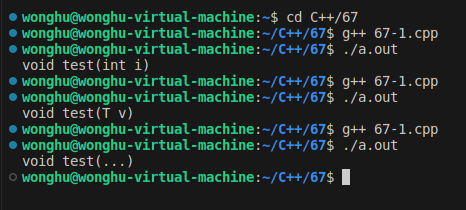 

将变量分为两类：指针 VS 非指针，编写函数：

- 指针变量调用时返回true
- 非指针变量调用时返回false

 

根据参数的匹配，返回true就是指针，变参函数返回false就不是指针。

然而该程序还是存在缺陷的，变参函数无法解析对象参数，可能造成程序崩溃；


**解决方案：**

让编译器精确匹配函数，不进行实际的调用，只去进行匹配而不运行；

```c++
class Test
{
public:
    Test() = default;
    virtual ~Test() = default;
};

template <typename T>
char IsPtr(T *v) // match pointer
{
    return 'd';
}

int IsPtr(...) // match non-pointer
{
    return 0;
}

#define ISPTR(p) (sizeof(IsPtr(p)) == sizeof(char))

int main(int argc, char *argv[])
{
    int i = 0;
    int *p = &i;

    cout << "p is a pointer: " << ISPTR(p) << endl; // true
    cout << "i is a pointer: " << ISPTR(i) << endl; // false

    Test t;
    Test *pt = &t;

    cout << "pt is a pointer: " << ISPTR(pt) << endl; // true
    cout << "t is a pointer: " << ISPTR(t) << endl;   // false

    return 0;
}
```

> 注解： 编译器编译阶段根据参数类型，判断使用哪个函数，sizeof可以根据函数类型给出相应计算结果(没有调用函数)。

## 构造函数中抛出异常

- 构造过程立即停止
- 当前对象无法生成
- 析构函数不会被调用
- 对象所占用的空间立即收回

**工程项目中的建议：**

- `不要在构造函数中抛出异常`
- 当构造函数可能产生异常时，`使用二阶构造模式`


**析构中的异常**

应避免在析构函数中抛出异常！

析构函数的异常将导致对象所使用的资源无法完全释放；

## 令人迷惑的写法

**typename的作用：**

- 在模板定义中声明泛指类型
- 明确告诉编译器其后的标识符为`类型`


**捕获异常的写法**

- try catch用于`分隔`正常功能代码与异常处理代码
- try catch可以直接将函数实现`分隔为2部分`
- 函数声明和定义时可以`直接指定可能抛出的异常类型`
- 异常声明成为函数的一部分可以提高代码可读性

**函数异常声明的注意事项**

- 函数异常声明是一种与编译器之间的契约
- 函数声明异常后就只能抛出声明的异常
  - 抛出其它异常将导致程序运行终止
  - 可以直接通过异常声明定义无异常函数


不常用的动态异常例子（c++ 11中不支持动态异常规范）


# 自定义内存管理

**关键字mutable**

- mutable是为了`突破const函数的限制`而设计的
- mutable成员变量将`永远处于可改变的状态`
- mutable在实际的项目开发中被`严禁滥用`

**mutable的深入分析**

- mutable成员变量`破坏了只读对象的内部状态`
- const成员函数保证只读`对象的状态不变性`
- mutable成员变量的出现`无法保证`状态不变性


**避免使用mutable，如下：**


**new关键字创建出来的对象位于什么地方**

- `new / delete`的本质是C++预定义的`操作符`
- C++对这两个操作符做了严格的行为定义
  - new：
    - 获取足够大的内存空间（`默认为堆空间`）
    - 在获取的空间中`调用构造函数创建对象`
  - delete：
    - 调用析构函数销毁对象
    - 归还对象所占用的空间（`默认为堆空间`）

**C++中能够重载new/delete操作符**

全局重载（不推荐）
局部重载（针对具体类进行重载）

- 重载new/delete的意义在`改变动态对象创建时的内存分配方式`（可以换静态存储区，不放在堆空间中）

 **new/delete的重载方式**


 

```c++
class Test
{
    static const unsigned int COUNT = 4;
    static char c_buffer[];
    static char c_map[];

    int m_value;

public:
    void *operator new(size_t size)
    {
        void *ret = nullptr;
        for (int i = 0; i < COUNT; i++)
        {
            if (!c_map[i])
            {
                c_map[i] = 1;
                ret = c_buffer + i * sizeof(Test);
                cout << "succeed to allocate memory: " << ret << endl;
                break;
            }
        }
        return ret;
    }
    void operator delete(void *p)
    {
        if (p != nullptr)
        {
            char *mem = reinterpret_cast<char *>(p);
            int index = (mem - c_buffer) / sizeof(Test);
            int flag = (mem - c_buffer) % sizeof(Test);

            if ((flag == 0) && (0 <= index) && (index < COUNT))
            {
                c_map[index] = 0;
                cout << "succeed to free memory: " << p << endl;
            }
        }
    }
};

char Test::c_buffer[sizeof(Test) * Test::COUNT] = {0};
char Test::c_map[Test::COUNT] = {0};

int main(int argc, char const *argv[])
{
    cout << "===== Test Single Object =====" << endl;
    Test *pt = new Test;
    delete pt;

    cout << "===== Test Object Array =====" << endl;
    Test *pa[5] = {0};
    for (int i = 0; i < 5; i++)
    {
        pa[i] = new Test;
        cout << "pa[" << i << "] = " << pa[i] << endl;
    }
    for (int i = 0; i < 5; i++)
    {
        cout << "delete" << pa[i] << endl;
        delete pa[i];
    }

    return 0;
}
```

**如何在指定的地址上创建C++对象**

- 在类中`重载new/delete`操作符
- 在new的操作符重载函数中`返回指定的地址`
- 在delete操作符重载中标`记对应的地址可用`

```c++
#include <iostream>
#include <cstdlib>

using namespace std;

class Test
{
    static unsigned int c_count;
    static char *c_buffer;
    static char *c_map;

    int m_value;

public:
    static bool setMemorySource(char *memory, unsigned int size)
    {
        bool ret = false;
        c_count = size / sizeof(Test);
        ret = (c_count && (c_map = reinterpret_cast<char *>(calloc(c_count, sizeof(char)))));

        if (ret)
        {
            c_buffer = memory;
        }
        else
        {
            free(c_map);
            c_map = nullptr;
            c_buffer = nullptr;
            c_count = 0;
        }

        return ret;
    }

    void *operator new(size_t size)
    {
        void *ret = nullptr;
        if (c_count > 0)
        {
            for (int i = 0; i < c_count; i++)
            {
                if (!c_map[i])
                {
                    c_map[i] = 1;
                    ret = c_buffer + i * sizeof(Test);
                    cout << "succeed to allocate memory: " << ret << endl;
                    break;
                }
            }
        }
        else
        {
            ret = malloc(size);
        }
        return ret;
    }
    void operator delete(void *p)
    {
        if (c_count > 0)
        {
            if (p != nullptr)
            {
                char *mem = reinterpret_cast<char *>(p);
                int index = (mem - c_buffer) / sizeof(Test);
                int flag = (mem - c_buffer) % sizeof(Test);

                if ((flag == 0) && (0 <= index) && (index < c_count))
                {
                    c_map[index] = 0;
                    cout << "succeed to free memory: " << p << endl;
                }
            }
        }
        else
        {
            free(p);
        }
    }
};

unsigned int Test::c_count = 0;
char *Test::c_buffer = nullptr;
char *Test::c_map = nullptr;

int main(int argc, char const *argv[])
{
    char buffer[12] = {0};
    Test::setMemorySource(buffer, sizeof(buffer));

    cout << "===== Test Single Object =====" << endl;
    Test *pt = new Test;
    delete pt;

    cout << "===== Test Object Array =====" << endl;
    Test *pa[5] = {0};
    for (int i = 0; i < 5; i++)
    {
        pa[i] = new Test;
        cout << "pa[" << i << "] = " << pa[i] << endl;
    }
    for (int i = 0; i < 5; i++)
    {
        cout << "delete" << pa[i] << endl;
        delete pa[i];
    }

    return 0;
}
```

**new[] / delete[] 与 new / delete 完全不同**

- 动态对象数组创建通过new[]完成
- 动态对象数组的销毁通过delete[] 完成
- new[] / delete[] 能够被重载，进而改变内存管理方式

**new[] / delete[] 的重载方式**


**注意事项：**

- new[] 实际需要`返回的内存空间`可能`比期望的要多`
- 对象数组占用的内存中`需要保存数组信息`
- 数组信息用于确定构造函数和析构函数的调用次数

```c++
class Test
{
    int m_value;

public:
    Test()
    {
        m_value = 0;
    }
    ~Test() {}

    void *operator new(size_t size)
    {
        cout << "operator new: " << size << endl;

        return malloc(size);
    }

    void operator delete(void *p)
    {
        cout << "operator delete: " << p << endl;

        free(p);
    }

    void *operator new[](size_t size)
    {
        cout << "operator new[]: " << size << endl;

        return malloc(size);
    }

    void operator delete[](void *p)
    {
        cout << "operator delete[]: " << p << endl;

        free(p);
    }
};

int main(int argc, char const *argv[])
{
    Test* pt = nullptr;
    pt = new Test;
    delete pt;

    pt = new Test[6];
    delete[] pt;

    return 0;
}
```

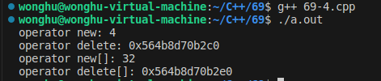

# 动态内存

**常见的动态内存分配代码**

```c++
//C代码
int* p = (int*)malloc(10 * sizeof(int));
if( p != NULL )
{
    ......
}

//C++代码
int* p = new int[10];
if( p != NULL )
{
    ......
}
```

**事实上：**

- malloc函数申请失败时返回`NULL`值
- new关键字申请失败时（根据编译器不同）
  - 返回`NULL`值
  - 抛出`std::bad_alloc`异常


**new关键字在C++规范中的标准行为**

- 在堆空间申请足够大的内存
  - 成功
    在获取的空间中调用构造函数创建对象
    返回对象的地址
  - 失败
    抛出std::bad_alloc异常
- new在分配内存时：
  - 如果空间不足，会调用全局的new_handler()函数
  - new_handler()函数中抛出std::bad_alloc异常
- 可以自定义new_handler()函数
  - 处理默认的new内存分配失败的情况


**new_handler()的定义和使用：**

```c++
void my_new_handler()
{
    cout << "No enough memory" << endl;
    exit(1);
}

int main()
{
    set_new_handler(my_new_handler);
    ......
    return 0;
}
```

通过set_new_handler(my_new_handler)函数告知编译器内存不足时，调用my_new_handler()；

- 参数说明
  - my_new_handler应为无参数且返回值类型为void
  - my_new_handler可以尝试获得更多的可用空间，也或者抛出异常，也或者终止程序。
  - my_new_handler如果是一个空指针，处理函数将被重置为默认值（将会执行抛出bad_alloc异常）。

- 返回值
  - 返回先前被设置的处理函数指针；如果尚未被设置或者已被重置，将返回空指针。
  - 返回的函数指针是无参的void返回值类型的函数指针。


**如何跨编译器统一new的行为，提高代码移植性？**

**解决方案**

- 全局范围（`不推荐`）
  重新定义new/delete的实现，不抛出异常
  自定义new_handler()函数，不抛出任何异常
- 类层次范围
  重载new/delete，不抛出任何异常
- 单次动态内存分配
  使用nothrow参数，指明new不抛出异常


实验二：屏蔽出现的段错误


实验三：禁止编译器抛出异常、在指定位置创建对象


 

**实验结论**

- `不是所有的编译器都遵循C++的标准规范`
- 编译器可能重定义new的实现，并在实现中`抛出bad_alloc异常`
- 编译器的默认实现中，可能`没有`设置全局的new_handler()函数
- 对于移植性要求较高的代码，需要考虑new的具体细节

# 并发与多线程

**并发**

- 两个或者更多的任务（独立的活动）同时发生（进行）：`一个程序同时执行多个独立的任务`。
- 单核cpu某一个时刻只能执行一个任务：由操作系统调度，每秒钟进行多次所谓的“任务切换”。这种切换（上下文切换）是有`时间开销`的。（不是真正的并发）
  - 比如操作系统要保存你切换时的各种状态，执行进度等信息，都需要时间，一会切换回来的时候要复原这些信息。
- 在一块芯片上有多核（多个）cpu：双核，4核，8核，10核.....，能够实现真正的并行执行多个任务（`硬件并发`）。
- 使用并发的原因：主要就是同时可以干多个事，提高性能。


**可执行程序**

- 磁盘上的一个文件：
  - windows下， 一个扩展名为. exe的。
  - linux（ ls -la查看）， rwxrwxrwx (x执行权限)。

**进程**

- 进程，就是一个可执行程序运行起来了，就叫创建了一个进程。
- 进程，就是处于运行状态的可执行程序，是一个动态的概念。

**线程**

- 每个进程（执行起来的可执行程序），都有一个主线程，这个主线程是唯一的，也就是一个进程中只能有一个主线程，系统创建的。
- 当你执行要给可执行程序，产生了一个进程后，这个主线程就随着这个进程黑默的启动起来了。
  - 比如运行一个程序，实际上是进程的主线程来执行（调用）这个main函数中的代码。
  - 主线程与进程唇齿相依，有你必然有我，有我必然有你，没有我必然没有你。
  - 线程：用来执行代码的。
- 线程这个东西理解成一条代码的执行通道。


- 除了主线程之外，我们可以通过自己写代码来创建其他线程，其他线程走的是别的道路，甚至去不同的地方
- 每创建一个新线程，就可以在同一个时刻，多干一个不同的事（多走一条不同的代码执行路径）。
- 多线程（并发）
  - 线程并不是越多越好，每个线程，都需要一个独立的堆栈空间（1M），线程之间的切换要保存很多中间状态。
  - 切换会耗费本该属于程序运行的时间。


**总结**

- 线程是用来执行代码的。把线程这个东西理解成一条代码的执行通路（道路），一个新线程代表一条新的通路。
- 一个进程自动包含一个主线程，主线程随着进程黑默黑默的启动并运行，我们可以通过编码来创建多个其他线程（非主线程）
  - 但是创建的数量最大都不建议超过200-300个，至于到底多少个合适，在实际的项目中可以不断调整和优化。
- 因为主线程是自动启动的，所以一个进程中最少也是有一个线程（主线程）。
- 多线程程序可以同时干多个事，所以运行效率高。但是到底有多高，仍旧需要在实际编程，实际项目中进行体会和调整优化。


**并发的实现方法**

- 两个或者更多的任务（独立的活动）同时发生（进行）实现并发的手段：
  - 通过多个进程实现并发。
  - 在单独的进程中，我们创建多个线程来实现并发；自己写代码来创建除了主线程之外的其他线程。

1. **多进程并发**
   - 进程之间通信（同一个电脑上：管道，文件，消息队列，共享内存）。
   - 不同电脑上：socket通信技术。
2. **多线程并发**
   - 多线程并发：单个进程中，创建了多个线程。
   - 线程：每个线程都有自己独立的运行路径，但是一个进程中的`所有线程共享地址空间`（共享内存）。
     - 全局变量，指针，引用都可以在线程之间传递，所以，使用多线程开销远远小于多进程。
   - 共享内存带来新问题，`数据一致性问题`。

> 多进程并发和多线程并发虽然可以混合使用，建议优先考虑多线程技术手段而不是多进程。
>
> - 和进程比，线程如下优点：
>   - 线程启动速度更快，更轻量级。
>   - 系统资源开销更少，执行速度更快，比如共享内存这种通信方式比任何其他的通信方式都快。
> - 缺点：
>   - 使用有一定难度，要小心处理数据的一致性问题。

## 线程

程序运行起来，生成一个进程，该进程所属的主线程开始自动运行。


- 主线程从main函数开始执行，那么自己创建的线程， 也需要`从一个函数开始运行`(初始函数），一旦这个函数运行完毕，就代表着这个线程运行结束（类似main函数）。
- 整个进程是`否执行完毕的标志是主线程是否执行完`。
- 一般情况下，如果想保持子线程（自己用代码创建的线程）的运行状态的话，那么就要让主线程一直保持运行，不要让主线程运行完毕。
- 包含头文件#include\<thread\>
- thread是标准库中的类

```C++
#include <iostream>
#include <thread>

using namespace std;

void myprint() {
	cout << "my thread start..." << endl;
	//...
	cout << "my thread end..." << endl;
}

int main()
{
	thread my_tobj(myprint);	//myprint是可调用对象。这句代码干了两件事：创建了线程，
    							//线程执行起点（入口）myprint()。myprint线程开始执行。
    
	my_tobj.join();	//阻塞主线程并等待子线程执行完

	std::cout << "Main Thread" << std::endl;

	return 0;
}
```

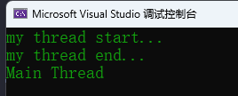

有两个线程在跑，相当整个程序的执行有两条线在同时走， 所以可以同时干两个事， 即使一条线被堵住了，另外一条线还是可以通行的。


**join()**

加入/汇合，阻塞主线程，让主线程等待子线程执行完毕，然后子线程和主线程汇合，然后再往下走。

```C++
//主线程阻塞到这里等待myprint()执行完，当子线程执行完毕，这个join()就执行完毕，主线程就续往下走。
my_tobj.join();
```

注释掉 join() 语句，观察现象:

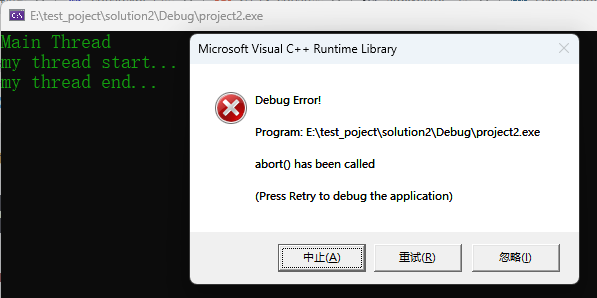

如果主线程执行完毕了，但子线程没执行完毕，这种程序是不合格的，程序是不稳定的。


**detach()**

传统多线程程序主线程要等待子线程执行完毕，然后自己再最后退出；

- detach：分离，也就是主线程不和子线程汇合了
- 一旦detach()之后，与这个主线程关联的thread对象就会`失去与这个主线程的关联`。此时这个子线程就会理留在后台运行(主线程与跟该子线程关去联系）。
- 这个子线程就相当于被c++运行时库接管，当这个子线程执行完成后，由运行时库负责清理该线程相关的资源（守护线程）。
- 一旦`调用了detach()`， 就`不能再用join()`，否则系统会报告异常。


**joinable()**

- 判断是否可以成功使用join或者detach
  - 返回`true` (可以join或者detach)
  - `false`(不能join或者detach)。

```C++
void myprint() {
	cout << "my thread start..." << endl;
	//...
	cout << "my thread end..." << endl;
}

int main()
{
	thread my_tobj(myprint);
	if (my_tobj.joinable())
	{
		my_tobj.join();
	}

	std::cout << "Main Thread" << std::endl;

	return 0;
}
```

### 其他创建线程手法

**用类对象（可调用对象），以及一个问题范例**

```C++
#include <iostream>
#include <string>
#include <thread>
using namespace std;
 
class AE
{
public:
   void operator()(){
        cout << "我的线程operator()开始执行了" << endl;
        //...
        //...
        cout << "我的线程operator()执行结束了" << endl;
        }
};
 
int main()
{
    AE ae;
    thread mythread(ae); //ae: 可调用对象
    
    mythread.join();
  
    //主线程执行
    std::cout << "主线程收尾" << std::endl;
 
    return 0;
}
```


- 注意这种传引用，同时使用detach的情形。

```C++
#include <iostream>
#include <string>
#include <thread>
 
using namespace std;
 
class AE
{
    int& m_i;
public:
    AE(int& i):m_i(i){
        cout << "AE 构造函数执行了" << endl;
    }
    AE(const AE& other):m_i(other.m_i) {
        cout << "AE 拷贝构造函数执行了" << endl;
    }
    ~AE() {
        cout << "~AE 析构函数执行了" << endl;
    }
 
   void operator()(){
        cout << "m_i的值"<< m_i << endl;       
        }
};
 
 
int main()
{
    int myi = 69;
    AE ae(myi);
    thread mythread(ae); //ae: 可调用对象
    
    mythread.detach();
  
    //主线程执行
    std::cout << "主线程收尾" << std::endl;
 
    return 0;
}
```

疑问：一旦调用了detach()， 那我主线程执行结束了，我这里用的这个ae这个对象还在吗? (对象不在了)

- 这个对象实际上是被`复制（值拷贝方式）`到线程中去，执行完主线程后，ae会被销毁，但是所复制的AE对象依旧存在。
- 所以，只要这个`AE类对象里没有引用，没有指针`，那么`就不会产生问题`。


- 如果使用join()


**lambda方式**

```C++
#include <iostream>
#include <string>
#include <thread>
 
using namespace std;
 
int main()
{
    thread mythread([](){
            cout << "lambda表达式线程执行了" << endl;
            //...
            cout << "lambda表达式线程结束了" << endl;
            }); //lambda表达式: 可调用对象
    
    mythread.join();
  
    //主线程执行
    std::cout << "主线程收尾" << std::endl;
 
    return 0;
}
```

### 线程传参

**要避免的陷阱1**

```C++
void myprint(const int& i, char* pmybuf ) {
    cout << i << endl;
    cout << pmybuf << endl;
    return;
}
 
int main()
{
    int val = 1;
    int& val_y = val;
    char buf[] = "This is a Test!";
    thread mythread(myprint, val, buf);  //传递参数
 
    mythread.join();
    //主线程执行
    std::cout << "主线程收尾" << std::endl;
    return 0;
}
```

- 由于传递给myprint的是val的引用，如果主线程结束，会不会给子线程造成影响？
  - 答案是不会，虽然传给子线程看上去是引用传递，实际上是将val的值拷贝给了函数参数 i，实际上不是引用传递，是`值拷贝传递`。建议使用detach的时候，线程函数，不要写成引用传递。
- 针对线程函数第二个参数 pmybuf，通过调试查看地址，发现主线程中的buf地址和线程中的pmybuf内存地址相同，如果使用detach，就会产生问题。
- 所以使用detach的时候不要使用引用传递，尤其是不要使用指针（绝对有问题），这会引起错误。

**解决方式**

```C++
void myprint(const int i, const string & pmybuf ) {
    cout << i << endl;
    cout << pmybuf.c_str() << endl;
    return;
}
```

- 字符数组转string，隐式类型转换。
- 创建临时对象，最终赋值给string，这样就是不同的内存了。


**要避免的陷阱2**

buf究竟是什么时候传递给string的？是否main函数都执行完了（此时mybuf被回收了），才把mybuf往string转。事实上这种方式是有这样的风险。

- 更安全的做法（进行显示类型转换），将线程的pmybuf绑定到buf转换成的string临时对象。在整个main函数执行完毕之前，肯定已经构造出了临时对象并且传递到线程中去了。

```C++
 thread mythread(myprint, val, string(buf) );  //这是一个可以保证在线程中肯定有效的对象。
```

**总结**

- 若传递int这种简单类型参数，建议都是值传递，不要用引用，防止节外生枝。
- 如果传递类对象，`避免隐式类型转换`。全部都在`创建线程这一行就构建出临时对象`出来，然后在线程函参数里，`用引用来接`（否则系统还会构造临时对象来接，构造三次）。
- `建议不使用detach()，只使用join()`，这样就不存在局部变量失效导致线程对内存的非法引用问题。

### **临时对象作为线程参数**

**线程id概念**

- id是个数字，每个线程（不管是主线程还是子线程）实际上都对应着一个数字，而且每个线程对应的这个数字都不同。
- 线程id可以用c++标准库里的函数来获取。通过 `std::this_thread::get_id()` 来获取。

**临时对象构造时机抓捕**

- 使用显示类型转换，创建临时对象的方式，可以`主线程执行完毕之前将临时对象构造出来`，然后拷贝到子线程当中去。
- 如果线程函数中使用值拷贝，不用引用方式：就会在子线程中多执行了一次拷贝构造函数。
- 所以建议`在类作为参数传递时，使用引用方式传递`（虽然写的是引用方式，但是实际上是按值拷贝方式处理）。


### 传递类对象、智能指针作为线程参数

在线程中修改变量的值不会影响到主线程。虽然传进去的是引用，但是线程中对成员变量的值进行修改，不会影响到main函数中的a对象的成员变量的值。

```C++
class A {
public:
    mutable int m_i;
    //类型转换构造函数，可以把一个int转换为类A对象
    A(int i) :m_i(i) { cout << "A::A(int i)函数执行了" << this << "  ThreadId  " \
                        << std::this_thread::get_id()<< endl; }
    A(const A &other) :m_i(other.m_i) { cout << "A::A(const A &other)函数执行了" << this \
                        << "  ThreadId  " << std::this_thread::get_id() << endl; }
    ~A() { cout << "A:: ~A()函数执行了" << this << "  ThreadId  "  \
                        << std::this_thread::get_id() << endl; }
};
 
void myprint(const A  &p_a ) {
    p_a.m_i = 89;
    cout << "子线程myprint()参数地址：" << &p_a << "  ThreadId  " \
                        << std::this_thread::get_id() << endl;
    return;
}
 
int main()
{
    cout << "主线程ID" << std::this_thread::get_id() << endl;
    A a(1);
    thread mythread(myprint, a);   
    mythread.join();
 
    //主线程执行
    std::cout << "主线程结束" << std::endl;
    return 0;
}
```

- 传进去的是引用，但是线程中对m_i的值进行修改，不会影响到main函数中的a对象的m_i的值。
- 虽然对象a是以引用传递的方式传给p_a，但是这个过程是拷贝构造的过程，两个对象的内存地址不同。


**std::ref()**

如果需要真正的把对象引用传递到线程函数当中，就需要使用`std::ref()`

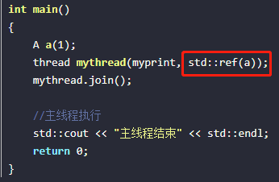

- 使用了std::ref() 拷贝构造函数就没有了，且两个对象地址相同，实现真正的引用传递。

**std::move()**

智能指针，想从一个堆栈到另一个堆栈，需要使用`std::move()`

```C++
void myprint(unique_ptr<int> ptr_u) {
    cout << "子线程myprint()执行了"  << endl;
    return;
}
 
int main()
{
    unique_ptr<int> m_ptr(new int(100));
    thread mythread(myprint, std::move(m_ptr));
    mythread.join();
 
    //主线程执行
    std::cout << "主线程结束" << std::endl;
    return 0;
}
```

- 调试查看m_ptr信息：两者指向的地址相同。

> 注意：如果这里使用detach，就很危险，因为线程中的智能指针指向的是主线程中的一块内存，当主线程执行完毕而子线程中的智能指针还指向这块内存就会出错。

### **用成员函数指针做线程函数**

```C++
class A {
public:
    int m_i;
    //类型转换构造函数，可以把一个int转换为类A对象
    A(int i) :m_i(i) { cout << "A::A(int i)函数执行了"<< endl; }
    A(const A &other) :m_i(other.m_i) { cout << "A::A(const A &other)函数执行了"  << endl; }
    void func(int i) { cout << "A::func(int i)函数执行了" << "  i =  " << i << endl; }
    ~A() { cout << "A:: ~A()函数执行了"  << endl; }
};
 
int main()
{
    A a_obj(11);
    thread mythread(&A::func, a_obj, 233);
    mythread.join();
 
    //主线程执行
    std::cout << "主线程结束" << std::endl;
    return 0;
}
```


```C++
//【注】类对象使用引用方式传递
thread mythread(&A::func, &a_obj, 233);

thread mythread(&A::func, std::ref(a_obj), 233);
```

- 使用引用或者std::ref不会调用拷贝构造函数，这时使用detach就要注意了。


**operator()带参数**

```C++
class A {
public:
    int m_i;
    //类型转换构造函数，可以把一个int转换为类A对象
    A(int i) :m_i(i) { cout << "A::A(int i)函数执行了"<< endl; }
    A(const A &other) :m_i(other.m_i) { cout << "A::A(const A &other)函数执行了"  << endl; }
    void operator()(int i) { cout << "A::operator()执行了" \
                            << "  i =  " << i << endl; }
    ~A() { cout << "A:: ~A()函数执行了"  << endl; }
};

int main()
{
    A a_obj(11);
    thread mythread(a_obj, 666);
    //thread mythread(std::ref(a_obj), 999); //改用std::ref() 传递可调用对象
    										//少了拷贝构造函数进行资源复制，使用detach要小心。
    mythread.join();
 
    //主线程执行
    std::cout << "主线程结束" << std::endl;
    return 0;
}
```

### 创建多个线程

```c++
#include <iostream>
#include <thread>
#include <vector>
using namespace std;

void myprint(int val) {
	cout << "thread start，num： " << val << endl;
	//...
	cout << "thread end, num： " << val << endl;
}

int main()
{
	vector<thread> my_threads;

	for (int i = 0; i < 10; i++) {
		my_threads.push_back(thread(myprint, i));	//创建10个线程，并且这10个线程开始执行
	}

	for (auto iter = my_threads.begin(); iter != my_threads.end(); ++iter) {
		iter->join();
	}

	cout << "main tread" << endl;
	return 0;
}
```

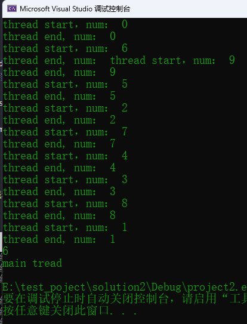

- 多个线程执行顺序是乱的，跟操作系统内部对线程的运行调度机制有关。
- 主线程等待所有子线程运行结束，最后主线程结束，推荐这种join的写法，更容易写出稳定的程序。
- 把thread对象放入到容器里管理，看起来像个thread对象数组，这对一次创建大量的线程并对大量线程进行管理更加方便。

### **数据共享分析**

**只读的数据**

- 只读的数据：是安全稳定的，不需要特别什么处理手段。直接读就可以。

**有读有写**

- 假设有读有写：2个线程写，8个线程读，如果代码没有特别的处理，那程序肯定崩溃。
- 最简单的不崩溃处理，读的时候不能写，写的时候不能读。

**共享数据的保护案例代码**

- 网络游戏服务器。两个创建的线程，一个线程收集玩家命令（用一个数字表示玩家发来的命令），并把命令数据写到一个队列中。
- 另外一个线程从队列中取出玩家发送来的命令进行解析，然后执行玩家需要的动作。
- 下面代码中两个线程同时对消息队列msgRecvQueue进行操作，读或者写，会`导致异常`，`需要引入互斥量`进行解决。

```C++
class A {
public:
	void inMsgRecvQueue() {
		for (int i = 1; i < 100; ++i) {
			cout << "inMsgRecvQueue插入一个元素 " << i << endl;
			msgRecvQueue.push_back(i);
		}
	}

	void outMsgRecvQueue() {
		for (int i = 1; i < 100; ++i) {
			if (!msgRecvQueue.empty()) {//消息队列不为空
				int command = msgRecvQueue.front();	//返回第一个元素，但不检查元素是否存在
				msgRecvQueue.pop_front();	//移除第一个元素，但不返回
				//具体的命令具体处理
			}else{
				//消息队列为空
				cout << "outMsgRecvQueue()，当前消息队列为空" << i << endl;
			}
		}
		cout << "outMsgRecvQueue()执行完毕" << endl;
	}
private:
	std::list<int> msgRecvQueue;	//消息队列
};

int main()
{
	A obja;
	thread inMsgThread(&A::inMsgRecvQueue, &obja);	//第二个参数是引用，保证线程里操作同一个对象
	thread outMsgThread(&A::outMsgRecvQueue, &obja);
	
	inMsgThread.join();
	outMsgThread.join();

	cout << "main thread end" << endl;

	return 0;
}
```

## 互斥量

**互斥量(mutex)的基本概念**

- 保护共享数据，操作时，某个线程用代码先把共享数据锁住、操作数据、解锁，其他想操作共享数据的线程必须等待解锁。
- 互斥量是个类对象
  - 理解成一把锁，多个线程尝试用 `lock()` 成员函数来加锁，`只有一个线程能锁定成功`（成功的标志是lock()函数返回）。
  - 如果没锁成功，那么流程阻塞在lock()这里不断的尝试去锁这把锁头。
- 互斥量使用要小心，保护数据应不多也不少；少了，没达到保护效果，多了，影响效率。

**互斥量的用法**

引入头文件  #include \<mutex\>

lock()， unlock()

- 步骤：先lock(), 操作共享数据，再unlock（）
- lock()和unlock()要成对使用，每调用一次lock()，必然应该调用一次unlock()。有lock，忘记unlock的问题，非常难排查
- 如果lock了，注意退出的地方（如 return）是不是加上了unlock，`几个出口几个unlock`

```C++
#include <iostream>
#include <thread>
#include <list>
#include <mutex>
using namespace std;
 
class A{
public:
    //把收到的消息（玩家命令）加入到一个队列的线程
    void inMsgRecvQueue() 
    {
        for (int i = 1; i < 10000; ++i) 
        {
            cout << "inMsgRecvQueue执行了，插入一个元素" << i << endl;
            my_mutex.lock();
            msgRecvQueue.push_back(i);    //假设这个数字就是玩家发来的命令，加入到消息队列中
            my_mutex.unlock();
        }
    }
 
    //在这个函数中加锁
    bool outMsgMutPro(int& command )
    {
        my_mutex.lock();
        if (!msgRecvQueue.empty()) {
            //消息队列不为空
            command = msgRecvQueue.front(); //返回第一个元素，但不检查元素是否存在
            msgRecvQueue.pop_front();           //移除第一个元素，但不返回
            my_mutex.unlock();
            return true;
        }
        my_mutex.unlock();
        return false;
    }
 
    //把消息从消息队列中取出的线程
    void outMsgRecvQueue() 
    {
        int command{};
       
        for (int i = 1; i < 10000; ++i) 
        {
            bool ret = outMsgMutPro(command);
            if (ret) 
            {
                cout << "outMsgMutPro执行了，取出一个元素" << command << endl;
                //这里就针对具体的命令具体处理
                //...
            }
            else {
                //消息队列为空
                cout << "outMsgRecvQueue执行了，但是当前消息队列为空" << i << endl;
            }
        }
        cout << "outMsgRecvQueue()执行完毕" << endl;
    }
 
private:
    std::list<int> msgRecvQueue;  //容器（消息队列），专门代表玩家给我们发来的命令
    std::mutex my_mutex;
};
 
int main()
{
    A obja;
    std::thread outMsgThread(&A::outMsgRecvQueue, &obja); //第二个参数是引用，保证线程里操作同一个对象
    std::thread inMsgThread(&A::inMsgRecvQueue, &obja);
 
    inMsgThread.join();
    outMsgThread.join();
 
    //主线程执行
    std::cout << "主线程结束" << std::endl;
    return 0;
}
```

###  **std::lock_guard类模板**

- 为了防止忘记unlock()，引入了一个叫std::lock_guard的类模板
- std::lock_guard 类模板：直接取代lock() 和unlock()；用了lock_guard之后，`再不能`使用lock()和unlock()了
- lock_guard`构造函数`里执行了mutex::lock()。lock_guard`析构函数`里执行了mutex::unlock()。
- 结合 {} ，可以控制作用的范围（RAII）

```C++
void inMsgRecvQueue() 
{
    for (int i = 1; i < 10000; ++i)
    {
        cout << "inMsgRecvQueue执行了，插入一个元素" << i << endl;
        {
            std::lock_guard<mutex> mutex_guard_in(my_mutex);
            msgRecvQueue.push_back(i);    //加入到消息队列中
        }
        //其他代码...
    }
}

//在这个函数中加锁
bool outMsgMutPro(int& command )
{
    std::lock_guard<mutex> mutex_guard_out(my_mutex);
    if (!msgRecvQueue.empty()) 
    {
        //消息队列不为空
        command = msgRecvQueue.front(); //返回第一个元素，但不检查元素是否存在
        msgRecvQueue.pop_front();           //移除第一个元素，但不返回
        return true;
    }
    return false;
}
```

### **死锁**

- 死锁这个问题是由至少两个锁头也就是`两个互斥量`才能产生；
- 两个线程 A,B
  - (1) 线程A执行的时候，这个线程先锁金锁，把金锁lock()成功了，然后它去lock银锁。
  - 出现了上下文切换
  - (2) 线程B执行了，这个线程先锁银锁，因为银锁还没有被锁，所以银锁会lock()成功，线程B要去lock金锁。
  - 此时此刻，死锁就产生了。
  - (3) 线程A因为拿不到银锁头，流程走不下去（后边代码有解锁金锁锁头的但是流程走不下去，所以金锁头解不开）。
  - (4) 线程B因为拿不到金锁头，流程走不下去（后边代码有解锁银锁锁头的但是流程走不下去，所以银锁头解不开）。

**死锁的一般解决方案**

- 只要保证这两个互斥量`上锁的顺序一致`就不会死锁。

**std::lock()函数模板**

- 用来处理`多个互斥量`的时候才出场
- 能力：一次锁住`两个或者两个以上的互斥量`（至少两个，多了不限，1个不行）
  - 如果互斥量中有一个没锁住，它就在那里等着，等所有互斥量都锁住，它才能往下走（返回）。
  - 要么两个互斥量都锁住，要么两个互斥量都没锁住。
  - 如果只锁了一个，另外`一个没锁成功`，则它`立即把已经锁住的解锁`。

```C++
void inMsgRecvQueue()
{
    for (int i = 1; i < 1000; ++i)
    {
        cout << "inMsgRecvQueue执行了，插入一个元素" << i << endl;
        std::lock(my_mutex1, my_mutex2);
        msgRecvQueue.push_back(i);    //假设这个数字就是玩家发来的命令，加入到消息队列中
        my_mutex1.unlock();
        my_mutex2.unlock();
    }
}

bool outMsgMutPro(int& command)
{
    std::lock(my_mutex1, my_mutex2);
    if (!msgRecvQueue.empty()) {
        //消息队列不为空
        command = msgRecvQueue.front(); //返回第一个元素，但不检查元素是否存在
        msgRecvQueue.pop_front();           //移除第一个元素，但不返回
        my_mutex1.unlock();
        my_mutex2.unlock();
        return true;
    }
    my_mutex1.unlock();
    my_mutex2.unlock();
    return false;
}
```

**std::lock_guard的std::adopt_lock参数**

- std::adopt_lock是个结构体对象，起一个标记作用：作用就是`表示这个互斥量已经lock()`
- `不需要`再std::lock_guard\<std::mutext\>`构造函数`里再面对对象进行`再次lock()`

```c++
void inMsgRecvQueue()
{
    for (int i = 1; i < 1000; ++i)
    {
        cout << "inMsgRecvQueue执行了，插入一个元素" << i << endl;
        std::lock(my_mutex1, my_mutex2);
        
        //构造函数不会再lock
        std::lock_guard<mutex> in_mutex_guard1(my_mutex1, std::adopt_lock);
        std::lock_guard<mutex> in_mutex_guard2(my_mutex2, std::adopt_lock);
        
        msgRecvQueue.push_back(i);    //假设这个数字就是玩家发来的命令，加入到消息队列中
        //my_mutex1.unlock();
        //my_mutex2.unlock();
    }
}
```

> std::lock()：一次锁定多个互斥量，谨慎使用（建议一个一个锁）。

### unique_lock

- unique_lock是个类模板，工作中一般用lock_guard(推荐使用)，lock_guard取代了mutex的lock()和unlock()
- unique_lock比lock_guard灵活很多，效率上差一点，内存占用多一点
- 缺省情况下，unique_lock和lock_guard作用相同

```C++
void inMsgRecvQueue()
{
    for (int i = 1; i < 10000; ++i)
    {
        cout << "inMsgRecvQueue执行了，插入一个元素" << i << endl;
        //std::lock_guard<mutex> in_mutex_guard(my_mutex);
        std::unique_lock<mutex> in_mutex_guard(my_mutex);           
        msgRecvQueue.push_back(i); 
        //其他代码
    }
}
```

**unique_lock的第二个参数**

**std::adopt_lock**

- 表示这个互斥量已经被lock了（必须要把互斥量提前lock了，否则会报异常）
  - 标记的效果就是"假设调用方线程已经拥有了互斥的所有权"`（表示已经lock()成功了）`
- unique_lock也可以带std::adopt_lock标记，含义相同，就是不希望再unique_lock()的构造函数中lock这个mutex。

```C++
 my_mutex.lock(); //要先lock，后续才能使用unique_lock的adopt_lock参数
 std::unique_lock<mutex> in_mutex_guard(my_mutex, std::adopt_lock); 
```

**std::try_to_lock**

- [例]：其中一个线程执行拿到锁后，阻塞20秒，另一个线程由于拿不到锁，也跟着阻塞20秒。
- try_to_lock
  - 使用try_to_lock时，尝试用mutex的lock去锁定这个mutex，但如果`没有锁定成功`，也会`立即返回`，并不会阻塞在那里
  - 用这个try_to_lock的前提是`不能先去lock`。同一个mutex调用两次lock()，程序会卡死

```C++
class A
{
public:
    //把收到的消息（玩家命令）加入到一个队列的线程
    void inMsgRecvQueue()
    {
        for (int i = 1; i < 10000; ++i)
        {
            cout << "inMsgRecvQueue执行了，插入一个元素" << i << endl;
            //使用try_to_lock参数
            std::unique_lock<mutex> in_mutex_guard(my_mutex, std::try_to_lock);
            if (in_mutex_guard.owns_lock()) 
            {   
                //拿到了锁
                msgRecvQueue.push_back(i);    //假设这个数字就是玩家发来的命令，加入到消息队列中
                //其他代码
            }
            else 
            {
                //没拿到锁
                cout << "inMsgRecvQueue()执行了，但没拿到锁，只能干其他的事" << i << endl;
            }
            
        }
    }
 
    //在这个函数中加锁
    bool outMsgMutPro(int& command)
    {
 
        //std::lock_guard<mutex> out_mutex_guard1(my_mutex);
        std::unique_lock<mutex> out_mutex_guard1(my_mutex);
        std::chrono::milliseconds dura(2000); // 1秒 = 1000毫秒
        std::this_thread::sleep_for(dura);    //休息一定的时长
 
        if (!msgRecvQueue.empty())
        {
            //消息队列不为空
            command = msgRecvQueue.front(); //返回第一个元素，但不检查元素是否存在
            msgRecvQueue.pop_front();           //移除第一个元素，但不返回
            return true;
        }
        return false;
    }
 
    //把消息从消息队列中取出的线程
    void outMsgRecvQueue()
    {
        int command{};
 
        for (int i = 1; i < 10000; ++i)
        {
            bool ret = outMsgMutPro(command);
            if (ret)
            {
                cout << "outMsgMutPro执行了，取出一个元素" << command << endl;
                //这里就针对具体的命令具体处理
                //...
            }
            else {
                //消息队列为空
                cout << "outMsgRecvQueue执行了，但是当前消息队列为空" << i << endl;
            }
        }
        cout << "outMsgRecvQueue()执行完毕" << endl;
    }
 
private:
    std::list<int> msgRecvQueue;  //容器（消息队列），专门代表玩家给我们发来的命令
    std::mutex my_mutex;
};
```

**std::defer_lock**

- 用这个defer_lock的前提是`不能自己先lock`，否则会报异常
- efer_lock的意思就是并没有给mutex加锁： `初始化了一个没有加锁的mutex`


**unique_lock的成员函数**

lock()

```C++
std::unique_lock<mutex> in_mutex_guard(my_mutex, std::defer_lock); //没加锁的my_mutex
in_mutex_guard.lock(); //后面会自己unlock
```

 unlock()

- 有时有一些分共享代码需要处理，所以需要把锁解开去处理非共享代码。
- 处理完后又想处理共享代码，再次调用lock() 上锁。
- `方便随时锁上，随时开锁`

```C++
std::unique_lock<std::mutex> uniq_mux(my_mutex, std::defer_lock); 没有加锁的my_mutex
uniq_mux.lock(); //后面可以自己unlock			
//处理共享代码			
uniq_mux.unlock();
//处理一些非共享代码
uniq_mux.lock();
//处理共享代码	
```

try_lock()

- 尝试给互斥量加锁，如果拿不到锁，则返回false，如果拿到了锁，返回true，这个函数不阻塞的

```C++
void inMsgRecvQueue()
{
    for (int i = 1; i < 10000; ++i)
    {
        cout << "inMsgRecvQueue执行了，插入一个元素" << i << endl;
        //使用defer_lock参数
        std::unique_lock<mutex> in_mutex_guard(my_mutex, std::defer_lock); //没加锁的my_mutex
        //使用try_lock()函数
        if (in_mutex_guard.try_lock() == true) 
        {
            //拿到锁了
            msgRecvQueue.push_back(i);    //假设这个数字就是玩家发来的命令，加入到消息队列中    
        }
        else 
        {
            //没拿到锁
            cout << "inMsgRecvQueue() 执行，但没有拿到锁，只能干点别的事" << i << endl;
        }  
    }
}
```

release()

- 返回它所管理的`mutex对象指针`，并释放所有权，也就是说，这个`unique_lock和mutext不再有关系`
- 如果原来mutex对象处于加锁状态，你有责任接管过来并负责解锁。（`release返回的是原始mutex指针`）

```C++
void inMsgRecvQueue()
{
    for (int i = 1; i < 10000; ++i)
    {
        cout << "inMsgRecvQueue执行了，插入一个元素" << i << endl;
        std::unique_lock<mutex> in_mutex_guard(my_mutex); 
        std::mutex* ptr_mutex = in_mutex_guard.release();
 
        msgRecvQueue.push_back(i);    //假设这个数字就是玩家发来的命令，加入到消息队列中
        //获取mutex指针后，需要自行unlock()
        ptr_mutex->unlock();
    }
}
```

**unique_lock()函数使用小结**

- 为什么有时候需要unlock()：
  - 因为你lock锁住的代码段越少，执行越快，整个程序运行效率越高。
- 有人也把锁头锁住的代码多少称为`锁的粒度`：
  - 锁住的代码少，这个粒度叫细，执行效率高。
  - 锁住的代码多，粒度叫粗，那执行效率就低。
- 要学会尽量选择合适粒度的代码进行保护，粒度太细，可能漏掉共享数据的保护，粒度太粗，影响效率。

**unique_lock所有权的传递**

```C++
std::unique_lock<std::mutex> mutex_guard(my_mutex);  //所有权概念
```

- mutex_guard拥有my_mutex的所有权。
- mutex_guard可以把自己对mutex (比如my_mutex) 的所有权转移给其他的unique_lock对象。
- 所以，unique_lock对象这个mutex的所有权是`属于可以转移`，但是`不能复制`

```C++
std::unique_lock<std::mutex> mutex_guard1(my_mutex);
 
std::unique_lock<std::mutex> mutex_guard2(mutex_guard1); //复制所有权是非法的
 f
std::unique_lock<std::mutex> mutex_guard2(std::move(mutex_guard1)); 
//移动语义，现在相当于mutex_guard2和my_mutex绑定到一起了,现在mutex_guard1指向空, mutex_guard2指向了my_mutex	
```

- 另外一种转移所有权的方式：

```C++
std::unique_lock<std::mutex> rtn_unique_lock(){
	std::unique_lock<std::mutex> tmp_guard(my_mutex);
	return tmp_guard; 
	//从函数返回一个局部的unique_lock对象时可以的。
	//返回这种局部对象tmpguard会导致系统生成临时unique_lock对象，并调用unique_lock的移动构造函数
}

//调用
std::unique_lock<mutex> mutex_guard = rtn_unique_lock();
```

### 其他各种mutex互斥量

**递归的独占互斥量 std::recursive_mutex**

- std::mutex `独占式互斥量`，自己lock时别人lock不了
- std::recursive_mutex：`递归的独占互斥量`，有lock也有unlock，它`允许在同一个线程中同一个互斥量多次被lock()` 。
- 但是递归加锁的次数是有限制的，太多可能会报异常，`效率要比mutex低`。
- 如果真的用了recursive_mutex要考虑代码是否有优化空间，如果能调用一次lock()就不要调用多次。


**带超时的互斥量 std::timed_mutex 和 std::recursive_timed_mutex**

- timed_mutex有mutex的功能且多了以下两个函数。

  - try_lock_for()：*等待一段时间*，如果拿到了锁，或者超时了未拿到锁，就继续执行（有选择执行）如下：

    ```C++
    //在inMsgRecvQueue函数里
    	void inMsgRecvQueue()
    	{
    		for (size_t i = 0; i < 1000; ++i)
    		{
    			cout << "收到消息，并放入队列 " << i << endl;
    			std::chrono::milliseconds timeout(100);
    			if (my_mutex.try_lock_for(timeout)) {//等待100ms尝试获取锁
    				//在100ms内拿到了锁
    				msgRecvQueue.push_back(i);
    				my_mutex.unlock();//用完了解锁
    			}
    			else {//100ms内没拿到锁
    				std::chrono::milliseconds sleeptime(100);
    				std::this_thread::sleep_for(sleeptime);
    			}
    		}
    		cout << "消息入队结束" << endl;
    	}
    private:
    	list<int> msgRecvQueue;
    	std::timed_mutex my_mutex;//类中定义带超时功能的独占互斥量
    ```

  - try_lock_until()：参数是一个未来的时间点，在这个未来的时间没到的时间内，如拿到了锁头，流程就走下来，如果时间到了没拿到锁，流程也可以走下来。

    ```C++
    //在inMsgRecvQueue函数里
    std::chrono::milliseconds timeout(100);
    if (my_mymutex.try_lock_until(chrono::steady_clock::now() + timeout)){//当前时间点+100ms
        //在未来的100ms内拿到了锁
        msgRecvQueue.push_back(i);
    	my_mutex.unlock();//用完了解锁
    }
    else{
        std::chrono::milliseconds sleeptime(100);
        std::this_thread::sleep_for(sleeptime);
    }
    ```

  - 两者的区别就是一个参数是时间段，一个参数是未来的时间点。

- std::recursive_timed_mutex：综合了recursive_mutex和timed_mutex的功能，允许同一个线程多次获取这个互斥量，多次lock。且有try_lock_for和try_lock_until函数。

## 单例设计模式

- 单例：整个项目中，有某个或者某些特殊的类，属于该类的对象，`只能创建1个`，多了创建不了
- 注意delete指针的技巧：类中套类，利用类对象回收时调用析构函数进行指针等资源的释放

```C++
class singleClass
{
private:
    singleClass() {};  //私有化构造函数
    static singleClass* m_instance;  //静态成员变量
 
public:
    static singleClass* GetInstance()
    {
        if (m_instance == NULL)
        {
            m_instance = new singleClass();
            static GuiderPtr gc;
        }
        return m_instance;
    }
    class GuiderPtr   //类中套类，用来释放对象
    {
    public:
        ~GuiderPtr()
        {
            if (singleClass::m_instance)
            {
                delete singleClass::m_instance;
                singleClass::m_instance = NULL;
            } 
        }  
    };
 
    void func() {
        cout << "This is a Test" << endl;
    }
};
    //类静态变量初始化
singleClass*  singleClass::m_instance = NULL;
 
int main()
{
    singleClass* sg_ptr = singleClass::GetInstance();  //创建一个singleClass类，并返回指针
    singleClass* sg_ptr1 = singleClass::GetInstance();  //返回的之前创建的指针
 
    sg_ptr->func();
    sg_ptr1->func();
    singleClass::GetInstance()->func();
 
    return 0;
}
```

**共享数据分析**

- 建议：在创建所有其他线程之前，`在主线程中创建出单例对象`，加载数据，后续使用。
- 需要在自己创建的线程（而不是主线程）中来创建singleClass这个单例类的对象，可能会面临GetInstance()这种成员函数要互斥。

```C++
#include <iostream>
#include <thread>
#include <mutex>

using namespace std;
mutex res_mutex;

class singleClass
{
private:
	singleClass() {};  //私有化构造函数
	static singleClass* m_instance;  //静态成员变量

public:
	static singleClass* GetInstance()
	{
		if (m_instance == nullptr) //双重检查，提高程序执行效率
		{
			std::unique_lock<mutex> mutex_getInstance(res_mutex);	//自动加锁
			if (m_instance == nullptr)
			{
				m_instance = new singleClass();
				static GuiderPtr gp;
			}
		}
		return m_instance;
	}
	class GuiderPtr   //类中套类，用来释放对象
	{
	public:
		~GuiderPtr()
		{
			if (singleClass::m_instance)
			{
				delete singleClass::m_instance;
				singleClass::m_instance = nullptr;
			}
		}
	};

	void func() {
		cout << "This is a Test" << endl;
	}
};
//类静态变量初始化
singleClass* singleClass::m_instance = nullptr;

void mythread() {
	cout << "线程函数开始执行了" << endl;
	singleClass* sg_ptr = singleClass::GetInstance();
	sg_ptr->func();
	cout << "线程函数执行完毕了" << endl;
}

int main()
{
	thread t_obj1(mythread);
	thread t_obj2(mythread);

	t_obj1.join();
	t_obj2.join();

	return 0;
}
```

**std::call_once(）**

- C++11引入的函数，该函数的第二个参数是一个函数名a()
- call_once 功能是`能够保证函数a()只被调用一次`
- call_once `具备互斥量能力`，而且效率上，比互斥量消耗的资源更少
- call_once()`需要与一个标记结合使用`，这个标记 std::once_flag是一个结构体
- call_once()就是通过这个标记来决定对应的函数a()是否执行，调用call_once成功后，call_once()就把这个标记设置为一种已调用状态
  - 后续再次调用call_once() ,只要once_flag被设置为了“已调用”状态，那么对应的函数a()就不会再被执行

```C++
#include <iostream>
#include <thread>
#include <mutex>

using namespace std;
std::mutex res_mutex;
std::once_flag g_flag; //全局变量，定义的标记
 
class singleClass
{
private:
    singleClass() {};  //私有化构造函数
    static singleClass* m_instance;  //静态成员变量
 
    static void CreatInstance()      //只被调用一次
    {   
        std::chrono::milliseconds dura(2000);
        std::this_thread::sleep_for(dura);
        cout << "CreatInstance()执行了" << endl;
 
        m_instance = new singleClass();
        static GuiderPtr gc;
    }
 
public:
    static singleClass* GetInstance()
    {
        //两个线程同时执行到这里，其中一个线程要等另外一个线程执行完毕CreateInstance（）；
        std::call_once(g_flag, CreatInstance);
        cout << "GetInstance()执行了" << endl;
        return m_instance;
    }
    class GuiderPtr   //类中套类，用来释放对象
    {
    public:
        ~GuiderPtr()
        {
            if (singleClass::m_instance)
            {
                delete singleClass::m_instance;
                singleClass::m_instance = NULL;
            } 
        }  
    };
 
    void func() {
        cout << "This is a Test" << endl;
    }
};
//类静态变量初始化
singleClass*  singleClass::m_instance = NULL;
 
//线程入口函数
void mythread() {
    cout << "线程函数开始执行了" << endl;
    singleClass* sgPtr = singleClass::GetInstance();  //这里可能有问题
    sgPtr->func();
    cout << "线程函数执行完毕了" << endl;
    return;
}

int main()
{
    std::thread t_obj1(mythread);
    std::thread t_obj2(mythread);
    
    t_obj2.join();
    t_obj1.join();
    
    return 0;
}
```

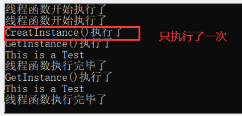 

>综上，还是建议优先在主线程中先创建单例对象。

## condition_variable、wait、notify_one

**条件变量std::condition_variable、wait()、notify_one()**

- 线程A: 等待一个条件满足
- 线程B: 专门往消息队列中放入消息（数据），达到一定条件，通知处于等待中的线程A。
- `std::condition_variable`实际上是一个`类`，是一个和条件相关的一个类，`就是等待一个条件达成`。
- 这个类是需要和互斥量来配合工作，用的时候要生成这个类的对象。

 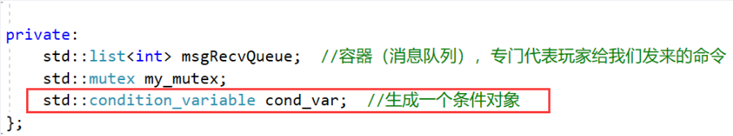

- wai() 用来等一个东西。

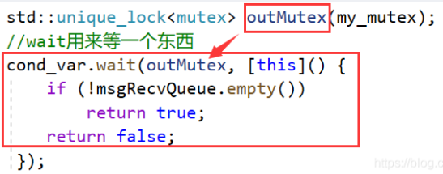 

- 如果第二个参数lambda表达式返回值是`true`，那wait（）`直接返回，继续往下执行`。
- 如果第二个参数lambda表达式返回值是`false`，那么wait()将`解锁互斥量，并堵塞到本行`。
  - 堵塞到`其他某个线程`调用`notify_one()`成员函数为止。
- 如果wait()没有第二个参数: my_cond.wait(outMutex)
  - 那么就跟第二个参数lambda表达式返回`false`效果一样
  - wait()将解锁互斥量，并堵塞到本行，`堵塞到其他某个线程调用notify_one() 成员函数为止`。

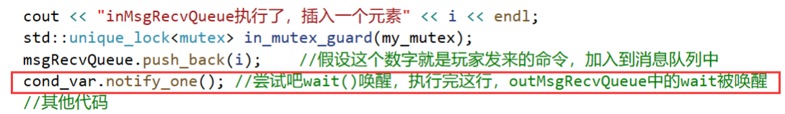 


- 当其他线程用notify_one() 将本wait（原来是阻塞）的状态唤醒后，wait就开始往下执行
  - a) wait() `不断的尝试重新获取互斥量锁`，如果获取不到，那么流程就卡在wait这里等着获取，如果获取到了，那么wait就走下来。
  - b1)如果wait有第二个参数（lambda）,就判断这个lambda表达式，如果lambda表达式为false，那wait又对互斥量解锁，然后又休眠这里等待再次被notify_one唤醒。
  - b2) 如果lambda表达式为true，则wait返回，往下执行。（此时互斥锁被锁着）
  - b3) 如果wait没有第二个参数，则wait返回，往下执行。

>注：还有一种唤醒方式notify_all()，通知所有线程。

```C++
#include <iostream>
#include <thread>
#include <mutex>
 
using namespace std;
 
class A
{
public:
    //把收到的消息（玩家命令）加入到一个队列的线程
    void inMsgRecvQueue()
    {
        for (int i = 1; i < 10000; ++i)
        {
            cout << "inMsgRecvQueue执行了，插入一个元素" << i << endl;
            std::unique_lock<mutex> in_mutex_guard(my_mutex);
            msgRecvQueue.push_back(i);    //假设这个数字就是玩家发来的命令，加入到消息队列中
            cond_var.notify_one(); //尝试吧wait()唤醒，执行完这行，outMsgRecvQueue中的wait被唤醒
            //假如outMsgRecvQueue（）正在处理一个事务需要一段时间，而不是正卡在wait()那里等待你唤醒，那么此时这个notify_one()这个调用也许就没效果.
        }
    }   
 
    //把消息从消息队列中取出的线程
    void outMsgRecvQueue()
    {
        int command{};
        while (true)
        {
            std::unique_lock<mutex> outMutex(my_mutex);
            //wait用来等一个东西
            cond_var.wait(outMutex, [this]() {
                if (!msgRecvQueue.empty())
                    return true;
                return false;
             });
 
            //流程只要能走到这里来，这个互斥锁一定是锁着的。同时msgRecvQueue至少是有一条数据的。
            command = msgRecvQueue.front(); // 返回第一个元素，但不检查元素是否存在
            msgRecvQueue.pop_front();       //移除第一个元素，但不返回
            outMutex.unlock();              //因为unique_lock 的灵活性，所以我们可以随时的unlock解锁，以免锁住太长时间
            cout << "outMsgRecvQueue()执行，取出一个元素" << command << endl;
 
        }//end while
        
    } //end outMsgRecvQueue()
 
private:
    std::list<int> msgRecvQueue;  //容器（消息队列），专门代表玩家给我们发来的命令
    std::mutex my_mutex;
    std::condition_variable cond_var;  //生成一个条件变量对象
}; //end A
 
int main()
{
    A obja;
    std::thread outMsgThread(&A::outMsgRecvQueue, &obja); //第二个参数是引用，保证线程里操作同一个对象
    std::thread inMsgThread(&A::inMsgRecvQueue, &obja);
 
    inMsgThread.join();
    outMsgThread.join();
 
    //主线程执行
    std::cout << "主线程结束" << std::endl;
    return 0;
}
```

**虚假唤醒**

- notify_one或者notify_all唤醒wait()后，实际有些线程可能不满足唤醒的条件，就会造成虚假唤醒，可以`在wait中再次进行判断解决虚假唤醒`。
- 解决：wait中要有第二个参数（lambda表达式），并且这个lambda表达式中要正确判断所处理的公共数据是否存在，如果存在则返回true，流程走下来，互斥锁本线程拿到；否则返回false，解锁并休眠，卡在wait等待被再次唤醒。

## async、future、packaged_task、promise

**std::async、std::future创建后台任务并返回值**

需求：希望线程返回一个结果

- std::async是个`函数模板`，用来`启动一个异步任务`，启动一个异步任务之后，`返回一个std::future对象`，std::future是个`类模板`。
  - “启动一个异步任务”，就是`自动创建一个线程并开始执行对应的线程入口函数`，它返回一个std::future对象。
    - 这个std::future对象里边就含有线程入口函数所返回的结果（线程返回的结果），可以通过调用future对象的成员函数get()来获取结果。
    - std::future提供了一种访问异步操作结果的机制，就是说这个结果你可能没有办法马上拿到，但在线程执行完毕的时候，就能够拿到结果，所以可理解为：这个future（对象）里会保存一个值，在将来的某个时刻能够拿到。
  - 这个get()函数不拿到值就卡在这里等待拿值。
  - `get()只能调用一次`，不能调用多次。
  - `wait()`，类似于join()等待线程返回，本身并不返回结果。

```C++
#include <iostream>
#include <thread>
#include <future>
 
using namespace std;
 
int mythread() //线程入口函数
{
    cout << "mythread start" << "ThreadId = " << std::this_thread::get_id() << endl;  //打印线程id
    std::chrono::milliseconds dura(5000);  //休息5秒
    std::this_thread::sleep_for(dura);
    cout << "mythread end" << "ThreadId = " << std::this_thread::get_id() << endl;  //打印线程id
    return 100;
}
 
int main()
{
    cout << "MianThreadID = " <<  std::this_thread::get_id() << endl;  //打印主线程id
    std::future<int> ret = std::async(mythread);  //创建线程并开始执行,将future对象与async创建的线程绑定到一起
                   								//流程不卡在这里，继续运行
 
    std::cout << ret.get() << std::endl;  //卡在这里等待mythread执行完毕，拿到结果
    //主线程执行
    std::cout << "主线程结束" << std::endl;
    return 0;
}
```

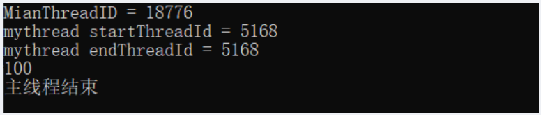 

- 使用类成员函数作为线程入口函数

```C++
#include <iostream>
#include <thread>
#include <future>
 
using namespace std;
 
class A{
public:
    int a_thread(int var) //线程入口函数
    {
        cout << var << endl;
        cout << "mythread start" << "ThreadId = " << std::this_thread::get_id() << endl;  //打印线程id
        std::chrono::milliseconds dura(5000);  //休息5秒
        std::this_thread::sleep_for(dura);
        cout << "mythread end" << "ThreadId = " << std::this_thread::get_id() << endl;  //打印线程id
        return 100;
    }
};
 
int main()
{
    A a;
    int tmp{666};
    cout << "MianThreadID = " <<  std::this_thread::get_id() << endl;  //打印主线程id
    std::future<int> ret = std::async(&A::a_thread, &a, tmp);  //第二个参数是一个对象引用,才能保证线程里使用的是同一个对象
 
    std::cout << ret.get() << std::endl;  //卡在这里等待mythread执行完毕，拿到结果
    //主线程执行
    std::cout << "主线程结束" << std::endl;
    return 0;
}
```

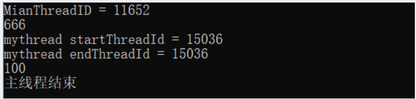 

如果上面代码中不使用get函数，结果如下：

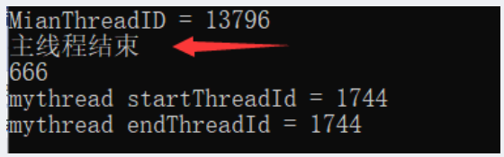 

- 通过额外向std::async()传递一个参数，该参数类型是`std::lunnch类型`（枚举类型）来达到一些特殊的目的。

  - std::launch::deferred: 表示线程入口函数调用被`延迟`到std::future的wait()或者get()函数`调用时才执行`。并且`不创建新线程`，在主线程中调用的线程入口函数。

     

    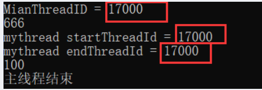 

    - 如果wait()或者get()`没有被调用`，那么线程`不会执行`，实际上，线程根本就`没创建`。

      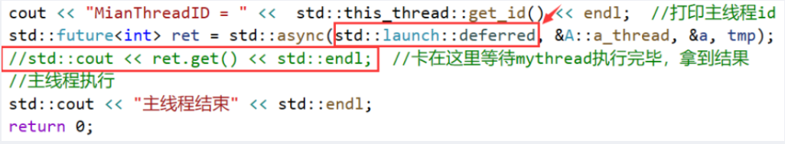 

      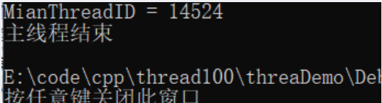 

  - std::launch::async：在调用async函数的时候就开始创建线程，即`立即执行`。

    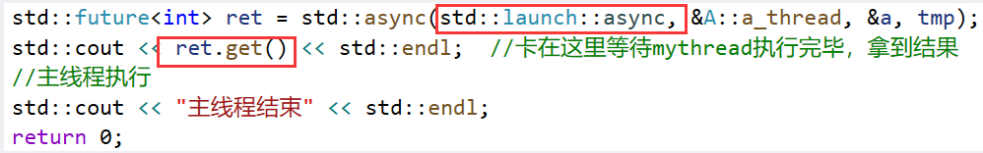 

     


**std::packaged_task（包装各种可调用对象），配合thread类、future类使用**

- std::packaged_task是个类模板，它的模板参数是各种可调用对象；通过std::packaged_task来把各种可调用对象包装起来，将来作为线程入口函数来调用。

```C++
#include <iostream>
#include <thread>
#include <mutex>
#include <future>
 
using namespace std;
 
int mythread(int var) //线程入口函数
{
    cout << var << endl;
    cout << "mythread start" << "ThreadId = " << std::this_thread::get_id() << endl;  //打印线程id
    std::chrono::milliseconds dura(5000);  //休息5秒
    std::this_thread::sleep_for(dura);
    cout << "mythread end" << "ThreadId = " << std::this_thread::get_id() << endl;  //打印线程id
    return 100;
}
 
int main()
{
    cout << "MianThreadID = " <<  std::this_thread::get_id() << endl;  //打印主线程id
    std::packaged_task<int(int)> myTask(mythread); //将函数mythread包装起来
    int tmp{ 233 };
    std::thread objThread(std::ref(myTask), tmp);  //线程直接开始执行，第二个参数作为线程入口函数的参数
   
    objThread.join();   //等待线程执行完毕
    std::future<int> ret = myTask.get_future(); //future包含有线程入口函数的返回结果，这里保存mythread的返回结果
    cout << ret.get() << endl;
 
    //主线程执行
    std::cout << "主线程结束" << std::endl;
    return 0;
}
```

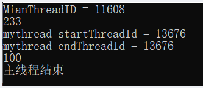 

- 使用lambda表达式

```C++
#include <iostream>
#include <thread>
#include <future>
 
using namespace std;
 
int main()
{
    cout << "MianThreadID = " <<  std::this_thread::get_id() << endl;  //打印主线程id
    std::packaged_task<int(int)> myTask([](int var) {
            cout << var << endl;
            cout << "mythread start" << "ThreadId = " << std::this_thread::get_id() << endl;  //打印线程id
            std::chrono::milliseconds dura(5000);  //休息5秒
            std::this_thread::sleep_for(dura);
            cout << "mythread end" << "ThreadId = " << std::this_thread::get_id() << endl;  //打印线程id
            return 100; 
        }); //将lambda表达式包装起来
    int tmp{ 233 };
    std::thread objThread(std::ref(myTask), tmp);  //线程直接开始执行，第二个参数作为线程入口函数的参数
   
    objThread.join();   //等待线程执行完毕
    std::future<int> ret = myTask.get_future(); //future包含有线程入口函数的返回结果，这里保存lambda表达式的返回结果
    cout << ret.get() << endl;
 
    //主线程执行
    std::cout << "主线程结束" << std::endl;
    return 0;
}
```

- packaged_task包装起来的可调用对象还可以直接调用，所以从这个角度来讲，`packaged_task对象也是一个可调用对象`。

```c++
#include <iostream>
#include <thread>
#include <future>
 
using namespace std;
int main()
{
    cout << "MianThreadID = " <<  std::this_thread::get_id() << endl;  //打印主线程id
    std::packaged_task<int(int)> myTask([](int var) {
            cout << var << endl;
            cout << "mythread start" << "ThreadId = " << std::this_thread::get_id() << endl;  //打印线程id
            std::chrono::milliseconds dura(5000);  //休息5秒
            std::this_thread::sleep_for(dura);
            cout << "mythread end" << "ThreadId = " << std::this_thread::get_id() << endl;  //打印线程id
            return 100; 
        }); //将lambda表达式包装起来
    int tmp{ 233 };
    myTask(tmp);    //直接调用，相当于直接调用
    std::future<int> ret = myTask.get_future(); //future包含有线程入口函数的返回结果，这里保存返回结果
    cout << ret.get() << endl;
 
    //主线程执行
    std::cout << "主线程结束" << std::endl;
    return 0;
}
```

- 结合容器和移动语义使用

```C++
#include <iostream>
#include <thread>
#include <vector>
#include <future>
 
using namespace std;
std::vector<std::packaged_task< int(int)>>  TaskVector;
int main()
{
    cout << "MianThreadID = " <<  std::this_thread::get_id() << endl;  //打印主线程id
    std::packaged_task<int(int)> myTask([](int var) {
            cout << var << endl;
            cout << "mythread start" << "ThreadId = " << std::this_thread::get_id() << endl;  //打印线程id
            std::chrono::milliseconds dura(5000);  //休息5秒
            std::this_thread::sleep_for(dura);
            cout << "mythread end" << "ThreadId = " << std::this_thread::get_id() << endl;  //打印线程id
            return 100; 
        }); //将lambda表达式包装起来
    
    TaskVector.push_back(std::move(myTask));  //加入至容器，使用了移动语义，进去后myTask就为空
    //...
    //取出来调用
    std::packaged_task< int(int)>  myTask2;
    auto iter = TaskVector.begin();
    myTask2 = std::move(*iter);
    TaskVector.erase(iter);   //删除第一个元素，之后迭代器就失效了，后面不可以使用iter了
    
    myTask2(72);    //直接调用，相当于直接调用
    std::future<int> ret = myTask2.get_future(); //future包含有线程入口函数的返回结果，这里保存返回结果
    cout << ret.get() << endl;
 
    //主线程执行
    std::cout << "主线程结束" << std::endl;
    return 0;
}
```

**std::promise**

- 能够在某个线程中给它赋值，然后在其他线程中把这个值取出来用。

```C++
#include <iostream>
#include <thread>
#include <future>
 
using namespace std;
 
void mythread(std::promise<int>& tmp, int clc)
{
    cout << "mythread start" << "ThreadId = " << std::this_thread::get_id() << endl;  //打印线程id
    //做一系列复杂运算
    clc++;
    clc *= 233;
    //其他运算，比如花费了5秒钟
    std::chrono::milliseconds dura(5000);  //休息5秒
    std::this_thread::sleep_for(dura);
    //计算出结果
    int ret = clc;  //保存结果
    tmp.set_value(ret); //结果保存到tmp中
    cout << "mythread end" << "ThreadId = " << std::this_thread::get_id() << endl;  //打印线程id
}
 
int main()
{
    cout << "MianThreadID = " <<  std::this_thread::get_id() << endl;  //打印主线程id
    
    std::promise<int> var_pro;  //创建一个promise对象，用来保存int类型的值
    std::thread objThread(mythread, std::ref(var_pro), 10);
    //获取结果
    objThread.join();
    std::future<int>  t1 = var_pro.get_future(); //promise和线程绑定，用于获取线程返回值
    auto val1 = t1.get();
    cout << val1 << endl;
    
    //主线程执行
    std::cout << "主线程结束" << std::endl;
    return 0;
}
```

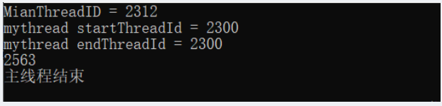 

- 线程1中返回值，线程2调用（promise + future 起连接作用），实现两个线程之间数据传递

```C++
#include <iostream>
#include <thread>
#include <future>
 
using namespace std;
 
void mythread(std::promise<int>& tmp, int clc)
{
    cout << "mythread start" << "ThreadId = " << std::this_thread::get_id() << endl;  //打印线程id
    //做一系列复杂运算
    clc++;
    clc *= 233;
    //其他运算，比如花费了5秒钟
    std::chrono::milliseconds dura(5000);  //休息5秒
    std::this_thread::sleep_for(dura);
    //计算出结果
    int ret = clc;  //保存结果
    tmp.set_value(ret); //结果保存到tmp中
    cout << "mythread end" << "ThreadId = " << std::this_thread::get_id() << endl;  //打印线程id
    return;
}
void mythread2(std::future<int>& tmp)
{
    cout << "mythread2 start" << "ThreadId = " << std::this_thread::get_id() << endl;  //打印线程id
    auto val = tmp.get();
    cout <<"mythread2 val = " <<  val << endl;    
    cout << "mythread2 end" << "ThreadId = " << std::this_thread::get_id() << endl;  //打印线程id
    return;
}
 
int main()
{
    cout << "MianThreadID = " <<  std::this_thread::get_id() << endl;  //打印主线程id
    
    std::promise<int> var_pro;  //创建一个promise对象，用来保存int类型的值
    std::thread objThread(mythread, std::ref(var_pro), 10);
    //获取结果
    objThread.join();
    std::future<int>  t1 = var_pro.get_future(); //promise和线程绑定，用于获取线程返回值
    std::thread objThread2(mythread2, std::ref(t1));
    //获取结果
    objThread2.join();        //等线程2执行完毕
    
    //主线程执行
    std::cout << "主线程结束" << std::endl;
    return 0;
}
```

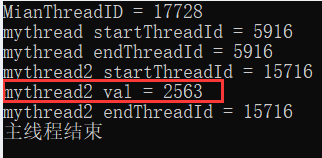 


**std::future的其他成员函数**

std::future_status 枚举值  +  future对象.wait_for

- future_status源码定义

```C++
// ENUM future_status
enum class future_status { // names for timed wait function returns
    ready,
    timeout,
    deferred
};
```

- std::future_status::timeout 示例

```C++
#include <iostream>
#include <thread>
#include <future>
 
using namespace std;
 
int mythread() //线程入口函数
{
    cout << "mythread start" << "ThreadId = " << std::this_thread::get_id() << endl;  //打印线程id
    std::chrono::milliseconds dura(5000);  //休息5秒
    std::this_thread::sleep_for(dura);
    cout << "mythread end" << "ThreadId = " << std::this_thread::get_id() << endl;  //打印线程id
    return 100;
}
 
int main()
{
    cout << "MianThreadID = " << std::this_thread::get_id() << endl;  //打印主线程id
    std::future<int> ret = std::async(mythread);  //创建线程并开始执行
                   //将future对象与async创建的线程绑定到一起，流程不卡在这里，继续运行
    std::future_status status = ret.wait_for(std::chrono::seconds(1));
    if (std::future_status::timeout == status)  //超时，等一秒中希望该线程返回，实际却没有返回
    {
        //表示等待的线程没有执行完毕
        cout << "超时，线程没有执行完" << endl;
    }
 
    //主线程执行
    std::cout << "主线程结束" << std::endl;
    return 0;
}
```

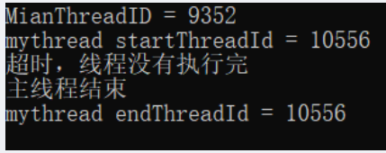 

- std::future_status::ready 示例

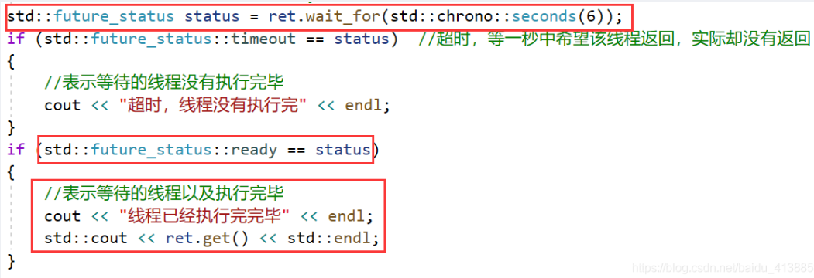 

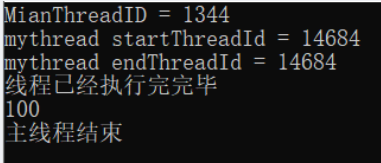 

- std::future_status::deferred 示例

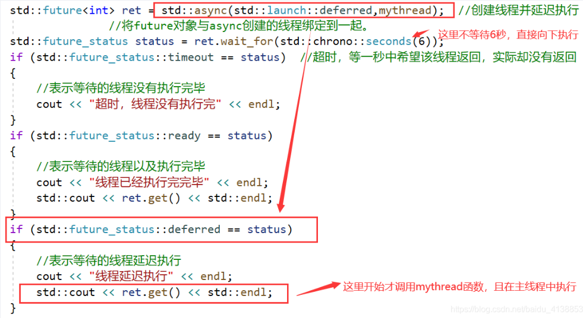 

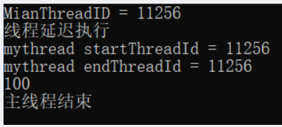 

- 案例源码

```C++
#include <iostream>
#include <thread>
#include <future>
 
using namespace std;
 
int mythread() //线程入口函数
{
    cout << "mythread start" << "ThreadId = " << std::this_thread::get_id() << endl;  //打印线程id
    std::chrono::milliseconds dura(5000);  //休息5秒
    std::this_thread::sleep_for(dura);
    cout << "mythread end" << "ThreadId = " << std::this_thread::get_id() << endl;  //打印线程id
    return 100;
}
 
int main()
{
    cout << "MianThreadID = " << std::this_thread::get_id() << endl;  //打印主线程id
    std::future<int> ret = std::async(std::launch::deferred,mythread);  //创建线程并延迟执行
                   //将future对象与async创建的线程绑定到一起。
    std::future_status status = ret.wait_for(std::chrono::seconds(6));
    if (std::future_status::timeout == status) 
    {
        //表示等待的线程没有执行完毕
        cout << "超时，线程没有执行完" << endl;
    }
    if (std::future_status::ready == status)  
    {
        //表示等待的线程以及执行完毕
        cout << "线程已经执行完完毕" << endl;
        std::cout << ret.get() << std::endl;
    }
    if (std::future_status::deferred == status)
    {
        //表示等待的线程延迟执行
        cout << "线程延迟执行" << endl;
        std::cout << ret.get() << std::endl;
    }
 
    //主线程执行
    std::cout << "主线程结束" << std::endl;
    return 0;
}
```

## shared_future、atomic

**std::shared_future** 

- shared_future是个类模板，get()函数`复制`数据
- 对于future对象,可以通过get()获取值，但只能get一次，否则会报异常。主要是因为get函数的设计，是一个移动语义。

 

- std::shared_future 示例

```C++
#include <iostream>
#include <thread>
#include <future>
 
using namespace std;
 
void mythread(std::promise<int>& tmp, int clc)
{
    cout << "mythread start" << "ThreadId = " << std::this_thread::get_id() << endl;  //打印线程id
    //做一系列复杂运算
    clc++;
    clc *= 233;
    //其他运算，比如花费了5秒钟
    std::chrono::milliseconds dura(5000);  //休息5秒
    std::this_thread::sleep_for(dura);
    //计算出结果
    int ret = clc;  //保存结果
    tmp.set_value(ret); //结果保存到tmp中
    cout << "mythread end" << "ThreadId = " << std::this_thread::get_id() << endl;  //打印线程id
    return;
}
void mythread2(std::shared_future<int>& tmp)
{
    cout << "mythread2 start" << "ThreadId = " << std::this_thread::get_id() << endl;  //打印线程id
    auto val = tmp.get();
    cout << "mythread2 val = " << val << endl;
    cout << "mythread2 end" << "ThreadId = " << std::this_thread::get_id() << endl;  //打印线程id
    return;
}
 
int main()
{
    cout << "MianThreadID = " << std::this_thread::get_id() << endl;  //打印主线程id
 
    std::promise<int> var_pro;  //创建一个promise对象，用来保存int类型的值
    std::thread objThread(mythread, std::ref(var_pro), 10);
    //获取结果
    objThread.join();
    std::future<int>  ret = var_pro.get_future(); //promise和线程绑定，用于获取线程返回值
 
    bool ifcanget = ret.valid();  //判断future对象中是否有有效值
    cout << "ret.valid() get前的值 " << ifcanget << endl;
 
    //std::shared_future<int> ret_s(std::move(ret)); //执行完毕后result_s里有值，而result里空了
    std::shared_future<int> ret_s(ret.share());   //执行完毕后result_s里有值，而result里空了
    ifcanget = ret.valid();
    cout << "ret.valid() get后的值 " << ifcanget << endl;
 
    //连续从ret_s中get两次值
    auto mythreadResualt = ret_s.get();
    mythreadResualt = ret_s.get();
    cout << "ret_s.valid() 连续get两次后的值 " << ret_s.valid() << endl;
 
    std::thread objThread2(mythread2, std::ref(ret_s));
    //获取结果
    objThread2.join();        //等线程2执行完毕
 
    //主线程执行
    std::cout << "主线程结束" << std::endl;
    return 0;
}
```

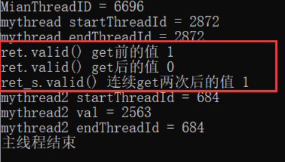 

- 可直接通过get_future()返回值`直接构造`一个shared_future对象

 


**原子操作std::atomic**

例如有两个线程，对一个变量进行操作，这个线程读该变量值，另一个线程往这个变量中写值。有两种方法保证结果正确。

互斥量：多线程编程中保护共享数据： 锁，操作共享数据，开锁。能保证最终结果正确，但是效率较低。

原子操作：理解成一种`不需要用到互斥量加锁（无锁）技术的多线程并发编程方式`。

- 原子操作: 在多线程中不会被打断的程序执行片段。`比互斥量效率上更胜一筹`。
- 互斥量的加锁一般是针对一个代码段（几行代码），而`原子操作针对的一般都是一个变量，而不是一个代码段`。
- 原子操作，一般都是指“`不可分割的操作`”，也就是说这种操作状态要么是完成的，要么是没完成的，不可能出现半完成状态。
- std::atomic来代表原子操作，`std::atomic是个类模板`。std::atomic这个东西是用来`封装某个类型的值的`。

基本的std::atomic用法范例

```C++
#include <iostream>
#include <thread>
#include <mutex>
#include <future>
 
std::atomic<int> my_count{0};  //封装了一个int类型的对象（值），可以像操作一个int类型的变量一样操作my_count
 
void my_thread()  //线程入口函数
{
    for (int i = 0; i < 1000000; i++)
    {
        my_count++;  //对应的是一个原子操作，不会被打断
    }
    return;
}
 
int main()
{
    std::thread threadObj1(my_thread);
    std::thread threadObj2(my_thread);
 
    threadObj1.join();
    threadObj2.join();
 
    std::cout << "两个线程执行完毕，最终 my_count的值是" << my_count << std::endl;
 
    return 0;
}
```

 

std::atomic示例2

```C++
#include <iostream>
#include <thread>
#include <mutex>
#include <future>
 
std::atomic<bool> thread_end{false};  //线程退出标记
 
void my_thread()  //线程入口函数
{
    std::chrono::milliseconds dura(2000); //2s
    while (false == thread_end)
    {
        //系统每要求线程退出，继续执行
        std::cout << "ThreadID = " << std::this_thread::get_id() << "线程执行中..." << std::endl;
        std::this_thread::sleep_for(dura);
    }
    std::cout << "ThreadID = " << std::this_thread::get_id() << "线程结束" << std::endl;
    return;
}
 
int main()
{
    std::thread threadObj1(my_thread);
    std::thread threadObj2(my_thread);
 
    std::chrono::milliseconds dura(4000); //5s
    std::this_thread::sleep_for(dura);
    thread_end = true;  //对原子对象的写操作，让线程自行运行结束
 
    threadObj1.join();
    threadObj2.join();
    std::cout << "程序执行完毕，退出" << std::endl;
 
    return 0;
}
```

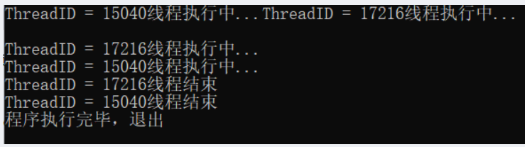 

> 原子用途：一般用于`计数`或者`统计`（例如累计发送出去了多少个数据包，累计接收到了多少个数据包）。


**原子操作std::atomic续谈**

```C++
#include <iostream>
#include <thread>
#include <future>
 
std::atomic<int> my_count{ 0 };  //封装了一个int类型的对象（值），可以像操作一个int类型的变量一样操作my_count
 
void my_thread()  //线程入口函数
{
    for (int i = 0; i < 1000000; i++)
    {
       // my_count++;  //对应的是一个原子操作，不会被打断
        my_count += 1;
    }
    return;
}
 
int main()
{
    std::thread threadObj1(my_thread);
    std::thread threadObj2(my_thread);
 
    threadObj1.join();
    threadObj2.join();
 
    std::cout << "两个线程执行完毕，最终 my_count的值是" << my_count << std::endl;
 
    return 0;
}
```

 

- 上述my_count++ ，及my_count += 1；都能保证是原子操作，结果正确；如果改为my_count = my_count + 1；则结果不正确：

 

>一般atomic原子操作，针对++,--,+=,&=,|=,^=是支持的。其他的可能不支持。


**补充知识点**

```C++
std::atomic<int> atm = 0;
cout << atm << endl;
```

- 这里只有读取atm是原子操作，但是整个这一行代码 cout << atm << endl; 并不是原子操作，导致最终显示在屏幕上的值是一个“曾经值”。

```C++
std::atomic<int> atm = 0;
auto atm2 = atm; //这种定义时初始化操作不允许，编译报错：“尝试引用已删除的函数”，编译器内部肯定把拷贝构造函数给干掉了
atomic<int> atm3 = atm;//也不允许
atomic<int> atm2;
atm2 = atm;//拷贝赋值运算符也不让用
```

- 这种拷贝初始化不可以，编译会报错。

```C++
atomic<int> atm2(atm.load());
auto atm3(atm.loac()):
```

- 读可以用load()：以原子方式读atomic对象的值。

```C++
atm2.store(12);
atm2 = 12;
```

- 写用store()：以原子方式写入内容。
- `原子操作实质`上是：不允许在进行原子对象操作时进行CPU的上下文切换。

## std::async与std::thread

std::async参数详述 ,async用来创建一个异步任务

```C++
#include <iostream>
#include <thread>
#include <future>
 
using namespace std;
 
int mythread() //线程入口函数
{
    cout << "mythread start" << "ThreadId = " << std::this_thread::get_id() << endl;  //打印线程id
  
    cout << "mythread end" << "ThreadId = " << std::this_thread::get_id() << endl;    //打印线程id
    return 100;
}
 
int main()
{
    cout << "MianThreadID = " << std::this_thread::get_id() << endl;  //打印主线程id
    std::future<int> ret = std::async(mythread);  //创建线程并开始执行
                   //将future对象与async创建的线程绑定到一起，流程不卡在这里，继续运行
    std::cout << ret.get() << std::endl;
  
    std::cout << "主线程结束" << std::endl;
    return 0;
}
```

- 使用std::thread() 创建线程，如果系统资源紧张，那么可能创建线程就会失败，那么执行std::thread()时整个程序可能崩溃。
- std::async()一般不叫创建线程，一般叫它`创建一个异步任务`。std::async和std::thread最明显的不同，就是async有时候并不创建新线程。
- async()参数 std::launch::deferred【延迟调用】 ，以及std::launch::async【强制创建一个线程】
  - std::launch::deferred`延迟调用`，并且`不创建新线程`，延迟到future对象调用 get()或者 wait() 的时候才执行mythread()。
    - 如果没有调用get或者wait，那么这个mythread()`不会执行`。
  - std::launch::async：`强制这个异步任务在新线程上执行`，意味着系统必须要创建出新线程来运行mythread()。
  - std::launch::async | std::launch::deferred，这里这个 | ：意味着调用async的行为可能是两种情况其一。
  - 不带额外参数，只给async函数一个入口函数名：
    - `默认值`应该是std::launch::async | std::launch::deferred；
    - 换句话说：`系统会自行决定是异步`(创建新线程)`还是同步`（不创建新线程）方式运行。


**std::async和std::thread的区别（重点）**

【std::thread】

 - std::thread创建线程，如果系统资源紧张，创建线程失败，那么整个程序就会报异常崩溃。
 - std::thread创建线程的方式，如果线程返回值，想拿到这个值也不容易。

【std::async】

- std::async创建异步任务。可能创建也可能不创建线程。
- std::async调用方法很容易拿到线程入口函数的返回值。

【系统资源限制的影响】

- 如果用std::thread创建的线程太多，则可能创建失败，系统报告异常，崩溃。
- 如果用std::async，一般就不会报异常不会崩溃，因为如果系统资源紧张导致无法创建新线程的时候，std::async这种不加额外参数的调用就不会创建新线程。而是后续谁调用了result.get()来请求结果，那么这个异步任务mythread就运行在执行这条get()语句所在的线程上。
  - 如果强制std::async一定要创建新线程，那么就必须使用  std::launch::async。承受的代价就是系统资源紧张时，程序崩溃。
- 经验：一个程序里，`线程数量不宜超过100-200`，原因是时间片的切换。


**std::async不确定性问题的解决**

- 可以通过 future的状态来进行判断，利用std::future对象的wait_for函数等待0秒。（注意等待 0 秒进行判断系统采用的策略，相当于执行到这里就立即得到future对象的状态）。

  - 如果系统采用的是std::launch::deferred方式，那么std::future对象就是std::launch::deferred状态。

  - 如果系统采用的是std::launch::async方式，那么std::future对象有可能有两种状态，因为在新线程可能执行完也有可能没有执行完，此时需要判断std::future对象状态是std::future_status::ready还是std::future_status::timeout。

```C++
std::future<int>  result = std::async(mythread); //想判断async到底有没有创建新线程立即执行还是延迟（没创建新线程）执行
 
std::future_status status = result.wait_for(0s);   //(std::chrono::seconds(0));
if (status == std::future_status::deferred)
{
	//线程被延迟执行了(系统资源紧张了，它给我采用std::launch::deferred策略了)
	cout << result.get() << endl; //这个时侯才去调用了mythread（）；
}
else
{
	//任务没有被推迟，已经开始运行了被，线程被创建了；
	if (status == std::future_status::ready)
	{
		//线程成功返回
		cout << "线程成功执行完毕并返回!" << endl;
		cout << result.get() << endl;
	}
	else if (status == std::future_status::timeout)
	{
		//超时线程还没执行完
		cout << "超时线程没执行完!" << endl;
		cout << result.get() << endl;
	}
}
```

## windows临界区

**windows临界区**

- windows临界区是windows编程中的内容，效果几乎可以等同于c++11的mutex，可以保护一个代码段。
- Windows临界区，“同一个线程‘”是可以重复进入的，但是`进入的次数与离开的次数必须相等`，而不会引起程序异常报错。
- C++互斥量mutex则不允许同一个线程重复加锁，会报异常。

```C++
#include <iostream>
#include <thread>
#include <list>
#include <mutex>
#include <Windows.h>//包含头文件

#define __WINDOWSJQ_//定义一个开关
using namespace std;

class A
{
public:
	// 把收到的消息传入队列
	void inMsgRecvQueue()
	{
		for (size_t i = 0; i < 1000; ++i)
		{
			cout << "收到消息，并放入队列 " << i << endl;

#ifdef  __WINDOWSJQ_
			EnterCriticalSection(&my_winsec);	//	进入临界区，类似lock加锁
			//EnterCriticalSection(&my_winsec);	//	可以再次进入临界区,程序不会出错
			msgRecvQueue.push_back(i);
			LeaveCriticalSection(&my_winsec);	//	离开临界区，类似unlock解锁
			//LeaveCriticalSection(&my_winsec);	//	如果进入两次，必须离开两次不会报错
#else
			my_mutex.lock();
			msgRecvQueue.push_back(i);//假设这个数字是我收到的命令，我直接弄到消息队列里来
			my_mutex.unlock();
#endif //  __WINDOWSJQ_
		}
		cout << "消息入队结束" << endl;
	}
	// 从队列中取出消息
	void outMsgRecvQueue()
	{
		for (size_t i = 0; i < 1000; ++i)
		{
#ifdef  __WINDOWSJQ_
			EnterCriticalSection(&my_winsec);	//	进入临界区
			if (!msgRecvQueue.empty())
			{
				// 队列不为空
				int num = msgRecvQueue.front();
				cout << "从消息队列中取出 " << num << endl;
				msgRecvQueue.pop_front();
			}
			else
			{
				// 消息队列为空
				cout << "消息队列为空 " << endl;
			}
			LeaveCriticalSection(&my_winsec);	//	离开临界区
#else
			my_mutex.lock();
			if (!msgRecvQueue.empty())
			{
				// 队列不为空
				int num = msgRecvQueue.front();
				cout << "从消息队列中取出 " << num << endl;
				msgRecvQueue.pop_front();
				my_mutex.unlock();
			}
			else
			{
				// 消息队列为空
				cout << "消息队列为空 " << endl;
				my_mutex.unlock();
			}
#endif //  __WINDOWSJQ_
		}
		cout << "消息出队结束" << endl;
	}
	A()//类A的构造函数
	{
#ifdef __WINDOWSJQ_
		InitializeCriticalSection(&my_winsec);	//用windows的临界区之前要初始化，而mutex不用
#endif // __WINDOWSJQ_
	}
private:
	list<int> msgRecvQueue;//容器，用来代表玩家发送来的命令
	std::mutex my_mutex;//创建互斥量

#ifdef __WINDOWSJQ_
	CRITICAL_SECTION my_winsec;	//定义windows中的临界区，非常类似C++11中的mutex
#endif // __WINDOWSJQ_

};

int main()
{
	A myobj;
	std::thread	myInMsgObj(&A::inMsgRecvQueue, &myobj);
	std::thread	myOutMsgObj(&A::outMsgRecvQueue, &myobj);
	myInMsgObj.join();
	myOutMsgObj.join();

	return 0;
}
```

**自动析构技术**

- C++11：lock_guard防止忘了释放信号量，是在析构时自动释放。
- windows：可以写个类，用于自动释放临界区，防止忘记LeaveCriticalSection导致死锁情况的发生。

```C++
//写个类
class CWinLock {
public:
    CWinLock(CRITICAL_SECTION *pCritmp)//构造函数
    {
        my_winsec = pCritmp;
        EnterCriticalSection(my_winsec);
    }
    ~CWinLock()//析构函数
    {
        LeaveCriticalSection(my_winsec)
    };
private:
    CRITICAL_SECTION *my_winsec;
};
//main里这样用
#ifdef  __WINDOWSJQ_
	CWinLock winlock(&my_winsec);
	CWinLock winlock2(&my_winsec);//多次调用也没问题
	msgRecvQueue.push_back(i);

```

> 上述这种CWinLock类叫**RAII类**（Resource Acquisition is initialization），即资源获取及初始化（构造函数初始化一个东西，析构函数中释放一个东西）。
>
> 容器，智能指针都属于这种类。

## 线程池

场景设想：服务器程序， 每来一个客户端，就创建一个新线程为这个客户提供服务。

- 线程池：把一堆线程弄到一起，统一管理。这种统一管理调度，循环利用的方式，就叫做线程池。
- 实现方式：程序启动时，一次性创建好一定数量的线程，用完了再放回到池子里，哪个空闲用哪个。没有空闲的线程就等待。这种方式让人更放心，觉得程序代码更稳定，效率高。


**线程创建数量谈**

- 线程创建的数量极限的问题
  - 一般来讲，2000个线程基本就是极限，再创建就会崩溃。
- 线程创建数量建议
  - 采用某些技术开发程序，接口提供商的建议（创建线程数量=cpu数量，cpu*2，cpu*2+2等等），遵照建议和指示来确保程序高效执行。
  - 创建多线程完成业务，考虑可能被阻塞的线程数量，创建多于最大被阻塞线程数量的线程，如100个线程被阻塞在充值业务，开110个线程就很合适。
  - 线程创建数量尽量不要超过500个，因为CPU要切换要调度要恢复内存数据等等，执行效率会降低，所以`尽量控制在200个之内`。

# 内存

## new与delete

**new类对象时加不加括号的差别**

- 如果是个空类，那么如下两种写法没有区别，现实中可能光写一个空类；
- 类A中有成员变量则： 带括号的初始化会把一些和成员变量有关的内存清0，但不是整个对象的内存全部清0；
- 当类A有构造函数 ，下面两种写法得到的结果一样了；

```C++
A *pa = new A(); //没构造函数，则清零；有构造函数，则像构造函数接管了一样。 		
A *pa = new A;
```

**new/delete干了什么**

new 可以叫 关键字/操作符，new 干了两个事：

- 一个是调用operator new(malloc)；
- 一个是调用了类A的构造函数；

delete干了两个事：

- 一个是调用了类A的析构函数；
- 一个是调用operator delete(free)；

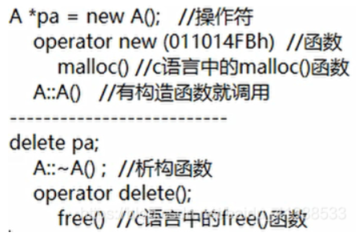 

```C++
class A
	{
	public:
		int m_i; //成员变量
		A(){
		}
		~A()
		{
		}
		//virtual void func() {}
	};
	void func()
	{
		
		A *pa = new A(); //看上去像函数调用
		....
		delete pa;		

		A *pa2 = new A;
		int *p3 = new int;  //初值随机
		int *p4 = new int(); //初值 0
		int *p5 = new int(100); //初值100
			
		operator new(120);    //F12查看调用，调用了malloc()
		
		//operator delete();
		//malloc()
		//free();

		int abc;
		abc = 6;
		
	}
```

## 内存池

内存池的概念和实现原理概述：

用malloc申请一大块内存，当你要分配的时候，我从这一大块内存中一点一点的分配给你，当一大块内存分配的差不多的时候，我再用malloc再申请一大块内存，然后再一点一点的分配给你；减少内存浪费，提高运行效率；

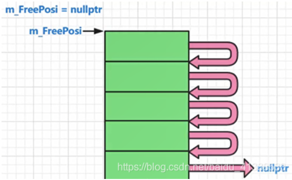 

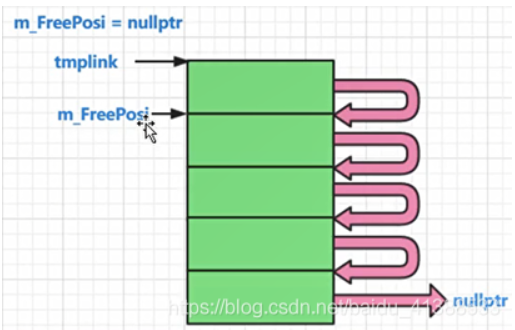 

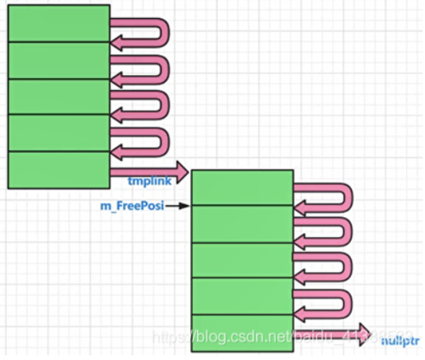 

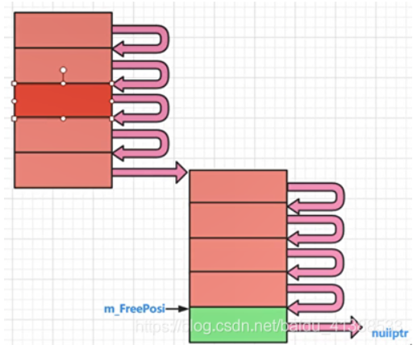 

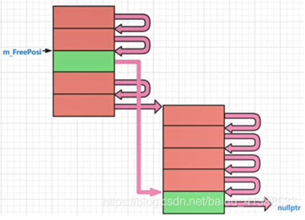 

```C++
#define MYMEMPOOL 1
	//针对一个类的内存池实现演示代码
	//针对一个类的内存池 A,
	//A *pa = new A() ,delete pa; 用内存池的手段实现new,delete一个对象；
	class A
	{
	public:
		static void *operator new(size_t size);
		static void operator delete(void *phead);
		static int m_iCout; //分配计数统计，每new一次，就统计一次
		static int m_iMallocCount; //每malloc一次，我统计一次
	private:
		A *next;
		static A* m_FreePosi; //总是指向一块可以分配出去的内存的首地址
		static int m_sTrunkCout; //一次分配多少倍的该类内存
	};
	int A::m_iCout = 0;
	int A::m_iMallocCount = 0;
	A *A::m_FreePosi = nullptr;
	int A::m_sTrunkCout = 5; //一次分配5倍的该类内存作为内存池子的大小

	void *A::operator new(size_t size)
	{
#ifdef MYMEMPOOL
		A *ppoint = (A*)malloc(size);
		return ppoint;
#endif
		A *tmplink;
		if (m_FreePosi == nullptr)
		{
			//为空，我要申请内存，要申请一大块内存
			size_t realsize = m_sTrunkCout * size; //申请m_sTrunkCout这么多倍的内存
			m_FreePosi = reinterpret_cast<A*>(new char[realsize]); //传统new，调用的系统底层的malloc
			tmplink = m_FreePosi; 

			//把分配出来的这一大块内存（5小块），彼此要链起来，供后续使用
			for (; tmplink != &m_FreePosi[m_sTrunkCout - 1]; ++tmplink)
			{
				tmplink->next = tmplink + 1;
			}
			tmplink->next = nullptr;
			++m_iMallocCount;
		}
		tmplink = m_FreePosi;
		m_FreePosi = m_FreePosi->next;
		++m_iCout;
		return tmplink;
	}
	void A::operator delete(void *phead)
	{
#ifdef MYMEMPOOL
		free(phead);
		return;
#endif
		(static_cast<A*>(phead))->next = m_FreePosi;
		m_FreePosi = static_cast<A*>(phead);                //类似在可用链表进行头插入
	}

	void func()
	{
		clock_t start, end; //包含头文件 #include <ctime>
		start = clock();
		//for (int i = 0; i < 500'0000; i++)
		for (int i = 0; i < 15; i++)
		{
			A *pa = new A();
			printf("%p\n", pa);
		}
		end = clock();
		cout << "申请分配内存的次数为：" << A::m_iCout << " 实际malloc的次数为：" << A::m_iMallocCount << " 用时(毫秒): " << end - start << endl;
	}
```

## 嵌入式指针

嵌入式指针（embedded pointer）概念

一般应用在内存池相关的代码中； 成功使用嵌入式指针有个前提条件：（类A对象的sizeof必须不小于4字节）

嵌入式指针工作原理：借用A对象所占用的内存空间中的前4个字节，这4个字节用来 链住这些空闲的内存块；但是，一旦某一块被分配出去，那么这个块的前4个字节就不再需要，此时这4个字节可以被正常使用；

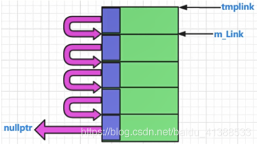 

嵌入式指针演示：
sizeof()超过4字节的类就可以安全的使用嵌入式指针；因为，在当前的vs2017环境下，指针的sizeof值是4


struct里放了一个指针，它的大小为4个字节。这个指针的值，存着下一个内存的地址。

```C++
class TestEP
	{
	public:
		int m_i;
		int m_j;

	public:
		struct obj //结构        //定义一个类型，不放在外部，污染全局变量
		{
			//成员，是个指针
			struct obj *next;  //这个next就是个嵌入式指针
			                   //自己是一个obj结构对象，那么把自己这个对象的next指针指向 另外一个obj结构对象，最终，把多个自己这种类型的对象通过链串起来；
		};
	};
	
	void func()
	{
		TestEP mytest;
		cout << sizeof(mytest) << endl; //8
		TestEP::obj *ptemp;  //定义一个指针
		ptemp = (TestEP::obj *)&mytest; //把对象mytest首地址给了这个指针ptemp，这个指针ptemp指向对象mytest首地址；
		cout << sizeof(ptemp->next) << endl; //4
		cout << sizeof(TestEP::obj) << endl; //4
		ptemp->next = nullptr;

	}
```

 

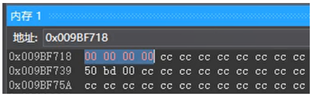 


**内存池代码的改进**

单独的为内存池技术来写一个类：专门的内存池类

```C++
class myallocator //必须保证应用本类的类的sizeof()不少于4字节；否则会崩溃或者报错；
	{
	public:
		//分配内存接口
		void *allocate(size_t size)
		{
			obj *tmplink;
			if (m_FreePosi == nullptr)
			{
				//为空，我要申请内存，要申请一大块内存
				size_t realsize = m_sTrunkCout * size; //申请m_sTrunkCout这么多倍的内存
				m_FreePosi = (obj *)malloc(realsize);
				tmplink = m_FreePosi;

				//把分配出来的这一大块内存（5小块），彼此用链起来，供后续使用
				for (int i = 0; i < m_sTrunkCout - 1; ++i) //0--3
				{
					tmplink->next = (obj *)((char *)tmplink + size);
					tmplink = tmplink->next;
				} //end for
				tmplink->next = nullptr;
			} //end if
			tmplink = m_FreePosi;
			m_FreePosi = m_FreePosi->next;
			return tmplink;
		}
		//释放内存接口
		void deallocate(void *phead)
		{
			((obj *)phead)->next = m_FreePosi;
			m_FreePosi = (obj *)phead;
		}
	private:
		//写在类内的结构，这样只让其在类内使用
		struct obj
		{
			struct obj *next; //这个next就是个嵌入式指针
		};
		int m_sTrunkCout = 5;//一次分配5倍的该类内存作为内存池子的大小
		obj* m_FreePosi = nullptr;
	};
```

**定义为宏，进行应用**

```C++
//------------------------
#define DECLARE_POOL_ALLOC()\
public:\
	static myallocator myalloc;\
	static void *operator new(size_t size)\
	{\
		return myalloc.allocate(size);\
	}\
	static void operator delete(void *phead)\
	{\
		return myalloc.deallocate(phead);\
	}\
//-----------
#define IMPLEMENT_POOL_ALLOC(classname)\
myallocator classname::myalloc;                 
//---------------静态变量

	class A
	{
		DECLARE_POOL_ALLOC()

	public:
		int m_i;
		int m_j; //为了保证sizeof(A)凑够4字节，老师演示时定义了两个int成员变量；	
	};
	IMPLEMENT_POOL_ALLOC(A)	
	
	void func()
	{
		A *mypa[100];
		for (int i = 0; i < 15; ++i)
		{
			mypa[i] = new A();    //调用重载的operator new/delete
			mypa[i]->m_i = 12;
			mypa[i]->m_j = 15;

			printf("%p\n", mypa[i]);
		}
		for (int i = 0; i < 15; ++i)
		{
			delete mypa[i];
		}

	}
}
```

# STL标准模板库

C++标准库： C++ standard Library。

C++标准模板库：Standard Template Library（STL）

泛型编程：使用模板为主要的编程手段来编程编写的代码。


**STL组成部分：**

- 容器：vector, list , map;
- 迭代器：用于遍历或者访问容器中的元素；
- 算法：（函数），用来实现一些功能，search,sort,copy.....
- 分配器（内存分配器）；
- 其他：适配器、仿函数等等；

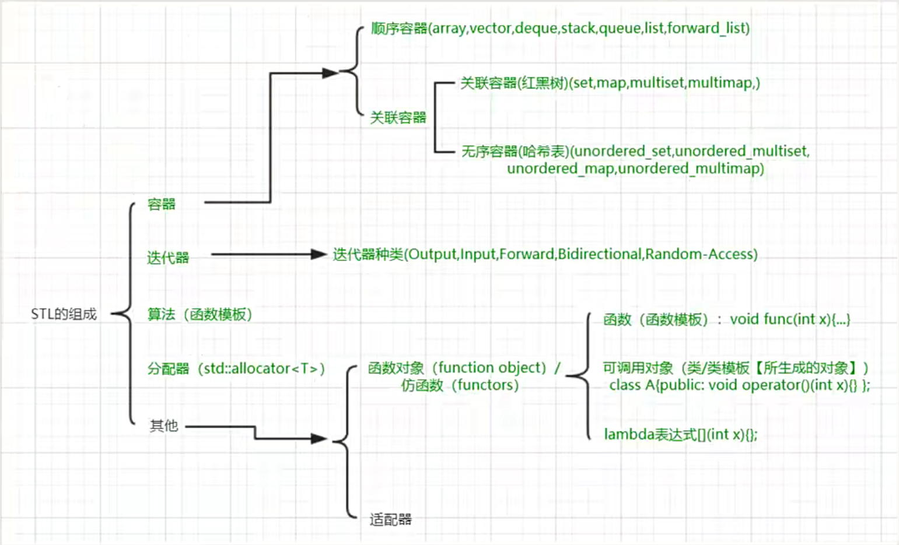

## 顺序容器 

- 顺序容器：放进去在哪里元素就排在哪里。如：arrary、vector、deque、list、forward_list；

- 关联容器：元素是 键/值 对，特别适合做查找。你能控制插入内容，但是一般来讲你不能控制插入位置。如：hash_set、hash_map、hash_multiset、hash_multimap；

- 无序容器：元素位置不重要，重要的是这个元素在容器中。无序容器也属于一种关联容器。

 

>C++11标准并没有规定任何容器必须使用特定的实现手段。

### arrary

顺序容器，其实是个数组，内存空间是连续的，大小是固定的；申请的时候多大，他就是多大，不能在改变它的大小。

```C++
namespace nmsp1 {
 
	void func() {
		array<string, 5> mystring{ "I","Love1Love2Love3Love4Love5Love6Love7","China" };
		cout << "myString.size() = " << mystring.size() << endl;
		mystring[0] = "It is very long~~~~~~~~~~~~~~~~~long~~~~~~~~~~~~~~long";
		mystring[4] = "It is very long~~~~~~~~~~~~~~~~~long~~~~~~~~~~~~~~long";
		cout << "sizeof(string) = " << sizeof(string) << endl;
		for (size_t i = 0; i < mystring.size(); ++i) {
			const char *p = mystring[i].c_str();
			cout << "-------------------begin----------------------" << endl;
			cout << "数组元素值= " << p << endl;
			printf("对象地址：%p\n", &mystring[i]);
			printf("对象指向的字符串地址：%p\n", p);
			cout << "------------------end--------------------------" << endl;
		}
		const char *p1 = "This is my life, This is my life";
		const char *p2 = "This is my life, This is my life";
 
		printf("p1字符串地址：%p\n", p1);
		printf("p2字符串地址：%p\n", p2);
	}
}
 
int main() {
	nmsp1::func();
	return 0;
}
```

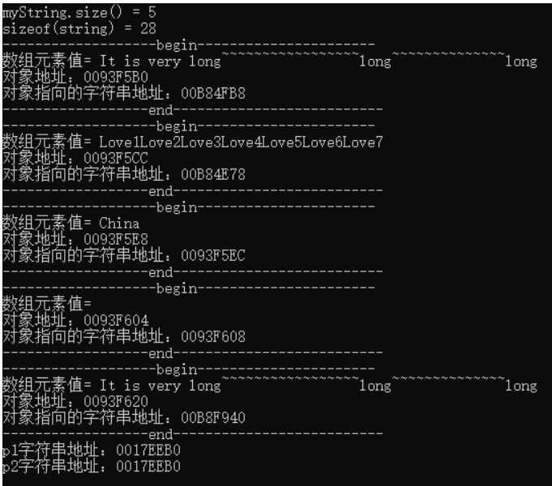 

由上可知，字符串的存储形式如下，当存储的字符串大于string的存储空间时，编译器会在外边找一块空间用来存放这个字符串。 p1、p2指向的内存地址相同。

 

### vector

- 往后边增加元素和删除元素很快。
- 往中间插入元素可能导致很多元素析构，重新构造，效率会非常低。
- 查找速度应该不会太快。

```C++
namespace nmsp2 {
	class A {
	public:
		int m_i;
		A(int tmpv) :m_i(tmpv) {
			cout << "A::A()构造函数执行" << endl;
		}
 
		A(const A &tmpa) :m_i(tmpa.m_i) {
			cout << "A::A()拷贝构造函数执行" << endl;
		}
 
		~A() {
			cout << "A::~A()析构函数执行" << endl;
		}
 
	};
 
	void func() {
		vector<A> myveca;
		for (int i = 0; i < 1; ++i) {
			cout << "---------------------begin-----------------------" << endl;
			myveca.push_back(A(i));
			cout << "----------------------end------------------------" << endl;
		}
	}
}

int main() {
	nmsp2::func();
	return 0;
}
```

 

```C++
namespace nmsp2 {
	class A {
	public:
		int m_i;
		A(int tmpv) :m_i(tmpv) {
			cout << "A::A()构造函数执行" << endl;
		}
 
		A(const A &tmpa) :m_i(tmpa.m_i) {
			cout << "A::A()拷贝构造函数执行" << endl;
		}
 
		~A() {
			cout << "A::~A()析构函数执行" << endl;
		}
 
	};
 
	void func() {
		vector<A> myveca;
		for (int i = 0; i < 5; ++i) {
			cout << "---------------------begin-----------------------" << endl;
			myveca.push_back(A(i));
			cout << "----------------------end------------------------" << endl;
		}
	}
}
 
int main() {
	nmsp2::func();
	return 0;
}
```

 

- vector容器内存空间是也是挨着的，vector容器有一个“空间”的概念。
  - 过程大概是这样的：首先编译器找一个能存放一个元素的空间存入该元素，在此插入元素时空间不够了，因为要要求存储空间连续所以，编译器要释放掉现有的内存，重新找一块能容纳两个元素的空间，放入这两个元素（一个先构造在拷贝，一个直接拷贝），过程以此类推。

- 容器里有`多少个元素可以用size()`来看，而容器`有多少空间可以用 capacity()`来看；

- capacity()一定不会小于size()；

```C++
namespace nmsp2 {
	class A {
	public:
		int m_i;
		A(int tmpv) :m_i(tmpv) {
			cout << "A::A()构造函数执行" << endl;
		}
 
		A(const A &tmpa) :m_i(tmpa.m_i) {
			cout << "A::A()拷贝构造函数执行" << endl;
		}
 
		~A() {
			cout << "A::~A()析构函数执行" << endl;
		}
 
	};
 
	void func() {
		vector<A> myveca;
		for (int i = 0; i < 6; ++i) {
			cout << "---------------------begin-----------------------" << endl;
			cout << "容器插入元素之前size= " << myveca.size() << endl;
			cout << "容器插入元素之前capacity= " << myveca.capacity() << endl;
			myveca.push_back(A(i));
			cout << "容器插入元素之后size= " << myveca.size() << endl;
			cout << "容器插入元素之后capacity= " << myveca.capacity() << endl;
			cout << "----------------------end------------------------" << endl;
		}
	}
}

int main() {
	nmsp2::func();
	return 0;
}
```

 

```C++
vector<A> myveca;
myveca.reserve(10);
```

>reserve(int size)用于预留空间，前提是你知道这个容器最多会容纳多少个元素；可以大大提高程序效率。

### deque

- deque(double end queue)：双向开口。相当于动态数组：头部和尾部插入和删除数据头很快；

如果像中间插入元素，那么可能涉及到要移动其他元素，效率会比较低；

**分段连续：**

 

- queue：队列，这是个普通队列，先进先出，后进后出，基本的数据结构

 

### stack

stack：栈（堆栈），先进后出，只有一个开口，只要把的却左边开口封死我们就可以认为它变成了一个stack；


**和vector的区别：**

- vector支持从中间插入与删除元素，虽然效率不高。

- stack只支持从栈顶放入与取出元素，这种设计是stack的初衷，deque实际上包含着stack的功能

 

### list

list：队列，这是一个双向链表，不需要各个元素之间的内存连在一起；查找效率不突出，在任意位置插入和删除元素非常迅速；


**vector和list的区别：**

- vector类似于数组，它的内存是连续的，list是双向链表，内存空间不连续至少不要求内存是连续的。

- vector从中间或开头插入元素的效率比较低；但是list的效率非常高；

- vector当内存不够时会重新找一块内存，对原来内存对象做析构，在找的新内存重新构造对象；

- vector能够高效的随机存取，而list不行；list要从第一个开始找（从第一个数据中找第二个数据的内存地址，到第二个数据中找第三个数据的内存地址）

 

forward_list：单项链表，节省了内存，尤其是元素多的时候，节省的内存非常可观。

## 关联容器

关联容器，容器内部的实现多为红黑树；往这种容器中保存数据时不需要指定数据位置，这种容器会自动的给你加入的元素一个位置。

### map

每个元素有两项，是个（键 / 值）；一般都是通过key找value；通过key找value特别快。`不允许key相同`，如果非要让key相同，你要采用mutimap

```C++
map<int, string> mymap;
mymap.insert(std::make_pair(1, "老王"))；
mymap.insert(std::make_pair(2, "老李"))；
 
mymap.insert(pair<int, string>(3, "老丁"))；
 
auto iter = mymap.find(3);
if(iter != mymap.end()){
    printf("编号为%d，名字%s\n",iter->first, iter->second.c_str());
}
```

### set

不存在键值对的说法，每个元素就是一个value；如果想重复可以使用mutiset

- 插入时，因为容器找一个适当的插入位置，所以插入的速度可能会慢。

- 查找的速度快。

## 无序容器

unordered_set / unordered_multimap 为新版本( hash_set， hash_map....老版本)

 

>优先使用容器里的find如果容器没有自己的find在使用全局find方法。

## 迭代器

迭代器是一个`可遍历STL容器全部或者部分元素`的对象（行为类似于指针对象）

迭代器是用来表现容器中的某一个位置；

迭代器依赖于容器，是由容器来提供的，一般来讲，容器里定义着迭代器的具体细节。

 


**迭代器的分类**

分类依据：迭代器的移动特性，以及这个迭代器上能够进行的操作；

迭代器行为如指针到处跳，表示一个位置，我们一般分类是依据他的跳跃能力，每个分类是一个对应struct定义；

- 输出型迭代器：struct output_iterator_tag;
- 输入型迭代器：struct input_iterator_tag;
- 前向迭代器：struct forward_iterator_tag;
- 双向迭代器（bidirectional iterator）：struct bidirectional_iterator_tag;
- 随机访问迭代器（random access iterator）：struct random_access_iterator_tag;


**继承关系**

 

大多数容器中都有一个迭代器类型，但`并不是所有容器都有迭代器`，比如：stack，queue这种容器就不提供迭代器。

 


**完善迭代器能力**

- 输出型迭代器（struct output_iterator）：一步一步能往前走，并且能够通过这种迭代器来改写容器数据；

   

- 输入型迭代器（struct input iterator）：以向前的方向读取元素，按照这个顺序一个一个返回元素。

   

- 前向迭代器（struct forward iterator）：继承自Input迭代器，因此它能向前的方向来读取元素，并且读取时提供额外保证。

   

- 双向迭代器（bidirectional iterator）：在前向迭代器基础之上增加了往回（反向）迭代，也就是迭代位置可以回退，新增加如下操作。

- 随机访问迭代器（random access iterator）：在双向迭代器的基础上又增加了所谓的随机访问能力。也就是增减某个偏移量能够计算距离（因为内存相连） 

## 算法

一种搭配迭代器使用的全局函数；可以理解为函数模板。比如：查找、排序等，有数十上百个算法；

STL库的算法函数前两个参数一般都是迭代器类型，表示容器中的元素的一个区间；

算法跟具体容器没关联，只跟迭代器有关联；只需要根据迭代器来开发算法，不需要理会具体容器。这种方式更加灵活，但是也缺失了直观性；某些数据结构和算法之间的兼容性也不那么好

调用方式：算法名(iterbg,itered)传递进去的应该是前闭后开的区间 [ begin() , end() ] ；算法头文件要包含进来：#include \<algorithm\>


**优点：**

- 如果第一个形参等于第二个形参，也就是 iterbg == itered, 那么就表示是个空区间；

- 迭代时，算法判断迭代器只要等于最后变这个开区间，那么就表示迭代结束；


**算法的一些内部处理**

- 算法会根据传递进来的迭代器来分析出迭代器的种类，不同种类的迭代器，算法会有不同的处理，要编写不同的代码来应对；

- 这种辨析不同代码来处理不同种类迭代器，能够直接影响到算法的执行效率；

- 这也是STL内部为什么要做一个分类的目的；


**一些算法使用范例**

- for_each()

  ```C++
  void myfunc(int i){
      cout << i << endl;
  }
  
  vector<int> myvec{ 10, 20, 30, 40 };
  for_each(myvec.begin(), myvec.end(), myfunc); //myfunc是一个可调用对象
  ```

- find()

  当成员函数和全局函数同时存在时，优先考虑使用同名的成员函数，如果没有成员函数在考虑使用全局函数。

  ```C++
  vector<int> myvec{ 10, 20, 30, 40 };
  vector<int> finder = find(myvec.begin(), myvec.end(), 40); //myfunc是一个可调用对象
   
  if (finder != myvec.end()){ //判断是否等于find的第二个参数，等于就没找到，不等于就找到了
      cout << "find it" << endl;
  }
  ```

  ```C++
  map<int, string> mymap;
  mymap.push_back(2, "li");
  mymap.push_back(1, "bai");
  auto finder = mymap.find(2);
  if (finder != mymap.end()){
      printf("id:%d, name:%s", iter->first, iter->second.c_str());
  }
  ```

- find_if()

  ```C++
  auto result = find_if(myvec.begin(), myvec.end(), [](int val)
  {
      if (val > 15){
          return true;
      }
      return false;
  }
  );
   
  if (result == myvec.end()){
      cout << "not find" << endl;
  }
  else{
      cout << "find it" << endl;
  }
  ```

- sort()

  ```C++
  vector<int> myvec = { 50, 15, 80, 30};
  sort(myvec.begin(), myvec.end()); //缺省参数时按照从小到大排列
  ```

  ```C++
  //可以自定义排序
  bool func(int i, int j){
      return i < j;  //从小到大排序
  }
   
  bool func(int i, int j){
      return i < j;  //从大到小排序
  }
   
  sort(myvec.begin(), myvec.end(), func);
  ```


## 仿函数

函数对象（function object）/仿函数（functors）

函数对象在STL中，一般都是和算法配合来使用,从而实现一些特定的功能；也就是说,这些函数对象主要用来服务于算法；


```C++
namespace _nmsp1
{	
	class A
	{
	public:
		bool operator()(int i, int j)
		{
			return i > j; //从大到小排序
		}
	};
 
	void func()
	{	
		vector<int> myvector = { 50,15,80,30,46 };
		A mya;
		sort(myvector.begin(), myvector.end(), mya);
 
		for (auto iter = myvector.begin(); iter != myvector.end(); ++iter)
		{
			cout << *iter << endl;
		}
		return;	
	}
}
```

**标准库中定义的函数对象**

标准库中也给我们提供了很多可以现成拿来使用的函数对象，使用它们之前，要包含一个头文件 functional

 

```C++
namespace _nmsp2
{
	//三：标准库中定义的函数对象范例
	class A 
	{
	public:
		bool operator()(int i, int j)
		{
			return i > j; //从大到小排序
		}
	};
 
	void func()
	{
		//plus<int>(); //加圆括号是生成一个临时对象 ，就是个可调用对象；
		//plus<int> myplus;
 
		vector<int> myvector = { 50,15,80,30,46 };
		//A mya;  //自定义的函数对象
		//sort(myvector.begin(), myvector.end(), mya); 
		//sort(myvector.begin(), myvector.end(), greater<int>()); // greater<int>()产生临时对象,称呼为系统定义的函数对象；
		sort(myvector.begin(), myvector.end(), less<int>());
 
		for (auto iter = myvector.begin(); iter != myvector.end(); ++iter)
		{
			cout << *iter << endl;
		}
	}
}
```

## 适配器

- 适配器基本概念：转接头
  把一个既有的东西 进行适当的改造，比如增加点东西，或者减少点东西，就构成了一个适配器；三种适配器：容器适配器，算法适配器，迭代器适配器。
- 容器适配器（类模板）：比如双端队列deque;
  stack：堆栈，是属于阉割版的deque；
  queue：队列，是属于阉割版的deque；
- 算法适配器（函数适配器） ：最典型的就是绑定器(binder)
  绑定器
  老版本 bind1st,bind2nd；c++11，名字被修改为bind；

 

```C++
namespace _nmsp1
{
	class A
	{
	public:
		bool operator()(int i)
		{
			//return i > 40; //希望大于40的元素被统计
			return 40 < i;  //希望大于40的元素被统计
		}
	};
 
	void func()
	{	
		vector<int> myvector = { 50,15,80,30,46,80 };
		//统计某个值出现的次数
		int cishu = count(myvector.begin(), myvector.end(), 80); //算法
		cout << cishu << endl;
 
		//A myobja;
		//cishu = count_if(myvector.begin(), myvector.end(), myobja);
		//cout << cishu << endl;
		
		//bind(less<int>(), 40, placeholders::_1);
		                            //less<int>的operator()的第一个参数绑定为40，那这样当调用less<int>()这个可调用对象时，
		                             //第二个参数，就用这里的 placeholders::_1表示，在调用这个函数时，被传入的第一个参数所取代；
		//auto bf = bind(less<int>(), 40, placeholders::_1);
		//bf(19);
 
		cishu = count_if(myvector.begin(), myvector.end(), bind(less<int>(),  //临时对象
								40,placeholders::_1));
		//a)bind:函数适配器中的绑定七；
		//b)less<int>()：是个函数对象（仿函数），这里是个临时对象
		//c)count_if：是个算法；
		cout << cishu << endl;
		
		return;	
	}
}

//reverse_iterator：反向迭代器；
namespace _nmsp2
{
	void func()
	{
		vector<int> iv = { 100,200,300 };
		for (vector<int>::reverse_iterator riter = iv.rbegin(); riter != iv.rend(); ++riter)
		{
			cout << *riter << endl;
		}
	}
}
```

# 未归类知识点

## 类型推断结果

推断有时候叫做推导，在现代c++中，经常涉及到推断，如auto等。这里主要讲解模板类型推断的知识。

通过“查看编译器类型推断的结果”这个手段来学习并掌握c++类型推断的规则。掌握C++类型推断结果，而不是依赖什么手段去查看编译器出来的结果。


**如何查看类型推断结果**

- 模拟编译器来推断一个模板参数和普通参数的类型。

- 使用boost库，把编译器给我们推断出来的类型信息打印出来。

  - 1.访问官网https://www.boost.org/ 下载boost库；

  *		2.点击右侧Version History可以下载到最新版本；
  *		3.将文件解压到一个文件夹中，本例中boost_1_68_0；
  *		4.右键项目--“属性”--“vc++目录”--“包含目录”中将解压的路径添加上（vs环境）；
  *		也可以使用nuget安装，右键项目 --“管理NuGet安装包”，搜索boost安装包；

**理解模板类型推断**

- 指针或者引用类型
  - 如果tem类型是个指针或者引用，但是不是万能引用

*			万能引用--形式参数tem是一个万能引用类型T&&
*			传值方式
*			数组做实参
*			数组名代表数组的首地址
*			函数名做实参，函数名相当于函数首地址，可以赋值给一个函数指针

**总结**

- 推断中，引用类型实参的引用类型等于不存在
- 万能引用中，实参为右值和左值，推断出来的结果不同
- 按值传递的实参，传递给形参时const属性不起作用，则传递过去指针可能起作用。
- 数组或者函数类型在推断中被看作指针，除非函数模板的形参是个引用。

```C++
#include<iostream>
#include<cstdlib>
#include <boost/type_index.hpp>

using namespace std;

//显示参数类型，这里不研究boost库
template<typename T>
//void myFunction01(T&tem)//T是类型模板参数，T是有类型的,tem是形参，tem也是有类型的
void myFunction01(const T &tem)
{
	using boost::typeindex::type_id_with_cvr;
	cout << "T type=" << type_id_with_cvr<T>().pretty_name() << endl;//显示T类型
	cout << "tem type=" << type_id_with_cvr<decltype(tem)>().pretty_name() << endl;//显示T类型

}

//2.1指针或者引用类型
template<typename T>
void myFunction02( T &tem)//tem是引用
{
	using boost::typeindex::type_id_with_cvr;
	cout << "T type=" << type_id_with_cvr<T>().pretty_name() << endl;//显示T类型
	cout << "tem type=" << type_id_with_cvr<decltype(tem)>().pretty_name() << endl;//显示T类型

}

template<typename T>
void myFunction03( const T &tem)//形参是常量引用
{
	using boost::typeindex::type_id_with_cvr;
	cout << "T type=" << type_id_with_cvr<T>().pretty_name() << endl;//显示T类型
	cout << "tem type=" << type_id_with_cvr<decltype(tem)>().pretty_name() << endl;//显示T类型

}

template<typename T>
void myFunction04( T *tem)//形参是指针类型
{
	using boost::typeindex::type_id_with_cvr;
	cout << "T type=" << type_id_with_cvr<T>().pretty_name() << endl;//显示T类型
	cout << "tem type=" << type_id_with_cvr<decltype(tem)>().pretty_name() << endl;//显示T类型

}

template<typename T>
void myFunction05(T &&tem)//形参是万能引用类型
{
	using boost::typeindex::type_id_with_cvr;
	cout << "T type=" << type_id_with_cvr<T>().pretty_name() << endl;//显示T类型
	cout << "tem type=" << type_id_with_cvr<decltype(tem)>().pretty_name() << endl;//显示T类型

}


template<typename T>
void myFunction06(T tem)//形参是万能引用类型
{
	using boost::typeindex::type_id_with_cvr;
	cout << "T type=" << type_id_with_cvr<T>().pretty_name() << endl;//显示T类型
	cout << "tem type=" << type_id_with_cvr<decltype(tem)>().pretty_name() << endl;//显示T类型

}

void tesFunction()
{
	;
}
int main(void)
{
	//(2)void myFunction01(const T&tem)
	myFunction01(100);
	/*
	 * T type=int
	 * tem type=int const &
	 */
	
	//2.1
	int i = 18;	//int
	const int j = i;	//const int
	const int&k = i;	//const int&类型
	cout << "-----" << endl;
	myFunction02(i);
	myFunction02(j);
	myFunction02(k);
	/*
	 *	T type=int
		tem type=int &
		T type=int const
		tem type=int const &
		T type=int const
		tem type=int const &
	1.如果实参是引用类型，则引用类型会被忽略掉，T不会被推到为引用类型。
	2.当我们向引用类型的形参tem传递const类型实参时，形参就会成为const&
		实参的const属性会成为类型模板参数的推导的类型的组成部分，
		也就是说，实参的const属性会传递。在函数中修改不了原来带const属性的实参。
	
	 */

	//形参是常量引用
	cout << "*******" << endl;
	myFunction03(i);
	myFunction03(j);
	myFunction03(k);
	/*
	 *  T type=int
		tem type=int const &
		T type=int
		tem type=int const &
		T type=int
		tem type=int const &

	1.如果实参是引用类型，则引用类型会被忽略掉，T不会被推到为引用类型。
	2.对于有const属性的实参，推导后T中的const属性没有了，因为模板函数myFunction03的形参tem出现了const。实参const替换掉形参const
	
	 */

	//指针类型
	const int*pi = &i;
	cout << "&&&&&&&&&" << endl;
	myFunction04(&i);
	myFunction04(pi);
	/*
	 *  T type=int
		tem type=int *
		T type=int const
		tem type=int const *
	结论：如果tem形参中没有const，则实参中的const就会传递到T类型中去。如果形参中有const，则T类型中不会带const。
	
	 */

	//*	2.2万能引用--形式参数tem是一个万能引用类型T&&
	cout << "2.2------------------------" << endl;
	myFunction05(i);//左值
	myFunction05(j);//左值
	myFunction05(k);
	myFunction05(100);//传递过去右值
	/*
	T type=int &
	tem type=int &	//这里有引用折叠
	T type=int const &
	tem type=int const &
	T type=int const &
	tem type=int const &
	T type=int
	tem type=int &&
	 */


	//2.3传值方式 如果形式参数tem是常规的传值方式传递
	cout << "2.3------------------------" << endl;
	myFunction06(i);
	myFunction06(j);
	myFunction06(k);
	/*
	 *  T type=int
		tem type=int
		T type=int
		tem type=int
		T type=int
		tem type=int
	const属性没有传递进去，因为形式参数是一个新副本。怎么传递进去const属性？？？-->传递指针进去
	 */
	char myStr[] = "jisuanjizuchengyhuanli";
	const char*const point = myStr;//第一个const修饰内存空间，第二个表示指针的指向不能改变
	cout << "jjjjjjjjjjjjjjjj" << endl;
	myFunction06(point);
	/*
	 T type=char const *
	 tem type=char const *
	传递const char*或者const char[]第一个const没有了，第二个const保留。
	 */

	//2.4数组做实参
	const char mystr02[] = "jisuanjizuchegnaun";
	cout << "22222222222222222222222" << endl;

	myFunction06(mystr02);
	myFunction02(mystr02);//调引用--推导成数组
	/*
	T type=char const *
	tem type=char const *
	T type=char const [19]
	tem type=char const (&)[19]//代表数组的引用
	*/

	//	2.5函数名做实参，函数名相当于函数首地址，可以赋值给一个函数指针
	cout << "6666666666666" << endl;
	myFunction06(tesFunction);

	myFunction02(tesFunction);//引用
	/*
	T type=void (__cdecl*)(void)//函数指针类型
	tem type=void (__cdecl*)(void)
	T type=void __cdecl(void)//函数指针引用
	tem type=void (__cdecl&)(void)
	 */

	cout << "helloWorld" << endl;
	system("pause");
	return 0;
}
```

## auto应用场合

**auto类型常规推断**

c++11中，auto用于变量的自动类型推断，在声明变量的时候根据变量的初值的类型`自动为此变量选择匹配的类型`，而不需要显示指定类型

- 自动类型推断发生在`编译期间`，不会影响程序执行期间的性能。
- auto定义的变量`必须立即初始化`，这样编译器才能自动推断它的类型。确定auto的类型和它所定义变量的类型。然后在编译期间使用真正的类型替换掉auto这个类型占位符。
- auto使用灵活，可以和指针，引用，const等限定符结合使用。
- auto类型推断和函数模板推断非常类似。auto推导后代表一个具体类型。auto实际上是一个类型，实际上相当于函数模板推导中的类型模板参数T。auto也是类型声明中的一部分，可以把auto当作类型占位符。


**auto类型推断分类**

*		指针或者引用类型，但不是万能引用：不会抛弃const属性，但是会抛弃引用等限定符；
*		万能引用类型
*		传值方式，非指针，非引用：`传值方式会抛弃引用和const属性`

```C++
#include<iostream>
#include<cstdlib>
#include <boost/type_index.hpp>

using namespace std;

//显示参数类型，这里不研究boost库
template<typename T>
void myFunction01(T&tem)//T是类型模板参数，T是有类型的,tem是形参，tem也是有类型的
{
	using boost::typeindex::type_id_with_cvr;
	cout << "T type=" << type_id_with_cvr<T>().pretty_name() << endl;//显示T类型
	cout << "tem type=" << type_id_with_cvr<decltype(tem)>().pretty_name() << endl;//显示T类型
}

int main(void)
{
	int number01 = 18;
	const int number02 = number01;
	const int&number03 = number01;
	myFunction01(number01);//T=int  tem=int&类型
	myFunction01(number02);//T=int const tem=const int&
	myFunction01(number03);//T=int const tem=const int& 引用会被忽略，传递不过去
	/*
	T type=int
	tem type=int &
	T type=int const
	tem type=int const &
	T type=int const
	tem type=int const &
	 */

	// (1)auto类型常规推断
	auto number04 = 23;//number04是int类型，auto是int类型占位符
	
	//1.指针或者引用类型，但不是万能引用
	const auto&number07 = number01;  //auto =int,number07=const int&
	auto number08 = number07;//传值方式，引用和const属性会被抛弃，把对方当作新副本， number08=int ,auto =int
	auto &number09 = number07;//auto =const int		number09=const int&  引用属性被丢弃，const属性被保留
	const auto*p1 = &number01;//auto =int		p1=const int*
	auto*p2 = &number01;//auto=int	p2=int*
	auto p3 = &number01;//auto=int*		p3=int*
	
	//2.万能引用类型  --函数模板万能引用是T&&   auto万能引用是auto&&
	auto&&number11 = number01;//number11是左值，auto =int&,number11=int&,这里产生引用折叠
	const auto number12 = 234;
	auto&&number13 = number12;//autu=int&，number13=const int&
	auto&&number14 = 234;//赋值给处置是右值  --auto=int,number14=int&&

	//3.传值方式，非指针，非引用--
	auto number05 = 234;
	const auto number06 = number05;//auto =int number06=const int

	//auto可以使用new操作符
	auto number10 = new auto(2343);//auto=int
	
	system("pause");
	return 0;
}
```

**auto针对数组和函数的推断**

```C++
#include<iostream>
#include<cstdlib>

#include <boost/type_index.hpp>

using namespace std;

//显示参数类型，这里不研究boost库
template<typename T>
void myFunction01(T&tem)//T是类型模板参数，T是有类型的,tem是形参，tem也是有类型的
{
	using boost::typeindex::type_id_with_cvr;
	cout << "T type=" << type_id_with_cvr<T>().pretty_name() << endl;//显示T类型
	cout << "tem type=" << type_id_with_cvr<decltype(tem)>().pretty_name() << endl;//显示T类型
}

void myFunction(double a,int b){}

int main(void)
{
	const char myStr[] = "jisuanjizuchengyaunli";//mystr=const char[长度]类型
	auto mystr02 = myStr;//const char*
	auto&mystr03 = myStr;//const char(&)[数组长度]类型

	int a[2] = { 1,2 };
	auto myIntarry = a;//auto =int* myIntArray=int*

	//函数类型
	auto myf = myFunction;//
	auto &myf02 = myFunction;//
	using boost::typeindex::type_id_with_cvr;
	cout << "myf type=" << type_id_with_cvr<decltype(myf)>().pretty_name() << endl;//显示类型
	cout << "myf02 type=" << type_id_with_cvr<decltype(myf02)>().pretty_name() << endl;
	/*
	    myf type=void (__cdecl*)(double,int)//函数指针
		myf02 type=void (__cdecl&)(double,int)//函数引用
	 */
	
	system("pause");
	return 0;
}
```

**auto类型std::initializer_list的特殊推断** 

- class std::initializer_list\<int> c++中引入的类模板，表示某种特定的值的数组 

- auto还可以放在函数返回值类型位置。

```C++
#include<iostream>
#include<cstdlib>
#include <boost/type_index.hpp>

using namespace std;

//显示参数类型，这里不研究boost库
template<typename T>
void myFunction01(T&tem)//T是类型模板参数，T是有类型的,tem是形参，tem也是有类型的
{
	using boost::typeindex::type_id_with_cvr;
	cout << "T type=" << type_id_with_cvr<T>().pretty_name() << endl;//显示T类型
	cout << "tem type=" << type_id_with_cvr<decltype(tem)>().pretty_name() << endl;//显示T类型
}

int main(void)
{
	//c++98支持的初始化方式
	int number01 = 10;
	int number02(23);
	//c++11支持的初始化方式
	int number03 = { 23 };
	int number04{ 234 };
	//替换为auto可以吗？？

	auto number05 = 23;//ok
	auto number06(23);
	auto number07 = { 23 };//class std::initializer_list<int>  auto遇见{}推导规则不一样
	auto number08{ 23 };
	using boost::typeindex::type_id_with_cvr;
	cout << "number07 type=" << type_id_with_cvr<decltype(number07)>().pretty_name() << endl;//显示T类型
	cout << "number08 type=" << type_id_with_cvr<decltype(number08)>().pretty_name() << endl;//显示T类型
	/*
	 *  number07 type=class std::initializer_list<int>一个类模板
		number08 type=int
	 */
	auto number09 = { 23,345 };//所有的类型要一致，需要进行二次推导，先推导auto=int,再推导出类模板类型
	
	system("pause");
	return 0;
}
```

**auto不适用场合举例**

- atuo不能使用与函数形参，比如void myfunction(auto x)
- 类中普通成员变量不能使用auto 。static const 允许，但是必须在类内初始化；

```C++
#include<iostream>
#include<cstdlib>
#include <boost/type_index.hpp>

using namespace std;

//显示参数类型，这里不研究boost库
template<typename T>
void myFunction01(T&tem)//T是类型模板参数，T是有类型的,tem是形参，tem也是有类型的
{
	using boost::typeindex::type_id_with_cvr;
	cout << "T type=" << type_id_with_cvr<T>().pretty_name() << endl;//显示T类型
	cout << "tem type=" << type_id_with_cvr<decltype(tem)>().pretty_name() << endl;//显示T类型
}

class TescClass
{
public:
	//auto m;//普通成员变量不可以是auto
	static  const auto m2 = 23;//static const 静态成员可以使用auto，其值必须在类内初始化
};

int main(void)
{
	system("pause");
	return 0;
}
```

**auto适用场合举例**

*	代替很长的类型名字，如迭代器
*	当没有办法确定类型的时候，使用auto

```C++
#include<iostream>
#include<cstdlib>
#include <boost/type_index.hpp>
#include <map>
#include <string>

using namespace std;

//显示参数类型，这里不研究boost库
template<typename T>
void myFunction01(T&tem)//T是类型模板参数，T是有类型的,tem是形参，tem也是有类型的
{
	using boost::typeindex::type_id_with_cvr;
	cout << "T type=" << type_id_with_cvr<T>().pretty_name() << endl;//显示T类型
	cout << "tem type=" << type_id_with_cvr<decltype(tem)>().pretty_name() << endl;//显示T类型
}

class TescClassA
{
public:
	static int test()
	{
		return 0;
	}
};

class TescClassB
{
public:
	static double test()
	{
		return 0.12;
	}
};

//通过类模板调用上面两个类中的函数,返回值不确定
template<typename T>
auto testFunction()
{
	auto value = T::test();//调用哪个函数不确定，返回值也不确定
	return value;
}

int main(void)
{
	std::map<string, int>myMap;
	myMap.insert(make_pair("aaa", 3454));
	myMap.insert({ "bbb",222 });
	myMap.insert({ "ccc",3434 });
	for (map<string,int>::iterator iter=myMap.begin();iter!=myMap.end();iter++)
	{
		cout << iter->first << "=" << iter->second << endl;
	}
	//可以使用auto代替类型
	for (auto iter=myMap.begin();iter!=myMap.end();iter++)
	{
		cout << iter->first << "=" << iter->second << endl;
	}

	//2.当没有办法确定类型的时候，使用auto
	cout << testFunction<TescClassA>() << endl;//0
	cout << testFunction<TescClassB>() << endl;//0.12
	
	system("pause");
	return 0;
}
```

## decltype

decltype 是 C++11 新增的一个用来`推导表达式类型的关键字`。

和 auto 的功能一样，用来在编译时期 进行自动类型推导。引入 decltype 是因为 auto 并不适用于所有的自动类型推导场景。也可以将 decltype 看作是 sizeof 运算符的另一种形式，因为两者都`不会真正计算其参数`，只充当一种编译期工具的角色。

```C++
auto varName = value;
decltype(exp) varName = value;
```

- auto 根据 = 右边的初始值推导出变量的类型，decltype 根据 exp 表达式推导出变量的类型，跟 = 右边的 value 没有关系；
- auto 要求变量必须初始化，因为 auto 是根据变量的初始值来推导变量类型的，如果不初始化，变量的类型也就无法推导；
- 而 decltype 不要求，因此可以写成如下形式：

```C++
decltype(exp) varName;
```

原则上讲，exp 只是一个普通的表达式，它可以是任意复杂的形式，但`必须保证exp的结果是有类型的`，不能用void来定义变量，会导致编译错误。


**decltype的几种形式**

```C++
int x = 0;
decltype(x) y = 1;            // y -> int
decltype(x + y) z = 0;        // z -> int
const int& i = x;
decltype(i) j = y;            // j -> const int&
const decltype(z) *p = &z;    // *p -> const int, p -> const int*
decltype(z) *m = &z;          // *m -> int, m -> int*
decltype(m)* n = &m;          // *n -> int*, n -> int**
```

**推导规则**

- 如果 exp 是一个不被括号()包围的表达式，或者是一个类成员访问表达式，或者是一个单独的变量，decltype(exp) 的类型和 exp 一致。

```C++
#include<string> 
#include<iostream>
using namespace std;
 
class A {
public:
    static int total;
    string name;
    int age;
    float scores;
}
 
int A::total = 0;
 
int main()
{
	int n = 0;
	const int &r = n;
	A a;
	decltype(n) x = n;           // n 为 int，x 被推导为 int
	decltype(r) y = n;           // r 为 const int &，y 被推导为 const int &
	decltype(A::total)  z = 0;   // total 是类 A 的一个 int 类型的成员变量，z 被推导为 int
	decltype(A.name) url = "www.baidu.com"; // url 为 string 类型
	
	return 0;
}
```

- 如果 exp 是函数调用，则 decltype(exp) 的类型就和函数返回值的类型一致。
- exp 中调用函数时需要带上括号和参数，但这仅仅是形式，`并不会真的去执行函数代码`。

```C++
int& func1(int, char);   // 函数返回值为 int&
int&& func2(void);       // 函数返回值为 int&&
int func3(double);       // 函数返回值为 int
 
const int& func4(int, int, int);  // 函数返回值为 const int&
const int&& func5(void);          // 函数返回值为 const int&&
 
int n = 50;
decltype(func1(100,'A')) a = n; // a 的类型为 int&
decltype(func2()) b = 0;        // b 的类型为 int&&
decltype(func3(10.5)) c = 0;    // c 的类型为 int
 
decltype(func4(1,2,3)) x = n;    // x 的类型为 const int&
decltype(func5()) y = 0;         // y 的类型为 const int&&
```

- C++中通过函数的返回值和形参列表，定义了一种名为函数类型的东西。它的作用主要是为了定义函数指针。
- 当使用decltype(func_name)的形式时，decltype会返回对应的函数类型，不会自动转换成相应的函数指针。

```C++
// 声明了一个函数类型
using FuncType = int(int &, int);

// 下面的函数就是上面的类型
int add_to(int &des, int ori);

// 声明了一个FuncType类型的指针
// 并使用函数add_to初始化
FuncType *pf = add_to;

int a = 4;
// 通过函数指针调用add_to
pf(a, 2);

//可以使用decltype获得函数add_to的类型：
decltype(add_to) *pf = add_to;
```

- 如果 exp 是一个`左值`，或被括号()包围，decltype(exp) 的类型`就是 exp 的引用`，假设 exp 的类型为 T，则 decltype(exp) 的类型为 T&。

```C++
class A 
{
public:
   int x;
}
 
int main()
{
	const A obj;
	decltype(obj.x) a = 0;   // a 的类型为 int
	decltype((obj.x)) b = a; // b 的类型为 int&
	 
	int n = 0, m = 0;
	decltype(m + n) c = 0;     // n + m 得到一个右值，c 的类型为 int
	decltype(n = n + m) d = c; // n = n + m 得到一个左值，d 的类型为 int &
	return 0;
}
```

```C++
int i = 42, *p = &i, &r = i;

// r + 1是一个表达式
// 算术表达式返回右值
decltype(r + 1) b;	// b是一个int类型

decltype(*p) c = i;	// c是一个int &
//解引用运算符*作用于指针类型，得到了p指向的对象的左值，p是指向int的指针，因此decltype(*p)得到的类型是int &。

decltype((p)) temp = p;	//(p)得到的是p的左值，temp是一个引用；p是指向int类型的指针，因此decltype得到的是指向int类型的指针的引用。
```

- 类的静态成员可以使用 auto， 对于类的非静态成员无法使用 auto，如果想`推导类的非静态成员的类型，只能使用 decltype`。

```C++
template<typename T>
class A
{
private :
   decltype(T.begin()) m_it;
   // typename T::iterator m_it;   // 这种用法会出错
public:
	void func(T& container)
	{
	   m_it = container.begin();
	}
};
 
int main()
{
	const vector<int> v;
	A<const vector<int>> obj;
	obj.func(v);
	return 0;
}
```

- 此外，可以在函数模板、类模板和 lambda 表达式中使用 decltype，从而推断类型或者声明类型。

```C++
#include <iostream>

int main()
{
    int x = 42;
    auto f = [&](decltype(x)& val) { val += 1; };
    f(x);

    std::cout << "x: " << x << std::endl;  // x: 43

    return 0;
}
//在这个例子中，定义了一个 lambda 表达式 f，它的参数使用了 decltype 推断出参数类型为 int&。由于在 lambda 表达式中使用的变量必须是可见的，因此在 lambda 表达式前面的捕获列表中使用了 [&]，以让 lambda 表达式捕获 x。最后，调用 lambda 表达式 f，并将变量 x 作为参数传递给它，从而使 x 的值被加 1。
```

## 可调用对象

- 函数指针

```C++
#include <iostream>
using namespace std;

void fun(int v)
{
	cout << "fun()函数执行了，v = " << v << endl;
}

int main()
{
	void(*pfun)(int) = fun;
	pfun(15);

	return 0;
}
```

- 仿函数是一个重载了operator()运算符、能行使函数功能的类，这个类的对象就是函数对象。函数对象本质上是一个对象，但使用形式就像和函数调用一样。

```C++
#include <iostream>
using namespace std;

class TC
{
public:
	void operator()(int tv) // 函数调用运算符
	{
		cout << "TC::operator()执行了，tv = " << tv << endl;
	}
};

int main()
{
	TC tc;
	tc(20); // 等价于tc.operator()(20);

	return 0;
}
```

- 可被转换为函数指针的类对象

```C++
#include <iostream>
using namespace std;

class TC
{
public:
	using pfun = void(*)(int); // 使用using指定别名

	static void fun(int tv) // 静态成员函数
	{
		cout << "TC::fun()静态成员函数执行了，tv = " << tv << endl;
	}

	operator pfun() // 类型转换运算符，能把本类类型对象转换成一个函数指针
	{
		return fun;
	}
};

int main()
{
	TC tc;
	tc(50); // 等价于tc.operator TC::pfun()(50);

	return 0;
}
```

- 类成员函数指针

```C++
#include <iostream>
using namespace std;

class TC
{
public:
	void fun(int tv)
	{
		cout << "TC::fun()非静态成员函数执行了，tv = " << tv << endl;
	}
};

int main()
{
	TC tc;
	void(TC::*pfun)(int) = &TC::fun; // 类成员函数指针变量pfun的定义与初始化
	(tc.*pfun)(50); // 对象tc通过类成员函数指针pfun调用成员函数fun()

	return 0;
}
```

## std::function

引入头文件为 `#include <functional>`

可调用对象的定义方法五花八门，保存和传递的过程很繁琐。为此，C++11 提供了解决方案，即可调用对象包装器 std::function。

std::function 是一个类模板，通过给它指定模板参数，它就能够用统一的方式来处理各种可调用对象，方便统一的保存和调用。

std::function 的应用场景：回调函数和作为函数参数。


**包装普通函数**

```C++
#include <iostream>
#include <functional>
using namespace std;

void fun(int v)
{
	cout << "fun()函数执行了，v = " << v << endl;
}

int main()
{
	std::function<void(int)> myf = fun;
	myf(100);

	return 0;
}
```

**包装函数指针**

```C++
#include <iostream>
#include <functional>
using namespace std;

void fun(int v)
{
	cout << "fun()函数执行了，v = " << v << endl;
}

int main()
{
	void(*pfun)(int) = fun;

	std::function<void(int)> myf = pfun;
	myf(15);

	return 0;
}
```

**包装函数对象**

```C++
#include <iostream>
#include <functional>
using namespace std;

class TC
{
public:
	void operator()(int tv) // 函数调用运算符
	{
		cout << "TC::operator()执行了，tv = " << tv << endl;
	}
};

int main()
{
	TC tc;
	std::function<void(int)> myf = tc;
	myf(100);

	return 0;
}
```

**包装可被转换为函数指针的类对象**

```C++
#include <iostream>
#include <functional>
using namespace std;

class TC
{
public:
	using pfun = void(*)(int); // 使用using指定别名

	static void fun(int tv) // 静态成员函数
	{
		cout << "TC::fun()静态成员函数执行了，tv = " << tv << endl;
	}

	operator pfun() // 类型转换运算符，能把本类类型对象转换成一个函数指针
	{
		return fun;
	}
};

int main()
{
	TC tc;
	std::function<void(int)> myf = tc;
	myf(100);

	return 0;
}
```

**包装类的静态成员函数**

```c++
#include <iostream>
#include <functional>
using namespace std;

class TC
{
public:
	static int fun(int tv) // 静态成员函数
	{
		cout << "TC::fun()静态成员函数执行了，tv = " << tv << endl;
		return tv;
	}
};

int main()
{
	// 静态成员函数不包含隐藏的this指针
	std::function<int(int)> myf = TC::fun;
	cout << myf(100) << endl;

	return 0;
}
```

**包装类的非静态成员函数**

```C++
#include <iostream>
#include <functional>
using namespace std;

class TC
{
public:
	int fun(int tv) // 非静态成员函数
	{
		cout << "TC::fun()非静态成员函数执行了，tv = " << tv << endl;
		return tv;
	}
};

int main()
{
	// 非静态成员函数包含一个隐藏的this指针，所以形参需要多定义一个类型
	std::function<int(TC, int)> myf = &TC::fun;
	cout << myf(TC(), 100) << endl;

	return 0;
}
```

## std::bind()

引入头文件：#include \<functional>

- std::bind() 是一个函数模板，它接受一个可调用对象，生成一个新的可调用对象来“适应”原对象的参数列表。具体说来，std::bind() 用于将可调用对象及其参数绑定到一起，返回一个仿函数，因此可以直接调用，也可以使用 std::function 进行保存。

- std::bind() 的思想实际上是一种`延迟计算的思想`，将可调用对象保存起来，然后在需要的时候再调用，而且这种绑定是非常灵活的，不论是普通函数、函数对象、还是成员函数都可以绑定，而且其参数可以支持占位符。


**绑定普通函数**

```C++
#include <iostream>
#include <functional>
using namespace std;

void fun(int x, int y, int z)
{
	cout << "x = " << x << ", y = " << y << ", z = " << z << endl;
}

int main()
{
	auto bf = std::bind(fun, 10, 20, 30);
	bf();

	return 0;
}
```

**placeholders占位符**

如果函数有多个参数，可以绑定部分参数，其他的参数在调用的时候指定。

```C++
#include <iostream>
#include <functional>
using namespace std;

void fun(int x, int y, int z)
{
	cout << "x = " << x << ", y = " << y << ", z = " << z << endl;
}

int main()
{
	auto bf = std::bind(fun, placeholders::_1, 20, placeholders::_2);
	bf(10, 30);

	return 0;
}
```

 

```C++
#include <iostream>
#include <functional>
using namespace std;

void fun(int x, int y, int z)
{
	cout << "x = " << x << ", y = " << y << ", z = " << z << endl;
}

int main()
{
	std::bind(fun, placeholders::_1, 20, placeholders::_1)(10, 30);

	return 0;
}
```

 

> 需要注意的是，std::bind() 对于预先绑定的函数参数是通过值传递的，对于通过 placeholders 占位的参数是通过引用传递的。

```C++
#include <iostream>
#include <functional>
using namespace std;

void fun(int& x, int& y)
{
	x++;
	y++;
}

int main()
{
	int a = 2;
	int b = 3;
	
	auto bf = std::bind(fun, a, placeholders::_1);
	bf(b);

	cout << "a = " << a << ", b = " << b << endl;

	return 0;
}
```

 


**绑定函数对象**

```C++
#include <iostream>
#include <functional>
using namespace std;

class CQ
{
public:
	CQ()
	{
		cout << "构造函数 - " << this << endl;
	}
	CQ(const CQ&)
	{
		cout << "拷贝构造函数 - " << this << endl;
	}
	~CQ()
	{
		cout << "析构函数 - " << this << endl;
	}
	void operator()() // 函数调用运算符
	{
		cout << "operator() - " << this << endl;
	}
};

int main()
{
	auto bf = std::bind(CQ());
	bf();

	return 0;
}
```

 


**绑定类的成员函数**

在下面代码中，第二个参数为 cq，这会导致调用 CQ 类的拷贝构造函数生成一个 CQ 类型的临时对象作为 std::bind() 的返回值。

```C++
#include <iostream>
#include <functional>
using namespace std;

class CQ
{
public:
	CQ()
	{
		cout << "构造函数 - " << this << endl;
	}
	CQ(const CQ&)
	{
		cout << "拷贝构造函数 - " << this << endl;
	}
	~CQ()
	{
		cout << "析构函数 - " << this << endl;
	}
	void fun(int x, int y)
	{
		cout << "x = " << x << ", y = " << y << endl;
	}
};

int main()
{
	CQ cq;
	auto bf = std::bind(&CQ::fun, cq, std::placeholders::_1, std::placeholders::_2);
	bf(10, 30);

	return 0;
}
```

 

在下面代码中，第二个参数为 &cq，这样就不生成 CQ 类型的临时对象了，此时 std::bind() 返回的就是 cq 对象本身。

```C++
#include <iostream>
#include <functional>
using namespace std;

class CQ
{
public:
	CQ()
	{
		cout << "构造函数 - " << this << endl;
	}
	CQ(const CQ&)
	{
		cout << "拷贝构造函数 - " << this << endl;
	}
	~CQ()
	{
		cout << "析构函数 - " << this << endl;
	}
	void fun(int x, int y)
	{
		cout << "x = " << x << ", y = " << y << endl;
	}
};

int main()
{
	CQ cq;
	auto bf = std::bind(&CQ::fun, &cq, std::placeholders::_1, std::placeholders::_2);
	bf(10, 30);

	return 0;
}
```

 

### std::bind()和std::function配合使用

```C++
#include <iostream>
#include <functional>
using namespace std;

class CQ
{
public:
	CQ()
	{
		cout << "构造函数 - " << this << endl;
	}
	CQ(const CQ&)
	{
		cout << "拷贝构造函数 - " << this << endl;
	}
	~CQ()
	{
		cout << "析构函数 - " << this << endl;
	}
	void fun(int x, int y)
	{
		cout << "x = " << x << ", y = " << y << endl;
	}
};

int main()
{
	CQ cq;
	std::function<void(int, int)> bf = std::bind(&CQ::fun, cq, std::placeholders::_1, std::placeholders::_2);
	bf(10, 30);

	return 0;
}
```

 

## lambda表达式

### 用法介绍

- lambda表达式是一种`可调用对象`。
- 它定义了一个`函数`，并且可以`捕获一定范围内的变量`。

```C++
auto f = [](int a)->int {
    return a+1
};
cout << f(1) << endl; //输出 2
```

- 特点：
  - 是个`匿名函数`，也可以理解为“可调用的代码单元” ，或者理解成`未命名的内联函数`。
  - 它有一个返回类型，一个参数列表，一个函数体。
  - 与函数不同的是，lambda表达式`可以在函数的内部定义`，这是常规函数做不到的。

- 格式：

  > [捕获列表]（参数列表）->返回类型(函数体);

  - 注意`结尾有分号`。

  - 因为很多时候lambda表达式返回值类型特别明显，所以允许lambda表达式返回值类型省略，编译器可以自动推导。

  - 编译器不是总能推断出返回值类型，如果编译器不能推断出类型就会报错，这个时候就需要你显示的给出返回值类型。

  - 没有参数的时候，参数列表可以省略，甚至()也能省略，所以如下写法也是合法的：

    ```C++
    auto f1 = [](){ return 1; };
     
    auto f2= [] { return 2; };
     
    cout << f1() << endl;  //输出1
     
    cout << f2() << endl;  //输出2
    ```

  - `捕获列表和函数体不能省略`，必须时刻包含。

  - lambda调用方法和普通函数相同，都是`使用()`这种函数调用运算符。

  - lambda表达式可以不返回任何类型，`不返回的类型就是 void`。

  - lambda表达式函数体`末尾分号不能省略`。

### 捕获列表 [ ]

[捕获列表]：通过捕获列表来捕获一定范围内的变量


- [ ]不捕获任何变量

  ```C++
  int i = 9;
   
  auto f = [] {
      return i;
  };
  ```

  - 编译报错（无法捕获外部变量），不认识i 在哪里定义。

  - 注意：a[] 不捕获任何变量，但不包括`静态局部变量`。lambda表达式可以直接使用局部静态变量（局部静态变量不需要捕获的）

    ```C++
    static int i = 9;
     
    auto f = [] {
        return i;
    };
    ```

- [&] 捕获外部作用域中的所有变量，并作为`引用`在函数体内使用**。**

  ```C++
  int i = 9 ;
   
  auto f = [&] {
      i = 5;
      return i;
  };
   
  cout << f() << endl;  //输出 5
  cout << i << endl;  //输出 5
  ```

  - 因为 & 的存在，那么就允许给 i 赋值，从而就改变了 i 的值。
  - 注意 i 的范围，其他地方调用f()，保证其内部的变量有效。

- [=]：捕获外部作用域中所有变量，并作为`副本`（按值）在函数中使用，也就是`可以用它的值`，但`不允许给它赋值`。

  ```C++
  int  i = 9;
   
  auto f = [=] {
       // i = 5; 非法，不可以给它赋值，因为是以值的方式捕获。
      return i;
  };
   
  cout << f() << endl; 输出9
  ```

- [this] ：一般用于类中，捕获当前类中的this指针，让lambda表达式有和当前类成员函数同样的访问权限。

  - 如果 [] 中已经使用了 & 或者 = ，那么默认就已经使用了 this ，捕获this 的目的是为了在lambda表达式中使用当前类的成员函数和成员变量。

    ```C++
    class Te {
    public:
    	int m__ = 5;
    	void func(int x, int y){
    	auto my_lambda = [this]{   //无论是this，还是 & 或者 = 都可以达到访问类成员的目的
    		
    		return m__;  //因为有了this，这个访问是合法的
    	  };	
    	}
    };
     
    int main(){
        Te t;
        t.func(3, 4);   //输出 5
        return 0;
    }
    ```

- [变量名] ：如果是多个变量名。彼此之间用 逗号分隔。[变量名] 表示按值捕获变量名代表的变量，同时不捕获其他变量。

  ```C++
  class Te {
  public:
  	int m__ = 5;
  	void func(int x, int y){
  	auto my_lambda = [this,x ,y ]{  
  		m__ = x + y;  //捕获x, y，可以使用，不能修改x，y的值
   
  		return m__;  
  	  };	
  	}
  };
  ```

- [&变量名] ：如果是多个变量名。彼此之间用 逗号分隔。[变量名] 表示按引用捕获变量名代表的变量，同时不捕获其他变量。

  ```C++
  class Te {
  public:
  	int m__ = 5;
  	void func(int x, int y){
  	auto my_lambda = [this,x ,y ]{  
  		x = 5;
          y = 5;  
  		return m__;  
  	  };	
  	}
  };
  ```

- [= , &变量名] ：按值捕获所有外部变量，但按引用捕获&中所指的变量，这里这个=必须写在开头位置，开头这个位置表示`默认捕获方式`。

  - 也就是说，这个捕获列表，`第一个位置`表示的是默认捕获方式（`隐式捕获方式`），`后续其他的都是显式捕获方式`。

  ```C++
  class Te {
  public:
  	int m__ = 5;
  	void func(int x, int y){
  	auto my_lambda = [this, &x ]{  
  		x = 5;  //显示指定引用方式捕获，可以修改
          y = 5;  //默认按值捕获，不能修改  
  		return m__;  
  	  };	
  	}
  };
  ```

- [&, 变量名]：按引用来捕获所有外部变量，但按值来捕获变量名所代表的变量，这里这个&必须写在开头位置，开头表示的是默认捕获方式。

  ```C++
  class Te {
  public:
  	int m__ = 5;
  	void func(int x, int y){
  	auto my_lambda = [&, x ]{  
  		x = 5;  //显示指定按值捕获，不能修改 
          y = 5;  //默认指定引用方式捕获，可以修改
  		return m__;  
  	  };	
  	}
  };
  ```


### lambda使用注意事项

**lambda表达式延迟调用易出错细节分析**

```C++
intx=5;
auto f = [=]
{
	return x;
};
 
x=10;
cout << f() << endl;
```

- 上面输出为 5 。
- 当遇到auto这一 行，也就是在捕获的这个时刻，x的值就已经被复制到了这个f 中了。
- 凡是按值捕获的外部变量，在lambda表达式定义的这个时刻，所有这些外部变量值就被复制了一份存储在lambda表达式变量中。
- 如果想要使用最新的值，则使用 & 进行捕获。


**lambda表达式中的mutable** (易变的)

```C++
intx=5;
 
auto f = [=]()mutable{
	x=6;  //可以修改
	return x;
}
```

- 注意mutable前面的圆括号不能省略。


**lambda表达式的类型及存储**

- c++11中lambda表达式的类型被称呼为“`闭包类型`（Closure Type）”。
- 闭包：函数内的函数（可调用对象）。本质上就是lambda表达式创建的`运行时期的对象`。
- lambda表达式是一种比较特殊的，匿名的，类类型【闭包类】的对象（也就是定义了一个类类型，又生成一个匿名的类类型的对象（闭包）。
  - 我们可以认为它是一个带有operator()的类类型对象，也就是仿函数（函数对象）。
- 所以，我们也可以用 std::function 和 std::bind 来保存和调用lambda表达式。每个lambda都会触发编译器给咱们生成独一无二的类类型对象。
- lambda表达式这种语法，是我们可以`就地定义匿名函数`（就地封装短小的功能闭包）。

```C++
auto f  = []{};
```

- f 是个`未命名的类类型对象`。
- 捕获到的变量类似于作为这个匿名的类类型对象的`成员变量`。

```C++
std::function<int(int)> fc1 =  [](int v){
	return v;
};
std::cout << fc1(6) <<std::endl; //输出6
 
 
std::function<int(int)> fc2 =  std::bind([](int v){ //bind第一个参数是函数指针(函数对象)，第二个参数开始 就是真正的函数参数。
	return v;
	},
	16
);
std::cout << fc2(1) <<std::endl; //输出16
```

- 不捕获任何变量的lambda表达式，也就是捕获列表为空，可以转换成一个普通的函数指针。

```C++
using functype = int(*)int);//定义一个函数指针类型；
 
functype fp = [](int tv){
		return tv;
		};
cout << fp(17)<< endl;  //输出17
```


**语法糖概念**

- 语法糖：一种便捷写法的意思。

```cpp
int a[5];
a[0]=1; //便捷写法（语法糖）
*(a+1) = 3：//a[1]=3
```

- 语法糖这个词，让我们写的代码更简单，看起来也更容易理解，有效的减少些代码出错的机率。
- 语法糖是指基于语言现有特性，构建出一个东西，程序员用起来会很方便。但它没有增加语言的原有功能。
- 所以，这个lambda表达式，大家也可以看成是定义仿函数闭包（函数中的函数）。

### lambda表达式再演示

- **for_each**：是个函数模板

  ```C++
  void myfunc(int i){
  	cout << i << endl;
  }
  ...
  //在main中调用
  vector<int> myvector = { 10, 20, 30, 40, 50 };
   
  for_each(myvector.begin(), myvector.end(), myfunc);
  //输出 10 20 30 40 50 
  ```

- 使用lambda表达式

  ```C++
  vector<int>myvector={10,20,30,40,50};
  int sum = 0;
   
  for_each(
      myvector.begin(), myvector.end(), [&sum](int val){
  	                                    sum += val;
  	                                    cout << val << endl;
                                          }
  );
  cout << sum << endl;  //输出150
  ```


**find_if简介：函数模板find_if**

- 用来查找一个东西，查什么东西呢？取决于它的第三个参数，它的第三个参数也是个函数对象(lambda表达式)。

```cpp
vector<int> myvector={10, 20, 30, 40, 50};

auto result = find_if(myvector.begin(), myvector.end(), [](int val){
    cout << val << endl;
    return false; //只要我返回false,那么find_if就不停的遍历myvecotr。一直到返回true或者遍历完为止。
})
```

- 如果find if第三个参数这个可调用对象(lambda)返回true，find_if就停止遍历。

```cpp
vector<int> myvector={10, 20, 30, 40, 50};

auto result = find_if(myvector.begin(), myvector.end(), [](int val){

    cout << val << endl;

    if(val > 15)
        return true; //返回true，停止遍历
    return false; 
})
```

### lambda表达式捕获模式的陷阱分析

**常见陷阱_捕获列表中的引用，局部变量超出作用域**

* 捕获外部区域中的所有变量，并作为引用在lambda表达式中使用。
* 按照引用这种捕获方式，会导致lambda包含绑定到局部变量中的引用。

```C++
#include<iostream>
#include<cstdlib>
#include<functional>
#include <vector>
#include <algorithm>
#include <ctime>
using namespace std;

//全局变量，每个元素都是function，每个元素都是参数是int，返回值是bool类型
std::vector<std::function<bool(int)>> gv;

void myFunction()
{
	srand((unsigned)time(nullptr));
	int temValue = rand() % 6;//产生一个0-5之间的种子
	gv.push_back(
		[&](int tv)//这里改为按值捕获可以解决=
	{
		if (tv%temValue == 0)//如果tv是temValue的倍数
		{
			return true;
		}
		return false;
	}
	);//把lambda表达式插入vector容器中
}

int main(void)
{
	myFunction();
	cout << gv[0](10) << endl;
	/*
	 * gv[0](10)调用的时候，temValue是个局部变量已经超出作用域了，这里调用有问题
	 * temValue的内存空间已经释放了。解决办法，改为按值捕获。
	 */
	system("pause");
	return 0;
}
```


**常见陷阱_类中成员变量捕获问题，实际上是捕获的this指针**

- 形参列表可以使用auto
  - c++14中允许在lambda表达式形参列表中使用auto。//18行

* 类中成员变量捕获问题，实际上是捕获的this指针

  - 明确一点：捕获这个概念，只针对在创建lambda表达式的作用域内可见的，非静态局部变量（包括形参）

  - m_temvalue不是非静态局部变量，m_temvalue是AT类的成员变量，成员变量不能被捕获到的。

  - 那么为什么可以在lambda中使用m_temvalue?

  - this指针指向对象本身，这里使用的[=]捕获的是this指针值。

  - \[=](auto tv) 等价于 \[this](auto tv)

  - 解决办法：将成员变量赋值到一个局部变量中，捕获局部变量的值。

```cpp
#include<iostream>
#include<cstdlib>
#include<functional>
#include <vector>
#include <algorithm>
#include <ctime>
using namespace std;

//全局变量，每个元素都是function，每个元素都是参数是int，返回值是bool类型
std::vector<std::function<bool(int)>> gv02;

class AT
{
public:
	int m_temvalue = 7;
	void addItem()
	{
		auto temvalue02 = this->m_temvalue;//成员变量转局部变量，lambda表达式捕获
		gv02.push_back(// c++4中允许在lambda表达式形参列表中使用auto
			//[=](auto tv)//按值捕获，解决引用捕获超出范围的问题（引用悬空）=按值，相当于有this
			//等价于
			[this](auto tv)
		{
			cout << "m_temvalue=" << m_temvalue << endl;//7
			if (tv % m_temvalue == 0)//如果tv是temValue的倍数
			{
				return true;
			}
			return false;
		}
		);
		/*
		 * 我们会认为=是按值捕获，使我们能够访问成员变量m_temvalue,lambda表达式中使用的是m_temvalue的副本。
		 *但是如果我们在调用lambda之前删除对象的指针，//46行，结果是：
		 *m_temvalue=-572662307
		 *0
		 *也就是lambda执行的正确与否却决于pat对象是否存在，这个lambda表达式在对象存在的时候才能正确执行。
		 */
	}
};

int main(void)
{

	AT *pat = new AT();
	pat->addItem();
	//delete pat;
	cout << gv02[0](10) << endl;//0
	delete pat;
	
	system("pause");
	return 0;
}
```


**广义lambda捕获**

- 广义lambda捕获generalized lambda capture

* c++14中引入，解决lambda表达式成员属性依赖this指针问题。

```CPP
#include<iostream>
#include<cstdlib>
#include<functional>
#include <vector>
#include <algorithm>
using namespace std;

//全局变量，每个元素都是function，每个元素都是参数是int，返回值是bool类型
std::vector<std::function<bool(int)>> gv02;

class AT
{
public:
	int m_temvalue = 7;
	void addItem()
	{
		gv02.push_back(// c++4中允许在lambda表达式形参列表中使用auto
				[abc=m_temvalue](auto tv)//将m_temvalue复制到闭包中来，lambda中使用的都是副本
					   //等价于
					//[this](auto tv)
		{
			cout << "m_temvalue=" << abc << endl;//7
			if (tv%abc == 0)//如果tv是temValue的倍数
			{
				return true;
			}
			return false;
		}
		);
		/*
		* 我们会认为=是按值捕获，使我们能够访问成员变量m_temvalue,lambda表达式中使用的是m_temvalue的副本。
		*但是如果我们在调用lambda之前删除对象的指针，//46行，结果是：
		*m_temvalue=-572662307
		*0
		*也就是lambda执行的正确与否却决于pat对象是否存在，这个lambda表达式在对象存在的时候才能正确执行。
		*/
	}
};

int main(void)
{
	AT *pat = new AT();
	pat->addItem();
	delete pat;//ok,可以提前删除
	cout << gv02[0](10) << endl;//0
	//delete pat;
	system("pause");
	return 0;
}
```


**lambda中不捕获静态局部变量**

- 捕获时间是不包括静态局部变量，也就是说静态局部变量是不能被捕获的。

*	但是可以在lambda表达式中使用静态局部变量，静态局部变量是保存在静态存储区，它的有效期是程序的运行期间。
*	静态变量不需要捕获，也捕获不到。但是这种对静态变量与按引用捕获效果类似。
*	将lambda匿名表达式存放在vector容器中，可以使用下表调用

```CPP
#include<iostream>
#include<cstdlib>
#include<functional>
#include <vector>
#include <algorithm>
using namespace std;
std::vector<void(*)(int)>gv2;//用于存放一个int类型参数，返回值是void类型的lambda表达式

int main(void)
{
	static int temvalue = 4;
	gv2.push_back([](int value)//静态局部变量可以直接使用
	{
		cout << temvalue << endl;
		temvalue++;
	});
	
	gv2[0](12);//4
	gv2[0](123);//5
	gv2[0](123);//6
	
	system("pause");
	return 0;
}
```

## 萃取(traits)技术

参考网页:https://en.cppreference.com/w/cpp/types


**类型萃取案例**

- C++11提供很多类型萃取接口，这些接口其实是一些类模板。
- 通过萃取接口中的value值为true，false获取信息。

```cpp
#include "pch.h"
#include <iostream>
#include <vector>
#include <algorithm>
#include <map>
#include <list>
#include <unordered_set>
#include <functional>
#include <queue>

using namespace std;

namespace _nmsp1
{	
	template <typename T>
	void printTraitsInfo(const T& t)
	{
		cout << "--------------begin-----------" << endl;

		cout << "我们要萃取的类型名字是：" << typeid(T).name() << endl;

		cout << "is_void = " << is_void<T>::value << endl;                                    //类型是否是void
		cout << "is_class = " << is_class<T>::value << endl;                                  //类型是否是一个class
		cout << "is_object = " << is_object<T>::value << endl;                                //类型是否是 一个对象类型
		cout << "is_pod = " << is_pod<T>::value << endl;                                      //是否普通类（只包含成员变量，不包含成员函数）；   POD(plain old data)
		cout << "is_default_constructible = " << is_default_constructible<T>::value << endl;  //是否有缺省构造函数
		cout << "is_copy_constructible = " << is_copy_constructible<T>::value << endl;        //是否有拷贝构造函数
		cout << "is_move_constructible = " << is_move_constructible<T>::value << endl;        //是否有移动构造函数
		cout << "is_destructible = " << is_destructible<T>::value << endl;                    //是否有析构函数
		cout << "is_polymorphic = " << is_polymorphic<T>::value << endl;                      //是否含有虚函数
		cout << "is_trivially_default_constructible = " << is_trivially_default_constructible<T>::value << endl;      //缺省拷贝构造函数是否是可有可无的(没有也行的),返回1表示确实可有可无

		cout << "has_virtual_destructor = " << has_virtual_destructor<T>::value << endl;      //是否有虚析构函数

		cout << "--------------end-------------" << endl;

	}

	class A
	{
	public:
		A() = default;
		A(A&& ta) = delete;           //移动构造：你要不写delete，系统一般就会认为你有这个成员函数；
		A(const A& ta) = delete;      //拷贝构造 
		virtual ~A() {}
	};
	class B
	{
	public:
		int m_i;
		int m_j;
	};
	class C
	{
	public:
		C(int t) {} //有自己的构造函数，编译器不会给你提供缺省构造函数
	};

	void func()
	{
		printTraitsInfo(int());     //扔一个临时对象进去
		printTraitsInfo(string());
		printTraitsInfo(A());
		printTraitsInfo(B());
		printTraitsInfo(C(1));
		printTraitsInfo(list<int>());
	}
}

int main()
{		
	_nmsp1::func();	
	
	return 1;
}
```

